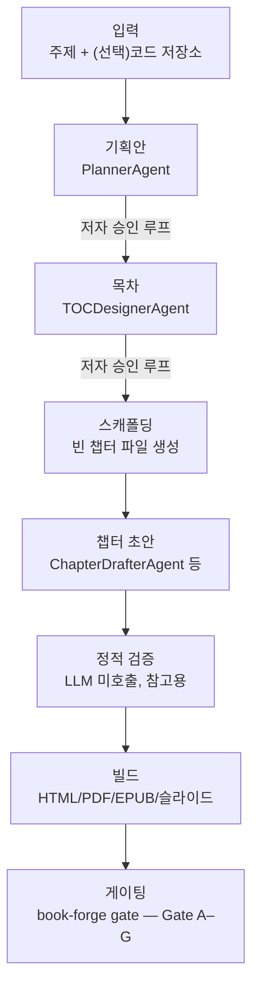
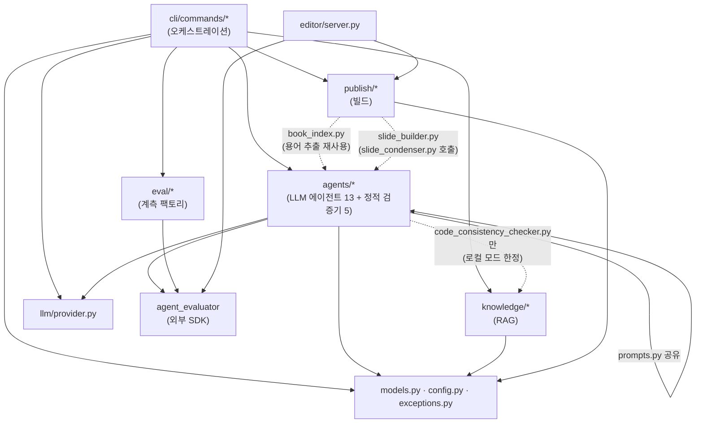
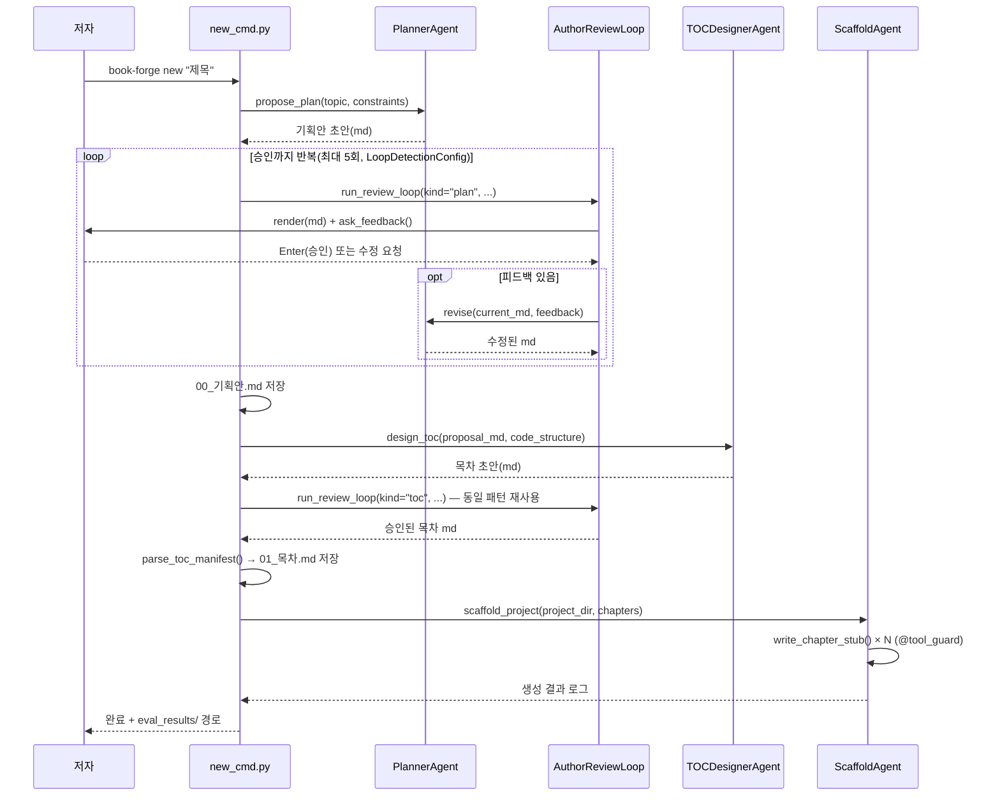
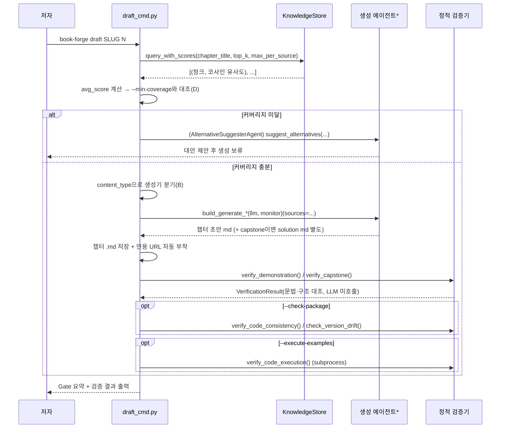
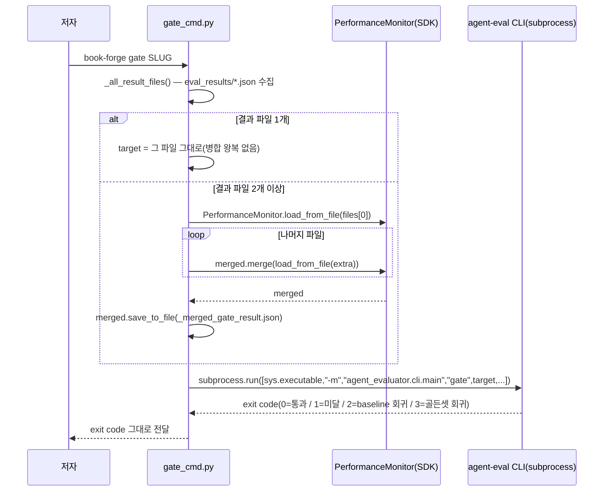

# Book-forge 둘러보기 — 이 책을 읽기 전에 알아야 할 최소한의 지도

> 서문이 이 책의 "왜"를 다뤘다면, 이 장은 "무엇을"을 다룬다. 1장부터는 곧바로 소스 코드 한 줄 한 줄을 해부하기 시작한다. 그 전에 **Book-forge를 실행하면 실제로 무슨 일이 일어나는지, Agent-Evaluator가 반복해서 등장시킬 용어가 무엇을 가리키는지**를 먼저 한자리에서 확인해두지 않으면, 코드 조각들이 서로 어떻게 이어지는지 놓치기 쉽다. 이 장은 새 개념을 설명하지 않는다. 대신 뒤에서 나올 개념들이 어느 위치에 놓이는지 보여주는 지도 한 장 역할을 한다.

---

## 0.0 여섯 단어로 시작하기 — AI 에이전트 개발이 처음이라면

이 책은 AI 에이전트나 Agent-Evaluator를 접해본 적 없는 개발자도 읽을 수 있게 썼다. 다만 아래 여섯 단어는 1장부터 설명 없이 그대로 쓰인다. 처음 보는 단어라면 여기서 한 번 짚고 넘어가자. 이미 아는 단어라면 0.1로 건너뛰어도 된다.

| 용어 | 무엇을 가리키는가 |
|---|---|
| **LLM**(거대 언어 모델) | 텍스트를 입력받아 텍스트를 출력하는 통계 모델(GPT·Claude·Llama 등). "생각"해서 답하는 게 아니라, 학습한 데이터를 근거로 "다음에 올 가능성이 가장 높은 단어"를 이어 붙인다 — 1장이 이 사실을 코드 한 줄(`prompt: str → str`)로 정확히 보여준다. |
| **프롬프트**(prompt) | LLM에 입력으로 주는 텍스트. Book-forge의 모든 에이전트는 결국 "어떤 프롬프트를 조립해 LLM에 넘기는가"로 요약된다(1~2장). |
| **환각**(hallucination) | LLM이 근거 없는 내용을 마치 사실인 것처럼 자신 있게 답하는 현상을 가리키는 AI 업계 용어다. "모른다"고 답하는 대신 그럴듯한 답을 지어내는 LLM의 구조적 특성에서 나온다 — 3장이 Book-forge에서 실제로 관측된 사례를 보여준다. |
| **RAG**(Retrieval-Augmented Generation, 검색 증강 생성) | LLM에 질문만 던지는 대신, 관련 자료(문서 조각)를 먼저 검색해 그 내용을 프롬프트에 함께 넣어주는 기법. LLM이 "아는 척"하지 않고 실제 자료를 근거로 답하게 만들어 환각을 줄이는 것이 목적이다 — 7장이 Book-forge의 RAG 구현(`knowledge/store.py`)을 다룬다. |
| **데코레이터**(decorator) | 파이썬에서 함수의 코드를 직접 고치지 않고, 그 함수를 감싸 부가 기능(로깅·계측 등)을 덧붙이는 문법(`@무언가` 형태). Book-forge는 이 문법으로 "이 LLM 호출을 측정해서 기록해줘"를 덧붙인다 — 2장이 이 동작을 한 줄씩 따라간다. |
| **Harness**(하네스) / **Harness Engineering** | 원래는 말이나 장비를 몸에 고정하는 "안전벨트·고정장치"를 뜻하는 단어다. 이 책에서는 **AI 에이전트의 실행 결과를 계측·판정하거나, 위험한 동작을 실행 전에 막는 장치 전체**를 가리키는 이름으로 쓰인다 — Agent-Evaluator SDK가 제공하는 배치 평가(Gate A–G)와 실시간 가드레일(LiveGuardrail)이 이 "하네스"를 이루는 두 축이며, 이 책 3~4부 전체의 주제다. |

> 이후 장에서 이 단어들이 다시 나올 때 뜻이 가물가물하면 이 표로 돌아오면 된다. 더 많은 용어(개별 Harness Config 이름 등)는 [부록 A. 용어집](Appendix/A_용어집.md)에 정리돼 있다.

## 0.1 Book-forge는 무엇을 하는 도구인가

한 줄로: **주제 하나(또는 코드 저장소 경로)를 주면, 기획안·목차를 저자와 함께 확정한 뒤, 챕터 초안을 자동으로 쓰고, 그 결과를 HTML·PDF·EPUB·발표자료로 만들어내는 CLI 도구.** 이 책의 핵심 관심사인 "품질을 어떻게 보장하는가"라는 질문에 대한 답도 여기 있다. 이 파이프라인의 매 단계에 계측이 이미 배선돼 있기 때문이다.



이 다이어그램의 화살표 하나하나가 이 책의 특정 파트에 대응한다. 아래 0.5절의 지도표가 그 대응을 명시적으로 보여준다. 지금은 "입력 하나가 여러 에이전트를 순서대로 거쳐 출력물이 된다"는 전체 모양만 눈에 담아두면 된다.

## 0.2 CLI로 본 전체 파이프라인

Book-forge는 위 흐름을 아래 명령들로 나눠 노출한다. 이 표는 코드베이스의 실제 `cli/main.py` 배선을 그대로 옮긴 것이다. 이 책이 다루는 모든 소스 코드는 결국 이 명령 중 하나가 호출하는 함수다.

| 명령 | 하는 일 | 이 책에서 주로 다루는 곳 |
|---|---|---|
| `book-forge new "<제목>"` | 기획→목차 대화형 루프 + 스캐폴드. `--source`를 주면 전체 챕터 자동 초안까지 | 1~4장 |
| `book-forge draft <slug> <ch\|--all>` | RAG 보조 챕터 초안 생성(narrative/reference_table/diagram/exercise/capstone/module_reference) | 7장 |
| `book-forge review <slug> <ch>` | 정확성/가독성 검토자 2명 + 편집장 종합 판정 | 5장 |
| `book-forge plan <slug> --revise` | 기획/목차 재검토(사람-에이전트 개정 루프) | 6장 |
| `book-forge chat <slug>` | 프로젝트 지식창고에 대화형 질의 | 7장 |
| `book-forge research <slug> <ch>` | 검색 쿼리 생성 → 웹 검색 → 저자 선택 → 지식창고 추가 | 7장 |
| `book-forge lint <slug>` | 챕터 간 기술 용어 표기 불일치 발견 | 10장 |
| `book-forge build html\|pdf\|epub\|slides <slug>` | 산출물 빌드 | (이 책의 범위 밖 — README 참고) |
| `book-forge gate <slug>` | `eval_results/`를 책 전체로 병합해 Gate A–G 판정 | 9·11장 |
| `book-forge edit <slug>` | 웹 에디터(팀 저장 충돌 실시간 차단) | 13장 |

나머지 `init`/`home`/`knowledge`는 설정·탐색용 보조 명령이라 이 책에서 별도로 다루지 않는다. 필요하면 `book-forge <명령> --help`로 확인하면 된다.

## 0.3 실행하면 실제로 무엇이 생기는가

`book-forge new "제목" --source ./repo`를 실행하면 `~/Documents/BookForge/projects/<slug>/`에 아래 구조가 만들어진다. 이 책의 여러 장이 이 경로 중 하나를 근거로 삼으므로, 처음 한 번은 실제 형태를 눈에 담아두는 편이 낫다.

```
<slug>/
├── 00_기획안.md            # PlannerAgent 산출물, 저자 승인 완료본
├── 01_목차.md              # TOCDesignerAgent 산출물(사람이 읽는 부분 + ```toc 매니페스트)
├── Part_X_.../
│   └── Chapter_XX_....md   # 챕터 본문 — 스캐폴딩이 빈 파일로 만들고 Drafter가 채운다
├── knowledge/store.json    # RAG 지식창고 — draft가 쌓고 chat이 재사용(7장)
├── eval_results/           # PerformanceMonitor가 챕터별로 남기는 계측 결과(8~9장)
│   └── _merged_gate_result.json  # gate 명령이 만드는 병합 산출물(11장)
└── outputs/                # html · pdf/ · epub · *_slides.html
```

`01_목차.md`의 ` ```toc ` 코드 블록은 4장에서, `eval_results/`의 JSON 파일들이 어떻게 쌓이고 병합되는지는 8~11장에서 각각 자세히 다룬다.

## 0.4 Agent-Evaluator는 무엇인가 — 전통적 QA에 빗대어, 그리고 세 층의 구조로

**이미 알고 있는 것에서 출발하자.** 전통적인 소프트웨어 개발에서 "품질을 보장한다"는 것은 대략 이런 도구들의 조합이었다. 로그(무슨 일이 있었는지 기록), 단위 테스트(결과가 맞는지 자동 확인), CI 게이트(기준 미달이면 배포를 막음), 이 세 가지다. Agent-Evaluator는 정확히 이 세 가지 각각의 **LLM 에이전트 버전**을 만든 SDK라고 생각하면 된다.

| 여러분이 이미 아는 것 | Agent-Evaluator의 대응 개념 |
|---|---|
| 로그·메트릭 수집(APM 등) | **Tracker** — 데이터를 자동으로 쌓고 계산하는 객체 |
| 단위 테스트의 "이 케이스는 이렇게 채점한다"는 설정 | **Harness Config** — 에이전트별로 채점 기준을 조정하는 dataclass |
| CI 게이트("커버리지 80% 미만이면 머지 금지") | **Gate A–G** — 여러 신호를 모아 0~1 점수로 판정하는 최종 축 |

다만 결정적인 차이가 하나 있다. 전통적 테스트는 "정답이 정확히 하나"인 경우가 많지만(함수가 5를 반환해야 하면 5여야 한다), LLM의 출력은 매번 표현이 달라지는 자유 텍스트다. "정답과 글자가 같은가"가 아니라 "정답이 담고 있어야 할 내용을 담았는가", "근거 없는 말을 지어내지 않았는가" 같은 **확률적·의미적 판정**이 필요하다. Agent-Evaluator의 복잡성 대부분은 이 차이 때문에 생긴다.

> 🧭 **다른 프레임워크를 써봤다면**: LangChain의 콜백/트레이싱, LangGraph의 상태 그래프, AutoGen·CrewAI의 역할 기반 멀티에이전트를 접해봤다면, 이 책에서 다루는 개념들이 그 경험과 느슨하게 겹친다는 것을 눈치챌 수 있다. "실행 경로를 관찰하는 장치"는 Tracker와 비슷한 문제를 다른 각도에서 풀고, "여러 에이전트에게 역할을 부여하고 상호작용을 조율하는 것"은 5장의 검토자-편집장 패턴과 비슷한 문제를 다룬다. 다만 이 책은 그 프레임워크들의 API를 설명하지 않는다. 대신 Book-forge/Agent-Evaluator 하나의 실제 코드로 "이런 문제가 있고, 이런 식으로 풀 수 있다"는 감각만 전달한다. 여러분이 쓰는 프레임워크에서 같은 문제를 어떻게 부르고 어떻게 푸는지는 각 프레임워크의 공식 문서에서 직접 대조해보길 권한다.

이제 세 층의 관계를 정리한다. 이 관계는 9장(§9.1)에서 실제 Tracker 코드(`LatencyTracker.record_latency()` 등)와 함께 훨씬 깊게 다시 다룬다. 여기서는 뼈대만 잡아둔다.

| 층 | 무엇인가 | 켜고 끌 수 있는가 |
|---|---|---|
| **Tracker** | 데이터를 실제로 쌓고 계산하는 객체. `PerformanceMonitor`가 만들어지는 순간 전부 자동으로 켜진다. | **아니오** — 항상 켜져 있다 |
| **Config**(Harness Config) | `@agent_eval`에 넘겨 특정 Tracker의 판정 기준(임계값 등)을 에이전트별로 조정하는 dataclass. | **예** — 필요한 에이전트만 선택 |
| **Gate**(A–G) | 여러 Tracker(+ Config로 조정된 판정)를 7개 축으로 묶어 점수 하나로 집계하는 최종 계층 — 목표 달성(A)·행동 무결성(B)·신뢰성(C)·성능(D)·보안(E)·다중 에이전트(F)·관측성(G) | 결과물(집계) |

정리하면 **"Config를 하나도 안 켜도 Tracker는 이미 데이터를 쌓고 있다"**는 뜻이다. CI 게이트에 빗대면, 로그 수집은 항상 켜져 있고, 그 로그를 어떤 기준으로 통과/실패 판정할지(Config)만 팀마다 다르게 정하는 것과 같은 그림이다.

| 용어 | 한 줄 정의 | 자세히 다루는 곳 |
|---|---|---|
| **`@agent_eval`** | LLM 호출 함수를 감싸 위 Config대로 Gate 점수를 계산·기록하는 배치(사후) 평가 데코레이터 | 2장 |
| **`PerformanceMonitor`** | 한 프로젝트(책) 안에서 Tracker들을 갖고 있는 객체. 계측 결과를 `eval_results/*.json`에 쌓고, 여러 챕터 결과를 병합(`merge()`)한다 | 9·11장 |
| **`LiveGuardrail` / `@tool_guard`** | 파일 쓰기처럼 되돌리기 어려운 동작을 **실행 전에** 막는 실시간 축 — 위 표(사후 채점)와는 완전히 다른 축. CI 게이트가 "배포 후 롤백"이 아니라 "배포 자체를 막는" 것과 같은 성격 | 12장 |
| **`HallucinationDetector`** | `rag_mode=True`인 에이전트에서 자동 활성화되는, 근거 없는 서술을 잡아내는 Gate C 하위 채점기(Tracker의 일종) | 7·9장 |

> 이 표에 없는 세부 Config(`ThreatSeverityConfig`, `ConflictResolutionConfig` 등)는 등장하는 장에서 그 자리에 필요한 만큼만 설명한다. 14개 에이전트 전체가 쓰는 Config를 한 표로 보고 싶다면 8장(§8.1)을 참고하고, 개별 용어는 [부록 A](Appendix/A_용어집.md)에서 찾아보면 된다.

## 0.5 이 지도를 어떻게 쓰는가 — 파이프라인 ↔ 챕터 ↔ Gate 대응표

앞으로 어떤 장을 읽든, "지금 0.1의 파이프라인 중 어느 화살표를 보고 있는가"를 이 표로 확인할 수 있다.

| 파이프라인 단계(0.1 다이어그램) | 대응 챕터 | 대응 Gate/축 |
|---|---|---|
| 입력 → 기획안 → 목차 | 1~4장 | Gate A |
| 목차 → 스캐폴딩 | 12장 | 실시간 가드레일 |
| 스캐폴딩 → 챕터 초안 | 4·7장 | Gate C |
| (초안과 별개) 검토자-편집장 리뷰 | 5장 | Gate F |
| (초안과 별개) 사람-에이전트 개정 루프 | 6장 | Gate B |
| 챕터 초안 → 정적 검증 | 10장 | 별도 축(Gate 미반영) |
| 초안/검증 → 게이팅 | 9·11장 | Gate A–G 전체 |
| (파이프라인 전반) 팀 동시 저장 | 13장 | 실시간 가드레일 |
| (파이프라인 전반) 품질 기준 조정 | 14장 | Gate 가중치 설정 |

## 0.6 직접 재현해보기 — 설치부터 첫 Gate 점수까지

이 책은 "실측으로 재현 가능하다"는 말을 여러 번 쓴다(1장 §1.4 등). 말로만 남기지 않고, 여기서 그 재현 절차를 실제 명령 순서로 적어둔다. Book-forge 저장소를 로컬에 클론했다는 것을 전제로 한다.

```bash
# 1. 설치 — RAG(--source)까지 쓰려면 [rag] extra 포함
pip install -e ".[dev,rag]"

# 2. LLM Provider 설정 — 기본값 Ollama는 API 키가 필요 없다
#    (Ollama가 로컬에 없다면 https://ollama.com 에서 설치 후 `ollama pull llama3.2`)
book-forge init

# 3. 첫 프로젝트 생성 — 기획안 승인 루프가 뜨면 Enter만 눌러 그대로 승인
book-forge new "테스트 프로젝트"

# 4. 스캐폴딩된 챕터 하나를 직접 열어 집필(또는 --source로 자동 초안)
book-forge draft "테스트 프로젝트" 1

# 5. Gate A–G 판정 — 9장(§9.5)에서 본 것과 같은 형식의 출력을 직접 확인한다
book-forge gate "테스트 프로젝트" --min-gate-score 0.0
```

5번 명령의 출력이 정확히 9장(§9.5)에서 인용한 형식(`✅ A (목표 달성): 0.663` 같은 줄들)으로 나온다면, 이 책이 지금부터 다룰 모든 실측 예제(`eval_results/*.json`, Gate 점수 로그, 병합 결과)가 여러분의 화면에서도 똑같이 재현됐다는 뜻이다. 결과 숫자는 여러분이 쓴 프롬프트·모델에 따라 이 책의 예시와 다를 수 있다. 다만 **숫자 자체가 아니라, "이런 형식·이런 구조의 결과가 나온다"는 것을 직접 확인하는 것**이 이 절의 목적이다.

> 👨‍💻 **개발자 TIP**: 이후 각 챕터의 "직접 해보기" 상자는 이 5단계를 이미 마쳤다는 전제로, 그 챕터가 다루는 메커니즘 하나를 더 깊이 파고들 작은 실험을 제안한다.

> ⚠️ **로컬 실행 환경(Ollama 등)이 없다면**: 이 5단계, 그리고 이후 챕터의 "직접 해보기" 상자 중 CLI 실행을 요구하는 것들은 건너뛰어도 이 책을 읽는 데 지장이 없다. 모든 챕터 본문이 실제 실행 로그·소스 코드를 이미 인용해 보여주므로, 코드를 읽는 것만으로도 각 장의 핵심 주장은 그대로 따라갈 수 있다. "직접 해보기"는 이해를 검증하고 손에 익히는 보너스지, 본문 이해의 전제 조건이 아니다. 회사 PC 등 설치가 어려운 환경이라면, 각 상자의 코드/명령을 읽고 "이걸 실행하면 무엇이 나올지" 스스로 예측해본 뒤 본문의 설명과 맞춰보는 것만으로도 충분한 학습 효과가 있다.

---

## 0.7 프로젝트 아키텍처 — 패키지 구조와 의존 라이브러리

Book-forge의 실제 코드는 `src/book_forge/` 아래 7개 서브패키지(+ 루트 3개 모듈)로 나뉜다. 이 절은 "어떤 묶음이 무슨 일을 하는가"를 30,000피트 상공에서 조망한다. 각 파일의 역할은 바로 다음 절(0.8)에서 표로 정리한다.

```
src/book_forge/
├── models.py, config.py, exceptions.py   # 루트 — 목차 데이터 모델·설정·예외 계층(3개 파일, 특정 패키지에 속하지 않음)
├── llm/            # LLM Protocol + OpenAI·Anthropic·Ollama 통합(provider.py 1개 파일)
├── agents/         # LLM 에이전트 13개 + @tool_guard 1개(scaffold) + 정적 검증기 5개 + 프롬프트 상수 1개
├── knowledge/      # RAG — 소스 어댑터·임베딩·지식창고·구조적 코드 인덱싱(7개 파일)
├── publish/        # 마크다운 → HTML/PDF/EPUB/Slides(9개 파일)
├── editor/         # Flask 웹 에디터(server.py 1개 파일)
├── eval/           # PerformanceMonitor 팩토리(2개 파일)
└── cli/            # click 진입점 + 13개 서브커맨드(15개 파일)
```

`__init__.py`처럼 실질적인 로직이 없는 빈 파일을 제외하면 약 58개 파일, 총 7,019줄(조사 시점 `wc -l` 기준)이 Book-forge 전체 구현이다. 이 책이 지금까지 인용해온 코드는 전부 이 58개 파일 중 일부다.

의존 라이브러리는 `pyproject.toml`이 코어와 옵트인 extra를 명확히 나눈다:

| 구분 | 라이브러리 | 어디서 쓰는가 |
|---|---|---|
| 코어(항상 설치) | `click` | `cli/` 전체 — 커맨드 정의 |
| 코어 | `python-dotenv` | `config.py` — `.env` 로드 |
| 코어 | `pydantic` | (설정 검증용으로 선언돼 있으나 이 책이 다루는 핵심 경로에서는 직접 노출되지 않는다) |
| 코어 | `markdown` | `publish/markdown_engine.py` — `md_to_html()`의 실제 변환 엔진 |
| 코어 | `requests` | `knowledge/embeddings.py`(Ollama API), `knowledge/web_search.py`, `knowledge/sources.py`(URL 소스) |
| 코어 | `agent-evaluator>=0.9.9` | `agents/*`(`@agent_eval`/`@tool_guard`), `eval/monitor.py`, `cli/commands/gate_cmd.py` |
| `[pdf]` | `playwright` | `publish/pdf_builder.py` — Chromium headless 인쇄 |
| `[rag]` | `pypdf`, `numpy` | `knowledge/pdf_source.py`(PDF 추출), `knowledge/store.py`(코사인 유사도 행렬 연산) |
| `[serve]` | `flask` | `editor/server.py` |
| `[korean]` | `agent-evaluator[korean]` | `eval/monitor.py`의 `use_korean_tokenizer=True`가 기대하는 형태소 분석기 |

> ⚠️ **`pyproject.toml`에 없는 의존성**: `llm/provider.py`는 provider로 OpenAI 또는 Anthropic을 선택했을 때만 `from openai import OpenAI` / `from anthropic import Anthropic`을 함수 내부에서 지연 import한다. 두 SDK 모두 `pyproject.toml`의 어떤 의존성 목록에도 선언돼 있지 않다. 기본값인 Ollama만 쓰면 이 문제를 겪을 일이 없지만, `LLM_PROVIDER=openai`로 전환하려면 `pip install openai`를 별도로 실행해야 한다. 이 책이 반복해서 강조하는 "관대한 파싱, 그러나 숨겨진 전제조건은 정직하게 문서화한다"는 원칙이 놓치기 쉬운 지점이 바로 여기다.

이 8개 패키지 전부가 공통으로 따르는 두 가지 배선 패턴(`build_X(llm, monitor) -> Fn` 팩토리, `@agent_eval` vs `@tool_guard`의 축 구분)은 이미 이 책의 핵심 주제이므로 2·8·12장에서 각각 코드로 따라간다. 이 절은 "그 패턴들이 정확히 어느 파일에 있는가"의 지도 역할만 한다.

## 0.8 파일별 책임 지도

아래 표는 Book-forge 소스 전체(58개 실질 파일)를 패키지별로 나눠, 각 파일의 책임과 이 책에서 주로 다루는 곳을 정리한 것이다. 처음 읽을 때 전부 외울 필요는 없다. 이후 장에서 낯선 파일 이름이 나올 때 돌아와 찾아보는 용도다.

### 루트 모듈

| 파일 | 책임 | 핵심 요소 |
|---|---|---|
| `models.py` | 목차 데이터 모델 — `ChapterSpec`, ` ```toc ` 매니페스트 파싱, 목차 개정 이력 조작 | `ChapterSpec`, `parse_toc_manifest()`, `append_toc_revision_entries()` |
| `config.py` | `~/Documents/BookForge/` 데이터 디렉토리 관리, `.env` 경로 해석 | `get_data_dir()`, `load_config()`, `project_dir_for()` |
| `exceptions.py` | 예외 계층 | `BookForgeError`(base), `MissingAPIKeyError`, `TocParseError` 등 |

### `llm/` — LLM 통합

| 파일 | 책임 | 핵심 요소 |
|---|---|---|
| `llm/provider.py` | OpenAI/Anthropic/Ollama를 하나의 인터페이스로 통합, provider별 SDK 지연 로딩 | `LLM`(Protocol), `OpenAILLM`/`AnthropicLLM`/`OllamaLLM`, `create_llm()` |

### `agents/` — LLM 호출 에이전트(13개, `build_X(llm, monitor) -> Fn` 팩토리 + `@agent_eval`)

| 파일 | 책임 | 담당 챕터 |
|---|---|---|
| `agents/planner.py` | PlannerAgent — 주제/제약 → 기획안 마크다운 | 2장 |
| `agents/toc_designer.py` | TOCDesignerAgent — 기획안(+코드 구조) → 목차 마크다운 | 4장 |
| `agents/chapter_drafter.py` | ChapterDrafterAgent — narrative/exercise 서술형 챕터 초안(기본 생성기) | 7장 |
| `agents/reference_table.py` | ReferenceTableAgent — RAG 소스에서 구조화된 사실만 표로 추출 | 7장 |
| `agents/diagram_generator.py` | DiagramGeneratorAgent — RAG 소스 → Mermaid 다이어그램 중심 챕터 | 7장 |
| `agents/capstone_generator.py` | CapstoneGeneratorAgent — 빈 템플릿+모범 정답을 한 번의 호출로 생성 | 7장 |
| `agents/module_reference.py` | ModuleReferenceAgent — 구조적 코드 인덱싱 결과를 빠짐없이 표로 정리(전체 커버리지) | 7장 |
| `agents/alternative_suggester.py` | AlternativeSuggesterAgent — 저커버리지 상황에서 자동 차단 대신 대안 제시 | 3장 |
| `agents/chat_agent.py` | ChatAgent — 지식창고 발췌+대화 이력 기반 Q&A | 7장 |
| `agents/research_agent.py` | ResearchAgent — 챕터 제목 → 검색 쿼리 생성(검색 자체는 `knowledge/web_search.py`) | 7장 |
| `agents/review_loop.py` | AuthorReviewLoop — 저자 피드백에 따른 반복 개정(`run_review_loop()`는 LLM 미호출 순수 오케스트레이션) | 6장 |
| `agents/review_panel.py` | ReviewerAgent(정확성/가독성)·ChiefEditorAgent — 감독자-작업자 다관점 리뷰 | 5장 |
| `agents/slide_condenser.py` | SlideCondenserAgent — 책 섹션 하나 → 슬라이드 한 장 | (범위 밖) |

### `agents/` — 그 외(LLM 호출 방식이 다르거나 아예 안 하는 7개 파일)

| 파일 | 책임 | 비고 |
|---|---|---|
| `agents/scaffold.py` | ScaffoldAgent — 승인된 목차 → 빈 챕터 스텁 생성 + 목차 재조정 | `@agent_eval`이 아니라 `@tool_guard`(부작용 있는 파일 쓰기, 실행 전 차단 대상) — 12장 |
| `agents/prompts.py` | 위 13개 에이전트 중 다수가 공유하는 프롬프트 템플릿 문자열 저장소 | 순수 상수 모듈, LLM 미호출 |
| `agents/demonstration_verifier.py` | content_type별 생성 후 정적 검증(exercise 문법·diagram 구조·capstone TODO 등) | LLM 미호출, `@agent_eval` 없음 — 10장 |
| `agents/code_consistency_checker.py` | 본문의 import/백틱 심볼이 실제 target_package에 존재하는지 대조 | LLM 미호출 — 10장 |
| `agents/sdk_version_pin.py` | `--check-package` 대상 버전을 프로젝트별로 최초 1회 고정, 드리프트 경고 | LLM 미호출 — 10장 |
| `agents/code_example_verifier.py` | python 코드 블록을 subprocess로 실제 실행해 exit code 검증(`--execute-examples`) | LLM 미호출 — 10장 |
| `agents/term_consistency_checker.py` | 챕터 간 백틱 기술 용어 표기 불일치 후보 검출 | LLM 미호출 — 10장 |

### `knowledge/` — RAG

| 파일 | 책임 | 담당 챕터 |
|---|---|---|
| `knowledge/store.py` | `KnowledgeStore` — numpy 인메모리 코사인 유사도 벡터 스토어, JSON 영속화 | 7장 |
| `knowledge/embeddings.py` | Ollama `/api/embeddings` 호출 래퍼(RAG는 항상 Ollama만 사용) | 7장 |
| `knowledge/sources.py` | PDF/코드저장소/텍스트/URL을 동일한 청크 리스트로 변환하는 소스 어댑터 라우터 | 7장 |
| `knowledge/pdf_source.py` | PDF → 텍스트 → 고정폭 슬라이딩 청크 | 7장 |
| `knowledge/web_search.py` | DuckDuckGo HTML 엔드포인트 검색(API 키 불필요) | 7장 |
| `knowledge/code_index.py` | Python `ast`로 모듈/클래스/함수 인벤토리 + 의존관계 정적 분석 | 4·7장 |
| `knowledge/lifecycle.py` | 지식창고 청크를 소스 태그별로 집계(`book-forge knowledge status`) | (범위 밖) |

### `publish/` — 빌드

| 파일 | 책임 | 비고 |
|---|---|---|
| `publish/config.py` | `BookConfig` — HTML/PDF/EPUB/Slide 엔진 공통 설정 dataclass | 이 책 범위 밖(README 참고) |
| `publish/front_matter.py` | `FrontMatter` — 저자/저작권/판 메타데이터를 별도 JSON으로 분리 저장 | 〃 |
| `publish/toc_loader.py` | `01_목차.md` 매니페스트 → 실제 파일 경로가 채워진 `ResolvedChapter` 목록 | 4장 |
| `publish/book_index.py` | 책 전체 찾아보기(색인) 항목 빌드(`term_consistency_checker`의 용어 추출 재사용) | 〃 |
| `publish/markdown_engine.py` | `md_to_html()` — mermaid/커스텀 HTML/코드 보존 3단계 마크다운 변환 엔진(공용) | 〃 |
| `publish/html_builder.py` | 전체 도서를 단일 HTML 파일로 빌드(사이드바 내비게이션 자동 생성) | 〃 |
| `publish/pdf_builder.py` | Playwright(Chromium headless)로 챕터별 개별 PDF 인쇄 | 〃 |
| `publish/epub_builder.py` | 순수 `zipfile`(표준 라이브러리)로 EPUB 3 컨테이너 조립 | 〃 |
| `publish/slide_builder.py` | 마크다운 챕터 → Reveal.js 발표자료(`slide_condenser.py` 호출) | 〃 |

### `editor/`, `eval/`

| 파일 | 책임 | 담당 챕터 |
|---|---|---|
| `editor/server.py` | Flask 웹 에디터 — Part/Chapter MD 편집 + 팀 동시성 클레임 충돌 방지 | 13장 |
| `eval/monitor.py` | `PerformanceMonitor` 팩토리 — 한국어 형태소 토크나이저, Gate 가중치 `.env` 오버라이드 | 14장 |
| `eval/gate_summary.py` | 방금 저장된 평가 결과 JSON에서 Gate A–G 점수를 즉시 읽어 CLI에 표시 | 9장 |

### `cli/` — 명령 오케스트레이션

| 파일 | 책임 | 담당 챕터 |
|---|---|---|
| `cli/main.py` | click 그룹 진입점 — 13개 서브커맨드 등록 | 0.2절 |
| `cli/project_utils.py` | 슬러그 → `BookConfig` 해석 공통 유틸(build/edit/gate/draft/plan이 공유) | (범위 밖) |
| `cli/commands/new_cmd.py` | `book-forge new` — 기획~스캐폴딩 오케스트레이션, `--source` 배치 초안 연쇄 | 4장 |
| `cli/commands/draft_cmd.py` | `book-forge draft` — RAG 초안 생성 오케스트레이션(733줄, 가장 큰 파일) | 7장 |
| `cli/commands/gate_cmd.py` | `book-forge gate` — 여러 챕터 결과 병합 + `agent-eval gate` CLI 위임 | 9·11장 |
| `cli/commands/plan_cmd.py` | `book-forge plan` — 기획/목차 재검토, `--revise` 재승인 루프 | 6장 |
| `cli/commands/review_cmd.py` | `book-forge review` — 리뷰 패널 호출 래퍼 | 5장 |
| `cli/commands/chat_cmd.py` | `book-forge chat` — 지식창고 기반 대화형 Q&A REPL | 7장 |
| `cli/commands/research_cmd.py` | `book-forge research` — 검색 쿼리 생성 → 웹 검색 → 저자 선택 → 지식창고 추가 | 7장 |
| `cli/commands/lint_cmd.py` | `book-forge lint` — 챕터 간 용어 불일치 발견·보고 | 10장 |
| `cli/commands/build_cmd.py` | `book-forge build html\|pdf\|epub\|slides` 서브그룹 | (범위 밖) |
| `cli/commands/edit_cmd.py` | `book-forge edit` — 웹 에디터 서버 실행 | 13장 |
| `cli/commands/init_cmd.py` | `book-forge init` — LLM provider/API 키 대화형 `.env` 설정 마법사 | (범위 밖) |
| `cli/commands/home_cmd.py` | `book-forge home` — 데이터/프로젝트 폴더를 OS 파일 탐색기로 열기 | (범위 밖) |
| `cli/commands/knowledge_cmd.py` | `book-forge knowledge status\|reset` | (범위 밖) |

## 0.9 모듈 간 관계 — 누가 누구를 부르는가

파일 67개 전부를 하나의 그래프에 그리면 알아볼 수 없으므로, 패키지 단위로 뭉쳐 실제 import 관계를 그린다. 화살표는 전부 실제 `from book_forge.X import Y` 문을 근거로 삼았다.



이 그래프에서 눈에 띄는 비대칭이 두 가지 있다.

1. **`agents/`는 `knowledge/`를 몰라도 대부분 동작한다.** RAG 소스(`sources`)는 `cli/commands/draft_cmd.py`가 `knowledge/store.py`에서 미리 꺼내 문자열로 넘겨주므로, 대부분의 에이전트 함수는 `KnowledgeStore` 객체 자체를 본 적이 없다. 유일한 예외는 `agents/code_consistency_checker.py`(점선 화살표)다. 이 파일만 로컬 디렉토리 모드에서 `knowledge/code_index.py`를 직접 지연 import한다.
2. **`publish/`는 원칙적으로 `agents/`를 몰라야 하는 레이어지만(빌드는 집필과 무관한 별도 단계), 실제로는 두 파일이 예외다.** `publish/book_index.py`는 `agents/term_consistency_checker.py`의 용어 추출 함수(순수 함수, LLM 미호출)를 재사용한다. 찾아보기(색인)를 만들 때 "이미 있는 로직을 새로 만들지 않는다"고 판단해 생긴 얕은 예외다. `publish/slide_builder.py`는 이보다 근본적으로 의존한다. 챕터 섹션을 슬라이드 한 장으로 압축하는 작업 자체를 `agents/slide_condenser.py`의 `build_condense_section()`(LLM 호출 에이전트)에 위임하기 때문이다. 그래서 "빌드는 집필과 무관하다"는 원칙이 발표자료 빌드에는 처음부터 적용되지 않는다.

`editor/server.py`가 `publish/`(마크다운 렌더링)와 `agent_evaluator`(팀 동시성 가드레일) 둘만 직접 의존하고 `agents/`나 `knowledge/`는 전혀 모른다는 점도 이 그래프에서 확인할 수 있다. 웹 에디터는 "사람이 직접 쓴 텍스트를 저장·미리보기"할 뿐, LLM을 한 번도 호출하지 않는다.

## 0.10 핵심 흐름 시퀀스 다이어그램

지금까지의 표와 그래프가 "무엇이 있는가"를 보여줬다면, 이 절은 "실제로 실행하면 어떤 순서로 호출되는가"를 세 가지 핵심 명령으로 보여준다. 각 다이어그램의 세부 사항은 표기된 장에서 코드로 다시 따라간다.

### `book-forge new "<제목>"` — 기획부터 스캐폴딩까지 (4장)



`RL`(AuthorReviewLoop)가 기획안·목차 두 단계에서 완전히 같은 함수로 재사용된다는 점이 이 다이어그램의 핵심이다. `kind` 인자 하나로 어떤 문서를 개정 중인지만 구분한다(6장).

### `book-forge draft <slug> <ch>` — RAG 조회부터 정적 검증까지 (7·10장)



> \* `Gen`은 content_type에 따라 실제로는 5개 서로 다른 파일 중 하나로 바뀐다 — narrative/exercise는 `chapter_drafter.py`, `reference_table`은 동명 파일, `module_reference`는 동명 파일(RAG 대신 구조 인덱싱 요약 사용), `diagram`은 `diagram_generator.py`, `capstone`은 `capstone_generator.py`다. 이 분기 전체는 0.8절의 "agents/ — LLM 호출 에이전트" 표와 대응한다.

RAG 조회(`Store.query_with_scores`)가 콘텐츠 생성기 분기(B)보다 **먼저** 일어난다는 순서가 중요하다. 검색된 청크의 평균 유사도가 낮으면 어떤 생성기를 부를지 결정하기도 전에 대안 제안 경로로 빠지기 때문이다.

### `book-forge gate <slug>` — 병합부터 최종 판정까지 (9·11장)



이 다이어그램에서 가장 중요한 점은, `gate_cmd.py` 안 어디에도 Gate A–G 점수를 실제로 계산하는 코드가 없다는 것이다. `PerformanceMonitor.merge()`(SDK 기존 기능)로 병합만 하고, 최종 판정은 `agent-eval` CLI subprocess에 완전히 위임한다. Book-forge가 "품질 판정 로직을 만들지 않고, agent-evaluator가 이미 제공하는 계측·게이팅 기능을 가져다 쓰는 응용 프로그램"이라는 이 책 전체의 전제(서문·CLAUDE.md)가 코드 레벨에서 가장 명확하게 드러나는 지점이 바로 여기다.

---

## 이 장의 핵심

- **Book-forge는 입력 하나가 여러 에이전트를 순서대로 거쳐 출력물이 되는 파이프라인이다.** 0.1의 다이어그램이 이 책 전체의 뼈대다.
- **CLI 명령 하나하나가 이 책의 특정 장에 대응한다.** 0.2의 표로 "지금 읽는 장이 실제로 어떤 명령을 설명하는가"를 확인할 수 있다.
- **Agent-Evaluator는 전통적 QA(로그·테스트·CI 게이트)의 LLM 버전이다.** Tracker(항상 켜짐)·Config(옵트인 조정)·Gate(최종 판정)라는 세 층으로 나뉜다. 이후 장에서 `@agent_eval`이나 `PerformanceMonitor`가 나오면 이 절(0.4)로 돌아와 확인하면 된다.
- **말로만 "재현 가능하다"고 하지 않는다.** 0.6의 5단계를 그대로 실행하면 이 책이 인용하는 모든 실측 예제의 형식을 직접 확인할 수 있다.
- **소스 전체는 8개 패키지·67개 파일·약 7,000줄이다.** 0.7~0.8이 그 전체 지도다. 0.9의 관계 그래프는 계층 간 의존 방향(그리고 그 방향을 깨는 두 예외)을 보여주고, 0.10의 시퀀스 다이어그램 3개는 `new`/`draft`/`gate` 세 핵심 명령이 실제로 어떤 순서로 함수를 호출하는지 보여준다.

## 참고 자료

- `Book-forge/README.md` — CLI 전체 옵션과 설치 방법(이 장은 그 축약본)
- `Book-forge/CLAUDE.md` — 프로세스 아키텍처 전체 다이어그램과 파일 구조

---

> **다음 챕터**는 이 파이프라인의 첫 화살표(입력 → 기획안)를 만드는 코드 그 자체가 아니라, 그보다 한 단계 더 아래로 내려가 "에이전트"라는 말이 Book-forge 코드에서 정확히 무엇을 가리키는지부터 확인한다.
