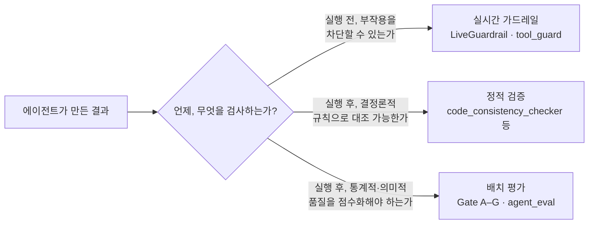

# 서문 — "돌아간다"와 "믿을 수 있다"는 다른 문장이다

## 시작하는 질문

Book-forge를 실행하면 몇 분 안에 챕터 하나가 완성된다. 화면에는 아무 에러도 뜨지 않고, 마크다운 파일이 생기고, 문장은 매끄럽다. 이 상태를 두고 "잘 작동한다"고 말해도 될까? 이 책은 그 질문에 "아니오"라고 답하는 데서 시작한다. **에러 없이 끝난 것과, 그 결과를 믿을 수 있는 것은 다른 문장이다.** 이 간극을 무엇으로, 어떻게 메울 것인가가 이 책 17개 챕터 전체가 다루는 단 하나의 질문이다.

이 질문에 답하려고 이 책이 고른 방법은 하나다. 이론이 아니라 **실제로 배포돼 동작하는 오픈소스 하나(Book-forge)를 처음부터 끝까지 소스 코드로 뜯어보는 것.** Book-forge는 마침 이 질문에 답하기 좋은 대상이다. 이 도구 자신이 여러 개의 LLM 에이전트로 이루어져 있고, 그 에이전트들의 결과를 [Agent-Evaluator](https://pypi.org/project/agent-evaluator/) SDK로 실제로 계측하기 때문이다. 이 책이 인용하는 코드는 전부 실제 커밋에 존재한다(기획안 참고) — 가상의 예제는 쓰지 않는다.

## 실제로 관측된 균열들

Book-forge를 개발하는 동안, 그리고 이 책 자신을 준비하는 동안 실제로 일어난 일들이다. 로컬 추론 모델이 "생각"에 토큰 예산을 다 써버려 챕터 파일이 통째로 빈 채 저장됐다. 존재하지 않는 클래스 이름(`BranchGuard`)을 자신 있게 인용한 챕터가 나왔다. 서로 무관했던 두 챕터가 같은 소스로 서서히 수렴했다. `book-forge gate`가 6개 챕터 중 5개를 무시하고 가장 최근 챕터 하나만 판정한 적도 있었다. 전부 "에러 없이 끝났다"는 조건은 만족했지만, "결과를 믿을 수 있다"는 조건은 만족하지 못한 사례들이다.

이런 균열은 LLM을 부르는 코드라면 어디에나 생긴다. 문제는 이 균열들이 **성격이 전부 다르다**는 점이다. 어떤 것은 결과가 다 나온 뒤에야 판정할 수 있고(환각), 어떤 것은 결과가 나오기도 전에 막아야 하고(무한 반복, 경로 침범), 어떤 것은 확률이 아니라 예/아니오로 정확히 답할 수 있다(코드 심볼이 실존하는가). 이 셋을 하나의 "품질 관리"로 뭉뚱그리면, 정작 무엇이 지금 검증되고 있고 무엇이 아직 검증되지 않았는지 아무도 답할 수 없게 된다.

## 세 채널, 그리고 그 채널들을 설계하고 지속시키는 법

이 책의 핵심 주장은 이 균열들이 성격별로 분리된 채널로 다뤄져야 한다는 것이다.

| 채널 | 담당하는 문제의 성격 | Book-forge의 구현 |
|---|---|---|
| **배치 평가** | 생성이 끝난 뒤, "이 결과가 통계적으로/의미적으로 괜찮은가"를 점수로 채점 | `@agent_eval` 데코레이터 + Gate A–G(Agent-Evaluator SDK) |
| **정적 검증** | LLM 호출 없이, 결정론적 규칙으로 "이 서술이 사실과 다른가"를 대조 | `code_consistency_checker.py`·`demonstration_verifier.py`·`term_consistency_checker.py` 등 |
| **실시간 가드레일** | 부작용이 있는 동작을 **실행되기 전에** 막을 수 있는가 | `LiveGuardrail`·`tool_guard`(`scaffold.py`·`editor/server.py`) |

세 채널을 구분하는 것만으로는 충분하지 않다. **어떤 Gate를 왜 쓰는지, 그 판정 기준을 어떤 근거로 정하는지**를 설명하지 못하면, "일단 다 켜놓고 보자"는 식의 피상적인 적용으로 흘러간다. 그리고 이 채널들을 사람이 매번 손으로 실행해야만 작동한다면, 결국 실행을 빠뜨리는 순간이 반드시 생긴다. 이 책은 이 두 가지를 채널 자체와 분리된 별도의 축으로 다룬다. **Gate를 실패 모드에서 거꾸로 도출하고 가중치를 설계하는 방법론**(10장), 그리고 **이 채널들을 CI/CD로 자동화해 사람의 손을 거치지 않고 지속시키는 방법**(13장)이다.

> 이 위에 하나가 더 있다. "이 채널들이 무엇을 기준으로 판정할지" 자체를 프로젝트마다 조정하는 **모니터 설정**(16장)이다. 채널이 아니라 채널의 다이얼에 가깝다. 17개 챕터를 다 읽은 뒤에는 맺음말이 이 다섯 축을 하나의 그림으로 다시 모아준다.

## 문제 → 해결 채널 매핑표

이 책 17개 챕터는 아래 문제들에 각각 대응한다. 각 행의 "담당 챕터" 열을 따라가면 자세한 설명을 찾을 수 있다.

| # | 예상되는 문제 | 해결 채널 | 담당 챕터 |
|---|---|---|---|
| 1 | 목표·제약이 결과에 실제로 반영됐는지 확인 불가 | 배치 평가(Gate A) | 2·8–9장 |
| 2 | 결과물이 근거 없는 서술을 섞음(환각) | 배치 평가(Gate C, HallucinationDetector) | 9장 |
| 3 | 어떤 Gate를, 어떤 가중치로 쓸지 근거 없이 고름 | Gate 매핑·가중치 설계 방법론 | 10장 |
| 4 | 언급한 코드 심볼이 실제로 존재하지 않음 | 정적 검증 | 11장 |
| 5 | 생성된 실습 코드가 문법조차 유효하지 않음 | 정적 검증 | 11장 |
| 6 | 여러 챕터가 같은 개념을 다르게 표기 | 정적 검증 | 11장 |
| 7 | 리뷰 없이 결과가 그대로 확정됨 | 멀티에이전트 협업(Gate F 실증) | 5장 |
| 8 | 챕터 하나만 판정되고 책 전체 품질을 못 봄 | 배치 평가(`PerformanceMonitor.merge()`) | 12장 |
| 9 | 사람이 게이팅 실행을 깜빡해 품질 하락을 놓침 | CI/CD 자동화 | 13장 |
| 10 | 파일 쓰기가 프로젝트 밖 경로를 침범하거나 무한 반복 | 실시간 가드레일(LoopDetection·경로 검사) | 14장 |
| 11 | 여러 저자가 동시에 같은 챕터를 저장해 덮어씀 | 실시간 가드레일(TeamConcurrencyConfig) | 15장 |
| 12 | 품질 기준이 프로젝트마다 다르게 조정되지 않음 | 모니터 설정(Gate 가중치·`.env`) | 16장 |

> 이 매핑표에 없는 문제도 있다. 예를 들어 "검증에서 낮은 점수가 나온 결과를 에이전트가 스스로 고쳐 쓰는 것"이나 "여러 실행에 걸친 서서히 나빠지는 추세를 자동으로 감지하는 것"은 Book-forge가 아직 다루지 못하는 영역이다. 17장(한계와 열린 문제)에서 이 경계를 숨기지 않고 정직하게 다룬다.

---

## 이 책이 다루는 범위 — Book-forge 하나, 그러나 그 이상

이 책은 Book-forge라는 구체적인 도구 하나를 처음부터 끝까지 뜯어본다. 하지만 목표는 그 도구 자체가 아니다. Part I(1~3장)이 이 여정의 출발점이다. 1장이 먼저 Book-forge가 무엇을 하는 도구인지(파이프라인·CLI·산출물)를 보여준 뒤, 곧바로 "그 파이프라인의 화살표 하나하나는 결국 무엇인가"라는 질문으로 넘어가 AI 에이전트의 최소 정의(`prompt: str → str`)까지 한 챕터 안에서 이어간다. 2장은 그 최소 단위 하나(`PlannerAgent`)가 실제로 어떻게 동작하는지, Agent-Evaluator가 이 동작을 어떤 세 개의 층(Tracker·Config·Gate)으로 계측하는지 한 줄씩 따라간다. 3장은 이 매끄러운 흐름이 실제로 어떻게, 왜 깨지는지 다섯 가지 실측 실패 유형으로 정리한다. Book-forge를 한 번도 접해본 적 없어도, "에이전트"라는 단어 자체가 낯선 개발자도 이 세 챕터만으로 자연스럽게 따라올 수 있게 하려는 순서다.

Part II~IV는 그 에이전트들이 실제로 어떻게 협업하고(4~7장), 그 결과물의 품질을 어떻게 배치로 채점하고 그 채점을 어떻게 설계·자동화하고(8~13장), 어떻게 실행 전에 막고 프로젝트마다 다르게 조정하는지(14~17장)를 실제 코드로 따라간다. 각 챕터는 "직접 해보기" 상자로 끝난다. Book-forge 코드를 읽는 데서 그치지 말고, 같은 질문을 여러분 자신의 에이전트에도 한번 던져보라는 뜻이다.

## 이 책과 Book-forge 소스의 관계

이 책은 Book-forge 저장소 안(`Book-forge/Book/`)에 있지만, 정작 Book-forge CLI로 만들어지지는 않았다. 소스 코드를 직접 읽고 사람이 쓴 독립 문서다(기획안 §6). Book-forge SDK 사용법이 궁금하면 `Book-forge/README.md`를, Agent-Evaluator SDK 전체(58개 지표)가 궁금하면 `Agent-Evaluator/Media/Book/`을 보면 된다. 이 책은 그 둘을 처음부터 다시 설명하지 않고, 필요한 곳마다 실제 소스 파일로 바로 연결한다. Part III의 두 챕터(10·13장)는 예외적으로 Agent-Evaluator의 또 다른 문서인 실전 이식 가이드(Part VI)의 방법론을 가져와, Book-forge 관점으로 재구성했다는 것도 밝혀둔다 — 두 챕터 모두 그 근거를 "참고 자료" 절에 명시한다.

## 독자별 읽기 경로

**바쁘다면**: 1장(§1.0~1.3)만 먼저 읽으면 된다. 용어·파이프라인 전체 그림·CLI 표가 여기 다 들어 있다(완전 초심자라면 §1.0의 여섯 단어 표부터). 시간이 더 있다면 아래 표로 자신에게 맞는 경로를 골라보자. 분량은 코드 블록을 눈으로만 훑을 때 기준이고, "직접 해보기"까지 손으로 따라 하면 1.5~2배 정도 더 걸릴 수 있다.

| 독자 유형 | 권장 읽기 경로 | 대략적인 분량 |
|---|---|---|
| AI 에이전트 개발이 아예 처음인 개발자 | 1장(§1.0부터 순서대로, §1.9에서 직접 설치·실행) → 2~3장 — 막히는 용어가 나오면 [부록 A 용어집](Appendix/A_용어집.md)으로 | 약 1.5~2시간 |
| AI 에이전트 개념을 처음 잡고 싶은 개발자 | Part I(1~3장) → Part II(4~7장) | 약 3시간 |
| Agent-Evaluator SDK 도입을 검토 중인 팀 | 1장(특히 §1.0의 SDK 3층 예고) → Part III(8~13장) → Part IV(14~17장) | 약 4시간 |
| Book-forge 자체를 확장·기여하려는 개발자 | 전체(Part I → II → III → IV) → 맺음말 → 부록 A·B·C | 약 6.5~7.5시간(한 번에 다 읽기보다 여러 세션에 나누길 권한다) |
| 이미 SDK는 아는데 실전 배선 예시가 필요하다 | Part III·IV만 순서대로(Part I은 건너뛰어도 무방) | 약 2.5시간 |
| 기존 프로젝트에 SDK를 이식하려는 개발자 | 10장(Gate 매핑 방법론) → 13장(CI/CD 통합) → Agent-Evaluator의 실전 이식 가이드(Part VI)로 이어서 | 약 1.5시간 |

---

— Sungwoo Kim
