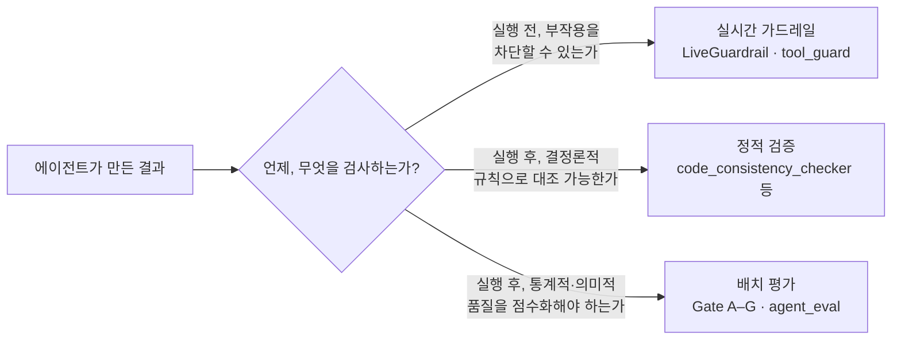

# 서문 — 이 책은 왜 Book-forge 자신을 예제로 삼는가

## ① AI 에이전트로 얻는 것 — 이 책이 지키려는 것

Book-forge 한 줄 요약: "주제만 주면(또는 코드 저장소만 가리키면) 기획→목차→집필까지 자동으로 진행해 HTML/PDF/EPUB/슬라이드를 만드는 도구." 이 도구가 실제로 주는 이득은 구체적이다 — 기획안 초안을 몇 초 만에 받아 저자는 "고치는" 작업부터 시작할 수 있고, 코드 저장소를 가리키면 실제 모듈·클래스·함수 목록을 목차 설계에 반영해 존재하지 않는 기능을 지어내지 않으며(`knowledge/code_index.py`의 구조적 코드 인덱싱), 챕터 하나하나를 저자가 손으로 쓰지 않고도 RAG로 실제 소스를 근거 삼아 초안을 채운다. 이 책 자체도 정확히 이 이득을 논증하는 사례다 — 다만 이 책은 그 파이프라인을 자동으로 돌리는 대신, 그 파이프라인을 **설명하기 위해** 사람이 직접 소스를 읽고 썼다(이유는 `00_기획안.md` §6).

## ② 문제 — 그 이득이 새는 지점

LLM은 그럴듯한 문장을 만드는 데 뛰어나고, 그 사실 자체가 위험의 근원이다. 실제로 존재하지 않는 Config 클래스 이름을 자신 있게 인용하고, 실제로는 도구 이름 목록일 뿐인 `ScopeConfig`를 파일 경로 검사기인 것처럼 서술하며, 같은 클래스를 챕터마다 `ToolCallAnalyzer`·`tool_call_analyzer`로 다르게 표기한다. 여러 챕터를 배치로 재생성하면 서로 다른 주제였던 챕터가 같은 소스 내용으로 드리프트하기도 한다 — 전부 이 프로젝트를 실제로 개발하며 실측으로 관측된 문제다. 파일 쓰기 같은 부작용이 있는 동작에서는 이야기가 더 심각해진다 — 프로젝트 디렉토리 밖에 쓰려 하거나, 같은 호출을 무한히 반복하거나, 여러 저자가 동시에 같은 챕터를 저장해 한쪽 작업을 조용히 덮어쓸 수 있다.

## ③ 해결 — Book-forge는 세 채널로 나눠 대응한다

이 책의 핵심 주장은 하나다 — **"품질을 보장한다"는 한 문장 뒤에는 성격이 전혀 다른 세 종류의 검사가 있고, 그 셋을 구분하지 않으면 무엇이 진짜로 검증되고 있는지 알 수 없다.**

| 채널 | 담당하는 문제의 성격 | Book-forge의 구현 |
|---|---|---|
| **배치 평가** | 생성이 끝난 뒤, "이 결과가 통계적으로/의미적으로 괜찮은가"를 점수로 채점 | `@agent_eval` 데코레이터 + Gate A–G(Agent-Evaluator SDK) |
| **정적 검증** | LLM 호출 없이, 결정론적 규칙으로 "이 서술이 사실과 다른가"를 대조 | `code_consistency_checker.py`·`demonstration_verifier.py`·`term_consistency_checker.py` |
| **실시간 가드레일** | 부작용이 있는 동작을 **실행되기 전에** 막을 수 있는가 | `LiveGuardrail`·`tool_guard`(`scaffold.py`·`editor/server.py`) |

## 장점·문제·해결채널 매핑표

이 책 15개 챕터가 아래 문제들에 각각 대응한다. 전체 부연 설명은 [부록 A](Appendix/A_Harness_Config_사용현황.md)를 참고하라.

| # | 예상되는 문제 | 해결 채널 | 담당 챕터 |
|---|---|---|---|
| 1 | 목표·제약이 결과에 실제로 반영됐는지 확인 불가 | 배치 평가(Gate A) | §8–9 |
| 2 | 결과물이 근거 없는 서술을 섞음(환각) | 배치 평가(Gate C, HallucinationDetector) | §9 |
| 3 | 언급한 코드 심볼이 실제로 존재하지 않음 | 정적 검증 | §10 |
| 4 | 생성된 실습 코드가 문법조차 유효하지 않음 | 정적 검증 | §10 |
| 5 | 여러 챕터가 같은 개념을 다르게 표기 | 정적 검증 | §10 |
| 6 | 리뷰 없이 결과가 그대로 확정됨 | 멀티에이전트 협업(Gate F 실증) | §5 |
| 7 | 챕터 하나만 판정되고 책 전체 품질을 못 봄 | 배치 평가(PerformanceMonitor.merge) | §11 |
| 8 | 파일 쓰기가 프로젝트 밖 경로를 침범하거나 무한 반복 | 실시간 가드레일(LoopDetection·경로 검사) | §12 |
| 9 | 여러 저자가 동시에 같은 챕터를 저장해 덮어씀 | 실시간 가드레일(TeamConcurrencyConfig) | §13 |
| 10 | 품질 기준이 프로젝트마다 다르게 조정되지 않음 | 배치 평가 설정(Gate 가중치·.env) | §14 |

> 이 매핑표에 없는 문제 — 예를 들어 "검증에서 낮은 점수가 나온 결과를 에이전트가 스스로 고쳐 쓰는 것" — 는 Book-forge가 아직 다루지 못하는 영역이다. §15(한계와 열린 문제)에서 이 경계를 정직하게 다룬다.

---

## 이 책과 Book-forge 소스의 관계

이 책은 Book-forge 저장소 안(`Book-forge/Book/`)에 있지만, Book-forge CLI로 만들어지지 않았다 — Book-forge와 Agent-Evaluator 소스 코드를 직접 읽고 사람이 쓴 독립 문서다(`00_기획안.md` §6). Book-forge SDK 자체의 사용법(CLI 명령·옵션)을 알고 싶다면 `Book-forge/README.md`를, Agent-Evaluator SDK의 전체 기능(58개 지표)을 알고 싶다면 `Agent-Evaluator/Media/Book/`(SDK 레퍼런스 도서)을 참고하라. 이 책은 그 둘 중 어느 것도 처음부터 설명하지 않고, 필요한 곳마다 해당 소스 파일로 직접 연결한다.

## 독자별 읽기 경로

| 독자 유형 | 권장 읽기 경로 |
|---|---|
| AI 에이전트 개념을 처음 잡고 싶은 개발자 | Part I(§1–3) → Part II(§4–7) |
| Agent-Evaluator SDK 도입을 검토 중인 팀 | Part III(§8–11) → Part IV(§12–15) |
| Book-forge 자체를 확장·기여하려는 개발자 | 전체(Part I → II → III → IV) → 부록 A |
| "이미 SDK는 아는데 실전 배선 예시가 필요하다" | Part III·IV만 순서대로 |

---

— Sungwoo Kim
