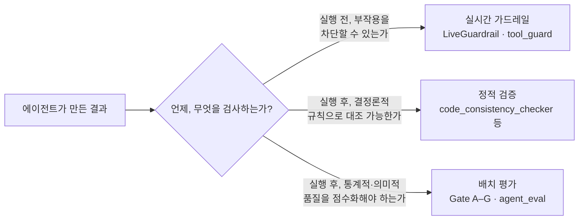

# 서문 — Book-forge로 읽는 AI 에이전트와 Harness Engineering

## ① AI 에이전트로 얻는 것 — 이 책이 지키려는 것

Book-forge를 한 줄로 정의하면 이렇다. "주제 하나만 주면(또는 코드 저장소 경로만 알려주면) 기획→목차→집필까지 자동으로 진행해 HTML·PDF·EPUB·발표자료까지 만들어내는 CLI 도구." 이 도구가 주는 이득은 막연하지 않고 구체적이다. 저자는 기획안 초안을 몇 초 만에 받아 "처음부터 쓰기"가 아니라 "고치기"부터 시작할 수 있다. 코드 저장소를 가리키면 실제 모듈·클래스·함수 목록을 목차 설계에 반영하므로, 존재하지 않는 기능을 지어내는 일이 줄어든다(`knowledge/code_index.py`의 구조적 코드 인덱싱). 챕터 한 편 한 편도 저자가 손으로 쓸 필요 없이, RAG(관련 자료를 먼저 검색해 LLM에 근거로 주는 기법 — 처음 듣는 단어라면 `00_Book_forge_둘러보기.md` §0.0을 먼저 보면 좋다)가 실제 소스를 근거 삼아 초안을 채운다. 이 책 자체도 정확히 이 이득을 증명하는 사례다. 다만 이 책은 그 파이프라인을 자동으로 돌리는 대신, 그 파이프라인을 **설명하기 위해** 사람이 직접 소스를 읽고 썼다(이유는 `00_기획안.md` §6에 있다).

## ② 문제 — 그 이득이 새는 지점

LLM은 그럴듯한 문장을 만드는 데 뛰어나다. 그런데 이 재능 자체가 위험의 근원이다. 실제로 존재하지 않는 Config 클래스 이름을 자신 있게 인용하기도 하고, 사실은 도구 이름 목록일 뿐인 `ScopeConfig`를 마치 파일 경로 검사기인 것처럼 서술하기도 한다. 같은 클래스를 챕터마다 `ToolCallAnalyzer`·`tool_call_analyzer`로 다르게 표기하는 것도 흔한 일이다. 여러 챕터를 한꺼번에 재생성하면 서로 다른 주제였던 챕터들이 같은 소스 내용으로 서서히 수렴해버리기도 한다. 전부 이 프로젝트를 실제로 개발하며 실측으로 관측된 문제들이다. 파일 쓰기처럼 되돌리기 어려운 동작에서는 이야기가 더 심각해진다. 프로젝트 디렉토리 밖에 쓰려 하거나, 같은 호출을 무한히 반복하거나, 여러 저자가 동시에 같은 챕터를 저장해 한쪽 작업을 조용히 덮어쓸 수도 있다.

## ③ 해결 — Book-forge는 세 채널로 나눠 대응한다

이 책의 핵심 주장은 하나다. **"품질을 보장한다"는 한 문장 뒤에는 성격이 전혀 다른 세 종류의 검사가 숨어 있고, 이 셋을 구분하지 못하면 무엇이 진짜로 검증되고 있는지 알 길이 없다.**

| 채널 | 담당하는 문제의 성격 | Book-forge의 구현 |
|---|---|---|
| **배치 평가** | 생성이 끝난 뒤, "이 결과가 통계적으로/의미적으로 괜찮은가"를 점수로 채점 | `@agent_eval` 데코레이터 + Gate A–G(Agent-Evaluator SDK) |
| **정적 검증** | LLM 호출 없이, 결정론적 규칙으로 "이 서술이 사실과 다른가"를 대조 | `code_consistency_checker.py`·`demonstration_verifier.py`·`term_consistency_checker.py` 등 |
| **실시간 가드레일** | 부작용이 있는 동작을 **실행되기 전에** 막을 수 있는가 | `LiveGuardrail`·`tool_guard`(`scaffold.py`·`editor/server.py`) |

> 이 세 채널 위에 하나가 더 있다. "이 채널들이 무엇을 기준으로 판정할지" 자체를 프로젝트마다 조정하는 **모니터 설정**(14장)이다. 채널이 아니라 채널의 다이얼에 가까워서 위 표에는 넣지 않았다. 15개 챕터를 다 읽은 뒤에는 `99_맺음말.md`가 이 네 축을 하나의 그림으로 다시 모아준다.

## 장점·문제·해결채널 매핑표

이 책 15개 챕터는 아래 문제들에 각각 대응한다. 각 행의 "담당 챕터" 열을 따라가면 자세한 설명을 찾을 수 있다.

| # | 예상되는 문제 | 해결 채널 | 담당 챕터 |
|---|---|---|---|
| 1 | 목표·제약이 결과에 실제로 반영됐는지 확인 불가 | 배치 평가(Gate A) | §8–9 |
| 2 | 결과물이 근거 없는 서술을 섞음(환각) | 배치 평가(Gate C, HallucinationDetector) | §9 |
| 3 | 언급한 코드 심볼이 실제로 존재하지 않음 | 정적 검증 | §10 |
| 4 | 생성된 실습 코드가 문법조차 유효하지 않음 | 정적 검증 | §10 |
| 5 | 여러 챕터가 같은 개념을 다르게 표기 | 정적 검증 | §10 |
| 6 | 리뷰 없이 결과가 그대로 확정됨 | 멀티에이전트 협업(Gate F 실증) | §5 |
| 7 | 챕터 하나만 판정되고 책 전체 품질을 못 봄 | 배치 평가(`PerformanceMonitor.merge()`) | §11 |
| 8 | 파일 쓰기가 프로젝트 밖 경로를 침범하거나 무한 반복 | 실시간 가드레일(LoopDetection·경로 검사) | §12 |
| 9 | 여러 저자가 동시에 같은 챕터를 저장해 덮어씀 | 실시간 가드레일(TeamConcurrencyConfig) | §13 |
| 10 | 품질 기준이 프로젝트마다 다르게 조정되지 않음 | 모니터 설정(Gate 가중치·`.env`) | §14 |

> 이 매핑표에 없는 문제도 있다. 예를 들어 "검증에서 낮은 점수가 나온 결과를 에이전트가 스스로 고쳐 쓰는 것"은 Book-forge가 아직 다루지 못하는 영역이다. §15(한계와 열린 문제)에서 이 경계를 숨기지 않고 정직하게 다룬다.

---

## 이 책이 다루는 범위 — Book-forge 하나, 그러나 그 이상

이 책은 Book-forge라는 구체적인 도구 하나를 처음부터 끝까지 뜯어본다. 하지만 목표는 그 도구 자체가 아니다. Part I(1~3장)은 먼저 "AI 에이전트"라는 말이 업계에서 대략 어떤 요소(추론 엔진·도구·메모리·오케스트레이션)의 조합을 가리키는지부터 정리한다. 그런 다음에야 Book-forge의 최소 정의로 들어간다(1장 §1.1). Book-forge를 한 번도 접해본 적 없어도, "에이전트"라는 단어 자체가 낯선 개발자도 자연스럽게 따라올 수 있게 하려는 순서다. Part II~IV는 그 에이전트들이 실제로 어떻게 협업하고(4~7장), 그 결과물의 품질을 어떻게 배치로 채점하고(8~11장), 어떻게 실행 전에 막고 프로젝트마다 다르게 조정하는지(12~15장)를 실제 코드로 따라간다. 각 챕터는 "직접 해보기" 상자로 끝난다. Book-forge 코드를 읽는 데서 그치지 말고, 같은 질문을 여러분 자신의 에이전트에도 한번 던져보라는 뜻이다.

## 이 책과 Book-forge 소스의 관계

이 책은 Book-forge 저장소 안(`Book-forge/Book/`)에 있지만, 정작 Book-forge CLI로 만들어지지는 않았다. 소스 코드를 직접 읽고 사람이 쓴 독립 문서다(`00_기획안.md` §6). Book-forge SDK 사용법이 궁금하면 `Book-forge/README.md`를, Agent-Evaluator SDK 전체(58개 지표)가 궁금하면 `Agent-Evaluator/Media/Book/`을 보면 된다. 이 책은 그 둘을 처음부터 다시 설명하지 않고, 필요한 곳마다 실제 소스 파일로 바로 연결한다.

## 독자별 읽기 경로

**바쁘다면**: `00_Book_forge_둘러보기.md` 하나만 먼저 읽으면 된다. 파이프라인 전체 그림, 용어, 재현 절차까지 1장에 들어가기 전에 한자리에 모아둔 장이다(완전 초심자라면 그 장의 §0.0부터). 시간이 더 있다면 아래 표로 자신에게 맞는 경로를 골라보자. 분량은 코드 블록을 눈으로만 훑을 때 기준이고, "직접 해보기"까지 손으로 따라 하면 1.5~2배 정도 더 걸릴 수 있다.

| 독자 유형 | 권장 읽기 경로 | 대략적인 분량 |
|---|---|---|
| AI 에이전트 개발이 아예 처음인 개발자 | 둘러보기 §0.0(용어) → §0.1–0.6(§0.6에서 직접 설치·실행) → Part I(§1–3, §1.1의 일반 개념부터) — 막히는 용어가 나오면 [부록 A 용어집](Appendix/A_용어집.md)으로 | 약 1.5~2시간 |
| AI 에이전트 개념을 처음 잡고 싶은 개발자 | 둘러보기 → Part I(§1–3) → Part II(§4–7) | 약 3시간 |
| Agent-Evaluator SDK 도입을 검토 중인 팀 | 둘러보기(특히 §0.4) → Part III(§8–11) → Part IV(§12–15) | 약 3.5시간 |
| Book-forge 자체를 확장·기여하려는 개발자 | 둘러보기 → 전체(Part I → II → III → IV) → 맺음말 → 부록 A·B | 약 6~7시간(한 번에 다 읽기보다 여러 세션에 나누길 권한다) |
| 이미 SDK는 아는데 실전 배선 예시가 필요하다 | Part III·IV만 순서대로(둘러보기는 건너뛰어도 무방) | 약 2시간 |

---

— Sungwoo Kim
