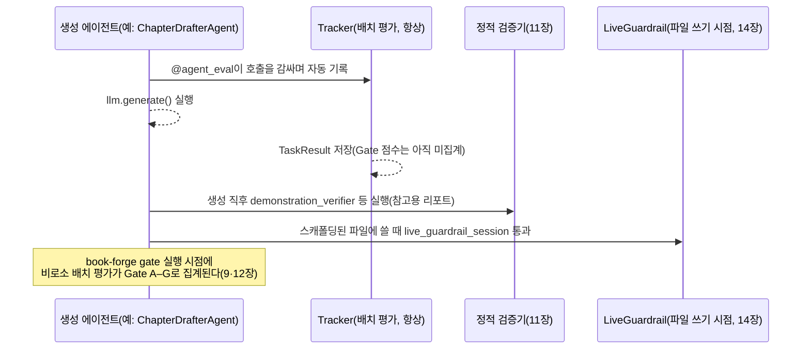

# 맺음말 — 지도를 다시 펼친다

1~2장은 본격적으로 코드를 파헤치기 전, 이 책 전체의 지도 한 장을 미리 보여줬다. 17개 챕터를 다 읽은 지금, 그 지도를 다시 펼쳐볼 차례다. 이번에는 각 칸이 더 이상 낯선 이름이 아니라, 실제 코드를 직접 읽은 자리다.

## 세 층, 다시 한번

2장(§2.1)이 미리 잡아둔 뼈대를 그대로 가져온다.

| 층 | 그때는 정의였다 | 지금은 이렇게 안다 |
|---|---|---|
| **Tracker** | "데이터를 쌓고 계산하는, 항상 켜진 객체" | `LatencyTracker.record_latency()`/`get_latency_stats()`(9장 §9.1)를 직접 읽었다 — "쌓기 → 계산하기" 패턴이 25개 트래커 전부에 반복된다는 것도 안다 |
| **Config** | "에이전트별로 판정 기준을 조정하는 dataclass" | `GoalAlignmentConfig`(2장)부터 `TeamConcurrencyConfig`(15장)까지, 14개 에이전트가 왜 서로 다른 조합을 골랐는지(8장 §8.6의 결정 트리)까지 설명할 수 있다 |
| **Gate** | "여러 신호를 모아 점수 하나로 만드는 최종 축" | Gate A의 실제 가중 평균 공식(9장 §9.4)과, 그 공식이 N/A를 어떻게 다루는지(§9.3)까지 안다 |

그리고 배치 평가와는 완전히 다른 축이 하나 더 있었다. 실행 **전에** 막는 `LiveGuardrail`/`@tool_guard`(14장), 그리고 그 메커니즘이 팀 동시성이라는 전혀 다른 문제에 재사용되는 것(15장)까지 봤다. 정적 검증(11장)과 모니터 설정(16장)까지 더하면 네 축이다. 10장과 13장은 새 축을 추가하지 않는다 — 이미 있는 배치 평가 축을 **어떻게 설계하고**(10장) **어떻게 지속시키는지**(13장)를 각각 다룬 메타 레이어다. 한 챕터가 만들어지는 순간, 이 넷은 이런 순서로 개입한다.

**"이 챕터는 품질이 보장됐는가"라는 질문의 정직한 답은 "어느 축을 말하는가에 따라 다르다"다.** 정적 검증을 통과했어도 Gate C(신뢰성) 점수가 낮을 수 있고, `book-forge gate`가 아직 안 돌았다면 배치 평가 축은 아직 아무 판정도 내리지 않은 상태다. 이 넷을 하나의 "품질 보장"으로 뭉뚱그리지 않는 것이, 이 책이 17개 챕터에 걸쳐 반복해온 유일한 주장이다.

## 네 가지 협업 — 각 챕터가 따로 답하지 않은 질문: "언제 어느 것을 쓰는가"

Part II의 네 챕터는 각자 자기 패턴이 무엇인지는 답했지만, "그럼 언제 어느 패턴을 골라야 하는가"는 어느 챕터도 정면으로 묻지 않았다. 네 패턴을 나란히 놓으면 답이 보인다. 가르는 기준은 **"이전 단계의 결과를 다음이 검증 없이 그대로 믿어도 되는가"** 하나다.

- 믿어도 된다면 **순차 파이프라인**(4장)으로 충분하다 — Planner의 출력을 TOCDesigner가 그대로 받아쓴다.
- 결과 하나를 여러 관점에서 재확인해야 한다면 **검토자-편집장**(5장)이 필요하다 — 순차 구조로는 "이 결과가 맞는가"라는 질문 자체를 할 수 없다.
- 확인의 주체가 코드가 아니라 사람이어야 한다면(주관적 판단이 필요하면) **사람-에이전트 루프**(6장)로 넘어간다.
- 애초에 같은 세션에 있지 않은 두 프로세스가 지식을 나눠야 한다면 **파일 매개 간접 협업**(7장)만 남는다.

이 넷은 서로 대체재가 아니라 **신뢰 경계가 어디 있는가에 대한 네 가지 다른 답**이다. Book-forge의 실제 파이프라인(1장 §1.1)이 이 넷을 전부 쓰는 이유도 여기 있다. 한 파이프라인 안에서도 단계마다 신뢰 경계의 위치가 다르기 때문이다.

## Book-forge 전체 인벤토리 — 컴포넌트별 상세는 8장으로

Book-forge 한 권 분량 파이프라인은 LLM 에이전트 14개, 실시간 가드레일 2개(스캐폴딩·웹 에디터 저장), 정적 검증기 5개(11장), 총 21개 컴포넌트로 이뤄진다. "각 컴포넌트가 무엇을 하고, 무엇을 보장해야 하고, agent-evaluator가 그걸 어떻게 재고 처리하는가"는 8장이 파이프라인 실행 순서대로 이미 표로 완결해뒀다 — 여기서 다시 나열하지 않는다.

이 절에서는 8장이 다루지 않은 한 가지만 덧붙인다. **어느 것이 4가지 협업 패턴 중 무엇에 속하는가**다.

| 협업 패턴 | 참여하는 컴포넌트 |
|---|---|
| 순차 파이프라인(4장) | PlannerAgent → TOCDesignerAgent → ScaffoldAgent → (ChapterDrafterAgent \| ReferenceTableAgent \| DiagramGeneratorAgent \| CapstoneGeneratorAgent \| ModuleReferenceAgent) |
| 검토자-편집장(5장) | ReviewerAgent × N → ChiefEditorAgent |
| 사람-에이전트 루프(6장) | `revise()` + 저자(사람) |
| 파일 매개 간접 협업(7장) | 생성 에이전트(쓰기) ↔ ChatAgent(읽기), `ConversationSession` |

`ResearchAgent`·`AlternativeSuggesterAgent`·`SlideCondenserAgent`(8장 §8.3·§8.5)는 이 네 패턴 어디에도 깔끔하게 들어가지 않는다. 각자 독립된 CLI 명령에서 단발로 호출되는, 협업이라기보다 파이프라인에 매달린 보조 단계에 가깝다. 이 역시 정직한 관찰이다. Book-forge의 모든 에이전트가 거창한 협업 구조에 속해 있는 것은 아니다.

## 이 책이 정직하게 남긴 빈칸

17장이 이미 밝혔듯, 이 책은 Book-forge를 완결된 정답으로 그리지 않았다. 검증은 하지만 스스로 고치지는 못하고, 클라이언트가 자발적으로 지켜야만 작동하는 방어가 있고, 지식창고는 의도적으로 단순한 대신 규모의 한계가 있다. **이 빈칸들을 숨기지 않고 남겨둔 것 자체가 이 책의 방법론이다.** 기획안 §2가 처음부터 약속한 "정확성이 핵심 가치"라는 원칙은, 잘 되는 부분만큼이나 안 되는 부분을 정확히 말하는 데서도 지켜져야 한다.

## 이제 여러분 차례다

이 책은 Book-forge 하나를 통해 읽었지만, 각 챕터의 "직접 해보기"가 반복해서 요구한 것은 하나였다. **여러분의 에이전트라면 어떨까.** 3장의 다섯 실패 유형 체크리스트, 8장의 Config 결정 트리, 17장의 "검증은 하지만 못 고치는 지점 찾기" — 이 세 가지를 여러분이 지금 만들고 있는(또는 만들 계획인) 에이전트에 순서대로 적용해보면, 이 책이 Book-forge에 대해 17개 챕터에 걸쳐 한 일을 여러분의 프로젝트에 대해 훨씬 짧은 시간에 해낼 수 있다. 이 세 가지에 10·13장의 가중치 설계·CI 자동화까지 더해 한 번에 순서대로 밟아보고 싶다면, [부록 D. 실전 체크리스트](Appendix/D_실전_체크리스트.md)가 Book-forge 이야기를 걷어낸 채로 그 순서만 모아뒀다.

Harness Engineering은 하나의 정답 아키텍처가 아니라, "이 에이전트가 정확히 무엇을 하는가"를 먼저 좁게 규정한 뒤 그 범위에 맞는 계측·방어만 정확히 고르는 태도에 더 가깝다. 이 책 전체가 반복해온 그 한 문장이, 이 책이 남기는 유일한 결론이다.

---

> 이 책의 근거는 특정 커밋 시점의 소스 코드다(기획안 참고). Book-forge와 Agent-Evaluator는 계속 바뀐다. 최신 상태를 알고 싶다면 언제나 이 책이 인용한 실제 파일로 돌아가라. 그 습관 하나가, 이 책이 가르치려 한 것 중 가장 오래 남을 것이다.

— Sungwoo Kim
