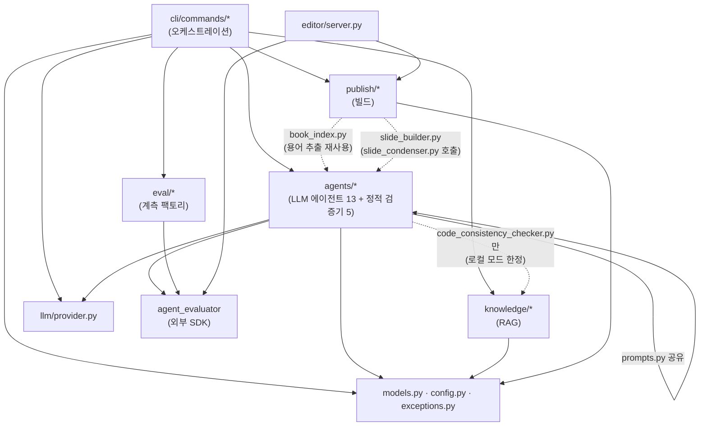

# 부록 C. 프로젝트 아키텍처 지도

> 이 부록은 새 개념을 설명하지 않는다. Book-forge 소스 전체(약 58개 실질 파일)가 어떤 패키지로 나뉘고, 각 파일이 무엇을 책임지며, 어느 챕터에서 다뤄지는지 한자리에 모아둔 **참조용 지도**다. 처음부터 끝까지 읽을 필요는 없다. 본문을 읽다가 낯선 파일 이름이 나올 때 돌아와 찾아보는 용도로 쓰면 된다.

---

## C.1 프로젝트 아키텍처 — 패키지 구조와 의존 라이브러리

Book-forge의 실제 코드는 `src/book_forge/` 아래 7개 서브패키지(+ 루트 3개 모듈)로 나뉜다. 이 절은 "어떤 묶음이 무슨 일을 하는가"를 30,000피트 상공에서 조망한다. 각 파일의 역할은 바로 다음 절(C.2)에서 표로 정리한다.

```
src/book_forge/
├── models.py, config.py, exceptions.py   # 루트 — 목차 데이터 모델·설정·예외 계층(3개 파일, 특정 패키지에 속하지 않음)
├── llm/            # LLM Protocol + OpenAI·Anthropic·Ollama 통합(provider.py 1개 파일)
├── agents/         # LLM 에이전트 13개 + @tool_guard 1개(scaffold) + 정적 검증기 5개 + 프롬프트 상수 1개
├── knowledge/      # RAG — 소스 어댑터·임베딩·지식창고·구조적 코드 인덱싱(7개 파일)
├── publish/        # 마크다운 → HTML/PDF/EPUB/Slides(9개 파일)
├── editor/         # Flask 웹 에디터(server.py 1개 파일)
├── eval/           # PerformanceMonitor 팩토리(2개 파일)
└── cli/            # click 진입점 + 13개 서브커맨드(15개 파일)
```

`__init__.py`처럼 실질적인 로직이 없는 빈 파일을 제외하면 약 58개 파일, 총 7,019줄(조사 시점 `wc -l` 기준)이 Book-forge 전체 구현이다. 이 책이 지금까지 인용해온 코드는 전부 이 58개 파일 중 일부다.

의존 라이브러리는 `pyproject.toml`이 코어와 옵트인 extra를 명확히 나눈다:

| 구분 | 라이브러리 | 어디서 쓰는가 |
|---|---|---|
| 코어(항상 설치) | `click` | `cli/` 전체 — 커맨드 정의 |
| 코어 | `python-dotenv` | `config.py` — `.env` 로드 |
| 코어 | `pydantic` | (설정 검증용으로 선언돼 있으나 이 책이 다루는 핵심 경로에서는 직접 노출되지 않는다) |
| 코어 | `markdown` | `publish/markdown_engine.py` — `md_to_html()`의 실제 변환 엔진 |
| 코어 | `requests` | `knowledge/embeddings.py`(Ollama API), `knowledge/web_search.py`, `knowledge/sources.py`(URL 소스) |
| 코어 | `agent-evaluator>=0.9.9` | `agents/*`(`@agent_eval`/`@tool_guard`), `eval/monitor.py`, `cli/commands/gate_cmd.py` |
| `[pdf]` | `playwright` | `publish/pdf_builder.py` — Chromium headless 인쇄 |
| `[rag]` | `pypdf`, `numpy` | `knowledge/pdf_source.py`(PDF 추출), `knowledge/store.py`(코사인 유사도 행렬 연산) |
| `[serve]` | `flask` | `editor/server.py` |
| `[korean]` | `agent-evaluator[korean]` | `eval/monitor.py`의 `use_korean_tokenizer=True`가 기대하는 형태소 분석기 |

> ⚠️ **`pyproject.toml`에 없는 의존성**: `llm/provider.py`는 provider로 OpenAI 또는 Anthropic을 선택했을 때만 `from openai import OpenAI` / `from anthropic import Anthropic`을 함수 내부에서 지연 import한다. 두 SDK 모두 `pyproject.toml`의 어떤 의존성 목록에도 선언돼 있지 않다. 기본값인 Ollama만 쓰면 이 문제를 겪을 일이 없지만, `LLM_PROVIDER=openai`로 전환하려면 `pip install openai`를 별도로 실행해야 한다. 이 책이 반복해서 강조하는 "관대한 파싱, 그러나 숨겨진 전제조건은 정직하게 문서화한다"는 원칙이 놓치기 쉬운 지점이 바로 여기다.

이 8개 패키지 전부가 공통으로 따르는 두 가지 배선 패턴(`build_X(llm, monitor) -> Fn` 팩토리, `@agent_eval` vs `@tool_guard`의 축 구분)은 이미 이 책의 핵심 주제이므로 2·8·14장에서 각각 코드로 따라간다. 이 절은 "그 패턴들이 정확히 어느 파일에 있는가"의 지도 역할만 한다.

## C.2 파일별 책임 지도

아래 표는 Book-forge 소스 전체(58개 실질 파일)를 패키지별로 나눠, 각 파일의 책임과 이 책에서 주로 다루는 곳을 정리한 것이다. 처음 읽을 때 전부 외울 필요는 없다.

### 루트 모듈

| 파일 | 책임 | 핵심 요소 |
|---|---|---|
| `models.py` | 목차 데이터 모델 — `ChapterSpec`, ` ```toc ` 매니페스트 파싱, 목차 개정 이력 조작 | `ChapterSpec`, `parse_toc_manifest()`, `append_toc_revision_entries()` |
| `config.py` | `~/Documents/BookForge/` 데이터 디렉토리 관리, `.env` 경로 해석 | `get_data_dir()`, `load_config()`, `project_dir_for()` |
| `exceptions.py` | 예외 계층 | `BookForgeError`(base), `MissingAPIKeyError`, `LLMProviderError`, `TocParseError` 등 |

### `llm/` — LLM 통합

| 파일 | 책임 | 핵심 요소 |
|---|---|---|
| `llm/provider.py` | OpenAI/Anthropic/Ollama를 하나의 인터페이스로 통합, provider별 SDK 지연 로딩, 빈 응답을 예외로 전파 | `LLM`(Protocol), `OpenAILLM`/`AnthropicLLM`/`OllamaLLM`, `create_llm()`, `_require_non_empty()` |

### `agents/` — LLM 호출 에이전트(13개, `build_X(llm, monitor) -> Fn` 팩토리 + `@agent_eval`)

| 파일 | 책임 | 담당 챕터 |
|---|---|---|
| `agents/planner.py` | PlannerAgent — 주제/제약 → 기획안 마크다운 | 2장 |
| `agents/toc_designer.py` | TOCDesignerAgent — 기획안(+코드 구조) → 목차 마크다운 | 4장 |
| `agents/chapter_drafter.py` | ChapterDrafterAgent — narrative/exercise 서술형 챕터 초안(기본 생성기) | 7장 |
| `agents/reference_table.py` | ReferenceTableAgent — RAG 소스에서 구조화된 사실만 표로 추출 | 7장 |
| `agents/diagram_generator.py` | DiagramGeneratorAgent — RAG 소스 → Mermaid 다이어그램 중심 챕터 | 7장 |
| `agents/capstone_generator.py` | CapstoneGeneratorAgent — 빈 템플릿+모범 정답을 한 번의 호출로 생성 | 7장 |
| `agents/module_reference.py` | ModuleReferenceAgent — 구조적 코드 인덱싱 결과를 빠짐없이 표로 정리(전체 커버리지) | 7장 |
| `agents/alternative_suggester.py` | AlternativeSuggesterAgent — 저커버리지 상황에서 자동 차단 대신 대안 제시 | 3장 |
| `agents/chat_agent.py` | ChatAgent — 지식창고 발췌+대화 이력 기반 Q&A | 7장 |
| `agents/research_agent.py` | ResearchAgent — 챕터 제목 → 검색 쿼리 생성(검색 자체는 `knowledge/web_search.py`) | 7장 |
| `agents/review_loop.py` | AuthorReviewLoop — 저자 피드백에 따른 반복 개정(`run_review_loop()`는 LLM 미호출 순수 오케스트레이션) | 6장 |
| `agents/review_panel.py` | ReviewerAgent(정확성/가독성)·ChiefEditorAgent — 감독자-작업자 다관점 리뷰 | 5장 |
| `agents/slide_condenser.py` | SlideCondenserAgent — 책 섹션 하나 → 슬라이드 한 장 | (범위 밖) |

### `agents/` — 그 외(LLM 호출 방식이 다르거나 아예 안 하는 7개 파일)

| 파일 | 책임 | 비고 |
|---|---|---|
| `agents/scaffold.py` | ScaffoldAgent — 승인된 목차 → 빈 챕터 스텁 생성 + 목차 재조정 | `@agent_eval`이 아니라 `@tool_guard`(부작용 있는 파일 쓰기, 실행 전 차단 대상) — 14장 |
| `agents/prompts.py` | 위 13개 에이전트 중 다수가 공유하는 프롬프트 템플릿 문자열 저장소 | 순수 상수 모듈, LLM 미호출 |
| `agents/demonstration_verifier.py` | content_type별 생성 후 정적 검증(exercise 문법·diagram 구조·capstone TODO 등) | LLM 미호출, `@agent_eval` 없음 — 11장 |
| `agents/code_consistency_checker.py` | 본문의 import/백틱 심볼이 실제 target_package에 존재하는지 대조 | LLM 미호출 — 11장 |
| `agents/sdk_version_pin.py` | `--check-package` 대상 버전을 프로젝트별로 최초 1회 고정, 드리프트 경고 | LLM 미호출 — 11장 |
| `agents/code_example_verifier.py` | python 코드 블록을 subprocess로 실제 실행해 exit code 검증(`--execute-examples`) | LLM 미호출 — 11장 |
| `agents/term_consistency_checker.py` | 챕터 간 백틱 기술 용어 표기 불일치 후보 검출 | LLM 미호출 — 11장 |

### `knowledge/` — RAG

| 파일 | 책임 | 담당 챕터 |
|---|---|---|
| `knowledge/store.py` | `KnowledgeStore` — numpy 인메모리 코사인 유사도 벡터 스토어, JSON 영속화 | 7장 |
| `knowledge/embeddings.py` | Ollama `/api/embeddings` 호출 래퍼(RAG는 항상 Ollama만 사용) | 7장 |
| `knowledge/sources.py` | PDF/코드저장소/텍스트/URL을 동일한 청크 리스트로 변환하는 소스 어댑터 라우터 | 7장 |
| `knowledge/pdf_source.py` | PDF → 텍스트 → 고정폭 슬라이딩 청크 | 7장 |
| `knowledge/web_search.py` | DuckDuckGo HTML 엔드포인트 검색(API 키 불필요) | 7장 |
| `knowledge/code_index.py` | Python `ast`로 모듈/클래스/함수 인벤토리 + 의존관계 정적 분석 | 4·7장 |
| `knowledge/lifecycle.py` | 지식창고 청크를 소스 태그별로 집계(`book-forge knowledge status`) | (범위 밖) |

### `publish/` — 빌드

| 파일 | 책임 | 비고 |
|---|---|---|
| `publish/config.py` | `BookConfig` — HTML/PDF/EPUB/Slide 엔진 공통 설정 dataclass | 이 책 범위 밖(README 참고) |
| `publish/front_matter.py` | `FrontMatter` — 저자/저작권/판 메타데이터를 별도 JSON으로 분리 저장 | 〃 |
| `publish/toc_loader.py` | `01_목차.md` 매니페스트 → 실제 파일 경로가 채워진 `ResolvedChapter` 목록 | 4장 |
| `publish/book_index.py` | 책 전체 찾아보기(색인) 항목 빌드(`term_consistency_checker`의 용어 추출 재사용) | 〃 |
| `publish/markdown_engine.py` | `md_to_html()` — mermaid/커스텀 HTML/코드 보존 3단계 마크다운 변환 엔진(공용) | 〃 |
| `publish/html_builder.py` | 전체 도서를 단일 HTML 파일로 빌드(사이드바 내비게이션 자동 생성) | 〃 |
| `publish/pdf_builder.py` | Playwright(Chromium headless)로 챕터별 개별 PDF 인쇄 | 〃 |
| `publish/epub_builder.py` | 순수 `zipfile`(표준 라이브러리)로 EPUB 3 컨테이너 조립 | 〃 |
| `publish/slide_builder.py` | 마크다운 챕터 → Reveal.js 발표자료(`slide_condenser.py` 호출) | 〃 |

### `editor/`, `eval/`

| 파일 | 책임 | 담당 챕터 |
|---|---|---|
| `editor/server.py` | Flask 웹 에디터 — Part/Chapter MD 편집 + 팀 동시성 클레임 충돌 방지 | 15장 |
| `eval/monitor.py` | `PerformanceMonitor` 팩토리 — 한국어 형태소 토크나이저, Gate 가중치 `.env` 오버라이드 | 16장 |
| `eval/gate_summary.py` | 방금 저장된 평가 결과 JSON에서 Gate A–G 점수를 즉시 읽어 CLI에 표시 | 9장 |

### `cli/` — 명령 오케스트레이션

| 파일 | 책임 | 담당 챕터 |
|---|---|---|
| `cli/main.py` | click 그룹 진입점 — 13개 서브커맨드 등록 | 1장 §1.2 |
| `cli/project_utils.py` | 슬러그 → `BookConfig` 해석 공통 유틸 — 13개 서브커맨드 중 `new`·`home`·`init` 3개를 뺀 10개(`build`·`draft`·`edit`·`gate`·`plan`·`chat`·`research`·`review`·`lint`·`knowledge`)가 `load_book_config()`/`resolve_project_dir()`를 공유 | (범위 밖) |
| `cli/commands/new_cmd.py` | `book-forge new` — 기획~스캐폴딩 오케스트레이션, `--source` 배치 초안 연쇄 | 4장 |
| `cli/commands/draft_cmd.py` | `book-forge draft` — RAG 초안 생성 오케스트레이션(733줄, 가장 큰 파일) | 7장 |
| `cli/commands/gate_cmd.py` | `book-forge gate` — 여러 챕터 결과 병합 + `agent-eval gate` CLI 위임 + CI 연동 플래그 | 9·12·13장 |
| `cli/commands/plan_cmd.py` | `book-forge plan` — 기획/목차 재검토, `--revise` 재승인 루프 | 6장 |
| `cli/commands/review_cmd.py` | `book-forge review` — 리뷰 패널 호출 래퍼 | 5장 |
| `cli/commands/chat_cmd.py` | `book-forge chat` — 지식창고 기반 대화형 Q&A REPL | 7장 |
| `cli/commands/research_cmd.py` | `book-forge research` — 검색 쿼리 생성 → 웹 검색 → 저자 선택 → 지식창고 추가 | 7장 |
| `cli/commands/lint_cmd.py` | `book-forge lint` — 챕터 간 용어 불일치 발견·보고 | 11장 |
| `cli/commands/build_cmd.py` | `book-forge build html\|pdf\|epub\|slides` 서브그룹 | (범위 밖) |
| `cli/commands/edit_cmd.py` | `book-forge edit` — 웹 에디터 서버 실행 | 15장 |
| `cli/commands/init_cmd.py` | `book-forge init` — LLM provider/API 키 대화형 `.env` 설정 마법사 | (범위 밖) |
| `cli/commands/home_cmd.py` | `book-forge home` — 데이터/프로젝트 폴더를 OS 파일 탐색기로 열기 | (범위 밖) |
| `cli/commands/knowledge_cmd.py` | `book-forge knowledge status\|reset` | (범위 밖) |

## C.3 모듈 간 관계 — 누가 누구를 부르는가

파일 수십 개 전부를 하나의 그래프에 그리면 알아볼 수 없으므로, 패키지 단위로 뭉쳐 실제 import 관계를 그린다. 화살표는 전부 실제 `from book_forge.X import Y` 문을 근거로 삼았다.



이 그래프에서 눈에 띄는 비대칭이 두 가지 있다.

1. **`agents/`는 `knowledge/`를 몰라도 대부분 동작한다.** RAG 소스(`sources`)는 `cli/commands/draft_cmd.py`가 `knowledge/store.py`에서 미리 꺼내 문자열로 넘겨주므로, 대부분의 에이전트 함수는 `KnowledgeStore` 객체 자체를 본 적이 없다. 유일한 예외는 `agents/code_consistency_checker.py`(점선 화살표)다. 이 파일만 로컬 디렉토리 모드에서 `knowledge/code_index.py`를 직접 지연 import한다.
2. **`publish/`는 원칙적으로 `agents/`를 몰라야 하는 레이어지만(빌드는 집필과 무관한 별도 단계), 실제로는 두 파일이 예외다.** `publish/book_index.py`는 `agents/term_consistency_checker.py`의 용어 추출 함수(순수 함수, LLM 미호출)를 재사용한다. 찾아보기(색인)를 만들 때 "이미 있는 로직을 새로 만들지 않는다"고 판단해 생긴 얕은 예외다. `publish/slide_builder.py`는 이보다 근본적으로 의존한다. 챕터 섹션을 슬라이드 한 장으로 압축하는 작업 자체를 `agents/slide_condenser.py`의 `build_condense_section()`(LLM 호출 에이전트)에 위임하기 때문이다. 그래서 "빌드는 집필과 무관하다"는 원칙이 발표자료 빌드에는 처음부터 적용되지 않는다.

`editor/server.py`가 `publish/`(마크다운 렌더링)와 `agent_evaluator`(팀 동시성 가드레일) 둘만 직접 의존하고 `agents/`나 `knowledge/`는 전혀 모른다는 점도 이 그래프에서 확인할 수 있다. 웹 에디터는 "사람이 직접 쓴 텍스트를 저장·미리보기"할 뿐, LLM을 한 번도 호출하지 않는다.

---

## 참고 자료

- `Book-forge/README.md` — CLI 전체 옵션과 설치 방법
- `Book-forge/CLAUDE.md` — 프로세스 아키텍처 전체 다이어그램과 파일 구조
- 1장(§1.1~§1.3) — Book-forge 파이프라인 전체 그림과 CLI 명령 표(이 부록보다 앞서, 개념 위주로 다룸)
