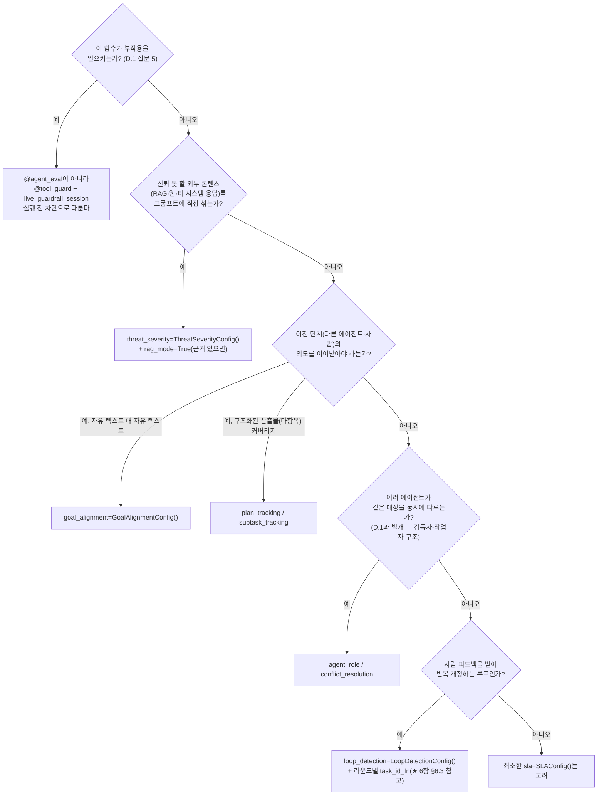
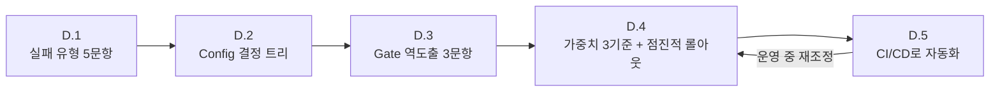

# 부록 D. Agent-Evaluator 적용 실전 체크리스트

> 이 부록은 새 개념을 설명하지 않는다. 3·8·9·10·13·16장에 흩어져 있던 방법론(실패 유형 분류 → Config 결정 → 가중치 설계 → CI 자동화 → 프로젝트별 조정)을 **Book-forge 이야기 없이, 여러분 자신의 프로젝트에 바로 적용할 수 있는 순서**로 재조합한 실전 체크리스트다. 각 절 끝의 "돌아갈 곳"이 그 방법론을 실제 코드로 확인한 챕터를 가리킨다 — 근거가 필요하면 그곳으로 돌아가면 된다.

---

## D.1 1단계 — 이 에이전트가 실패할 수 있는 방식을 먼저 나열한다

Gate나 Config 이름부터 고르지 않는다. 먼저 다섯 질문에 "예/아니오"로 답한다(3장이 Book-forge에서 실측으로 관측한 실패 유형을 일반화한 것).

| # | 질문 | "예"라면 이후 필요해지는 것 |
|---|---|---|
| 1 | 이 에이전트가 **추론(thinking) 모델**을 쓰거나, 토큰 예산이 빠듯한가? | 무응답(빈 응답) 방어 — provider 레벨의 "빈 문자열은 예외로 전파" 원칙 |
| 2 | 이 에이전트가 **사실을 생성**하는가(코드 심볼·수치·인용 등)? | 환각 대응 — Gate C(`HallucinationDetector`) + 정적 검증 |
| 3 | 이 에이전트를 **배치로 여러 번** 돌리는가(같은 세션에서 여러 태스크를 연달아)? | 드리프트 대응 — 소스/컨텍스트가 한 항목에 쏠리지 않게 하는 균형 로직 |
| 4 | 이 에이전트가 **도구를 반복 호출**할 수 있는가(재시도 로직, 루프)? | 반복 방어 — `LoopDetectionConfig` |
| 5 | 이 에이전트가 **파일을 쓰거나 부작용**을 일으키는가? | 경로/스코프 검사 — `@tool_guard` + 직접 구현한 경계 검사 |

다섯 질문에 전부 "아니오"라면(순수 텍스트 생성, 반복 없음, 부작용 없음), Gate A(목표 달성) 하나만으로 충분할 수 있다. 방어를 적게 쓰는 것 자체는 실패가 아니다 — 이 질문들에 답이 없는 위험을 미리 막으려 하지 않는 것이 오히려 원칙이다.

**돌아갈 곳**: 3장(§3.6, 실패 유형 표) · 8장(§8.6, Config 결정 트리)

---

## D.2 2단계 — Config를 결정 트리로 고른다(Gate에서 출발하지 않는다)

D.1에서 "예"가 나온 항목이 있다면, 아래 순서로 실제 Harness Config를 고른다. 이 플로차트는 8장(§8.6)의 결정 트리를 Book-forge 특정 에이전트 이름 없이 일반화한 것이다.

★ 표시가 있는 분기는 특히 주의가 필요하다. "여러 번 왕복하는 대화/개정 루프"라고 해서 SDK의 다회 대화 전용 데코레이터(`conversation_eval` 계열)를 반사적으로 고르면 안 된다. 실제로 그 루프 안의 반복 탐지(`LoopDetectionConfig`)가 작동하려면 **각 라운드가 독립된 채점 단위로 기록돼야** 하는데, 문서만 보고 고른 API가 그 구조를 지원하지 않을 수 있다. 6장(§6.3)이 이 함정을 실제 SDK 소스 확인으로 피해간 사례다 — 새 SDK 기능을 쓰기 전에 "이 API가 내가 필요한 신호를 실제로 만들어내는가"를 소스에서 직접 확인하는 습관이 여기서 나온다.

**돌아갈 곳**: 2장(§2.1, Tracker·Config·Gate 세 층) · 5장(§5.2, `AgentRoleConfig`) · 6장(§6.3, `conversation_eval`을 안 쓴 이유) · 8장(전체) · 9장(§9.3, N/A가 결함이 아닌 이유)

---

## D.3 3단계 — Gate를 실패 모드에서 거꾸로 도출한다

Config를 다 골랐다면, 이번에는 "이 에이전트가 망가지는 방식"을 세 질문으로 분류해 어떤 Gate가 그 신호를 잡아야 하는지 정한다(10장 §10.2의 방법론).

1. **망했다는 것을 어떻게 아는가?** → 대개 Gate A(목표 달성)/Gate C(신뢰성)
2. **잘못된 방향으로 가고 있다는 것을 어떻게 아는가?** → 대개 Gate B(반복)/Gate F(다중 에이전트 조정)/Gate G(설명 가능성)
3. **겉으로는 잘 돌아가지만 내부에서만 문제가 생기는 경우는?** → 대개 Gate D(성능)/Gate E(보안)

하나의 실패가 여러 Gate에 동시에 걸쳐도 된다 — 1:1 매핑을 억지로 강제할 필요는 없다. 반대로 세 질문 중 답이 안 나오는 게 있다면, 그 Gate는 이 에이전트에 필요하지 않다는 뜻이다(N/A로 남는 것이 정상).

**돌아갈 곳**: 9장(§9.2, Gate별 실제 기여 매핑) · 10장(§10.2)

---

## D.4 4단계 — 가중치를 세 기준으로 정한다

Gate가 정해졌다면, 그 Gate가 최종 점수에서 얼마나 무겁게 반영돼야 하는지를 아래 세 기준으로 판단한다(10장 §10.3).

| 기준 | 질문 | 무게를 올려야 하는 경우 |
|---|---|---|
| **회복 난이도** | 이 실패가 일어나면 되돌리기 얼마나 어려운가? | 보안·PII 유출처럼 사후 복구가 사실상 불가능한 경우 |
| **발생 빈도** | 이 신호가 실제로 자주 발생하는가? | 자주 걸리는 실패일수록 무게를 올릴 근거가 생긴다(반대로 개념상으로만 있고 실측으로 거의 안 걸리는 신호에 기본 가중치를 높게 주면 잡음만 늘어난다) |
| **사용자 가시성** | 사용자가 이 실패를 직접 목격하는가? | "파일이 생겼다"처럼 완료 자체는 보이지만 품질은 안 보이는 경우, 완료율보다 품질 지표 쪽에 무게를 더 준다 |

**점진적 롤아웃 원칙**(10장 §10.4): 처음부터 정확한 숫자를 맞히려 하지 않는다. 모든 가중치를 SDK 기본값(또는 1.0)으로 시작해 몇 차례 실제로 돌려본 뒤, **실제로 문제를 일으킨 신호만** 올린다. 처음부터 세게 걸면 팀이 게이팅 자체를 회피하게 된다.

**돌아갈 곳**: 10장(§10.3·§10.4)

---

## D.5 5단계 — 사람 손을 거치지 않고 지속시킨다(CI/CD)

측정이 "사람이 실행을 기억하는가"에 의존하면, 그 순간의 품질 하락은 결국 아무에게도 보고되지 않는다(13장 §13.1). 다음 순서로 자동화한다.

1. 품질이 만족스러운 시점에 현재 결과를 **기준선(baseline)**으로 저장한다.
2. CI에 게이팅을 연결하되, 처음에는 **경고만 하고 막지는 않는다**(`continue-on-error` 류의 옵션).
3. 팀이 리포트에 익숙해지면 하드 실패로 전환한다.
4. 여러 신호가 동시에 WARN/FAIL이면 아래 우선순위로 하나씩 고친다.

| 우선순위 | 상황 | 대응 시점 |
|---|---|---|
| 1(즉시) | 보안 관련 FAIL | 바로 — 되돌리기 가장 어렵다 |
| 2(근시일) | 목표 달성 관련 FAIL | 다음 작업 세션 내 — 핵심 가치와 직결 |
| 3(단기) | 반복·성능 WARN | 며칠 내 — 비용·시간 낭비로 이어질 수 있음 |
| 4(여유 있을 때) | 나머지 WARN | 다음에 그 부분을 다시 만질 때 함께 |

**돌아갈 곳**: 13장(전체, 특히 §13.4·§13.5) · 16장(§16.1, "코드에 있다"와 "실제로 켜져 있다"는 다르다는 것)

---

## D.6 한 페이지 요약

이 다섯 단계는 한 번 하고 끝나는 게 아니라 순환한다. 실제로 새로운 실패가 관측되면 D.1로 돌아가 목록에 추가하고, 다시 D.2~D.5를 거친다. 16장이 보여주듯 "이미 SDK가 제공하는 옵트인 기능을 안 켜고 있었다"는 것 자체도 흔한 재조정 지점이다 — 새 기능을 요청하기 전에 SDK가 이미 제공하는 파라미터부터 확인하는 습관이 이 순환에서 가장 저렴한 개선이다.

---

## 참고 자료

- 3장 — 이 체크리스트 D.1의 원본이 된 실측 실패 유형
- 8장 — D.2 결정 트리의 원본(Book-forge 14개 에이전트 실제 사례와 함께)
- 9장 — Gate A–G가 실제로 무엇을 재는지, N/A가 왜 결함이 아닌지
- 10장 — D.3·D.4 방법론의 원본(Agent-Evaluator 실전 이식 가이드 재구성)
- 13장 — D.5 CI/CD 자동화의 원본, 실제 플래그와 워크플로 예시
- 16장 — "코드에 있다"와 "실제로 도달 가능하다"는 다르다는 것을 보여준 실측 사례
