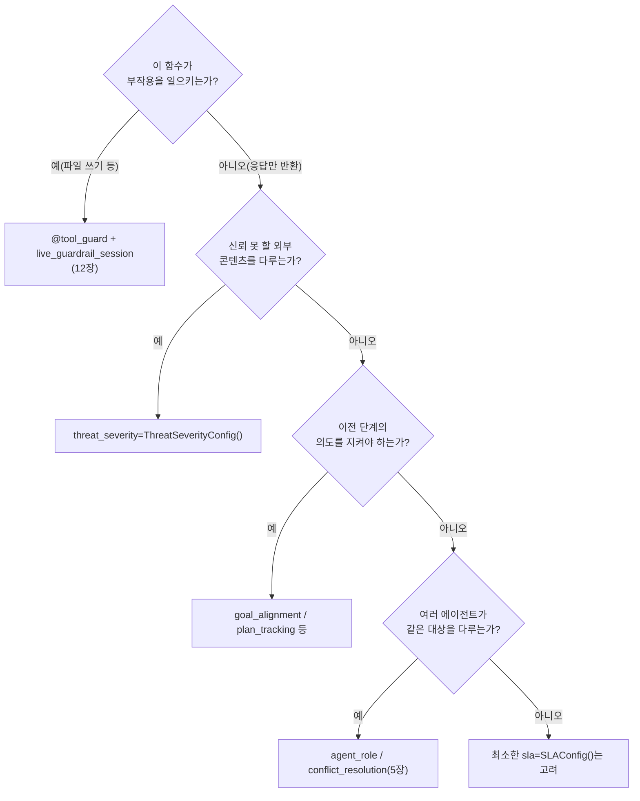

# Chapter 8. `@agent_eval` 데코레이터 해부

> **이 챕터에서 배우는 것**
> - Book-forge의 6개 에이전트가 각각 어떤 Harness Config를 골랐는지
> - 같은 데코레이터인데 왜 매번 다른 Config 조합을 쓰는지
> - "이 에이전트가 무엇을 하는가"를 보면 "어떤 Config가 필요한가"를 예측할 수 있는 이유

> **이런 분이 먼저 읽으면 좋습니다**: 2장에서 `@agent_eval`이 무엇을 가로채는지는 봤지만, 데코레이터 안에 들어가는 Config 값들이 왜 에이전트마다 다른지는 아직 궁금한 분.

---

## 8.1 여섯 에이전트, 여섯 가지 다른 설정

Book-forge에는 `@agent_eval`이 붙은 함수가 여러 개 있다 — 지금까지 이 책이 다룬 것만 추려도 여섯이다. 이들을 나란히 놓으면, Config 선택이 무작위가 아니라 **그 에이전트가 정확히 무엇을 하는가**에서 곧바로 도출된다는 것이 보인다.

| 에이전트 | 파일 | 핵심 Config | Config가 지키려는 것 |
|---|---|---|---|
| PlannerAgent | `planner.py` | `GoalAlignmentConfig(ignore_no_tool_tasks=False)`, `InstructionConfig`, `ExplainabilityConfig` | 기획안이 실제로 주제/제약을 반영했는가, 근거를 설명하는가 |
| TOCDesignerAgent | `toc_designer.py` | `PlanConfig`, `SubtaskConfig`, `ContextRetentionConfig` | 목차(subtask들)가 기획안의 결정사항을 이어받았는가 |
| ChapterDrafterAgent | `chapter_drafter.py` | `SLAConfig(p95_ms=60_000)`, `ThreatSeverityConfig`, `rag_mode=True` | 응답 지연이 허용 범위인가, 외부 RAG 소스에 프롬프트 인젝션은 없는가 |
| ChatAgent | `chat_agent.py` | `SLAConfig(p95_ms=30_000)`, `rag_mode=True` | 대화형 응답이라 더 짧은 지연 허용치, 근거 없는 답을 안 하는가 |
| ReviewerAgent | `review_panel.py`(`build_reviewer`) | `AgentRoleConfig(role_violation_penalty=0.3)` | 자기 역할(정확성/가독성)을 벗어나지 않는가 |
| ChiefEditorAgent | `review_panel.py`(`build_chief_editor`) | `ConflictResolutionConfig` | 리뷰어 간 이견을 실제로 조정하는가 |
| ReviseAgent | `review_loop.py` | `LoopDetectionConfig(consecutive_repeat_threshold=3)` | 같은 피드백이 반복되지 않는가 |

## 8.2 패턴 ① — "이 함수가 무엇을 판단하는가"가 Config를 결정한다

`PlannerAgent`와 `TOCDesignerAgent`를 비교하면 흥미로운 지점이 있다 — 둘 다 Gate A(목표 달성)에 기여하는 Config를 쓰지만, 정확히 어떤 Config인지는 다르다. `PlannerAgent`는 "주제와 제약을 반영했는가"(`GoalAlignmentConfig`)를 보고, `TOCDesignerAgent`는 "기획안의 결정사항을 목차가 커버하는가"(`PlanConfig`+`SubtaskConfig`)를 본다. 둘 다 넓게 보면 "이전 단계의 의도를 지켰는가"를 채점하지만, 전자는 자유 텍스트 대 자유 텍스트 정렬이고 후자는 목차라는 구조화된 산출물(여러 subtask)의 커버리지 문제다 — **입력·출력의 형태가 다르면 같은 목적이라도 다른 Config가 필요하다.**

## 8.3 패턴 ② — 부작용의 종류가 Config를 결정한다

`ChapterDrafterAgent`의 `ThreatSeverityConfig`는 우연이 아니다. 이 에이전트만 유일하게 **외부에서 온, 신뢰할 수 없는 콘텐츠**(RAG 소스로 넘어온 PDF/웹 발췌문)를 프롬프트에 직접 섞는다 — 코드 주석이 명시한다: "외부 PDF/문서(RAG 소스)에 프롬프트 인젝션이 섞여 있을 가능성." `PlannerAgent`는 저자가 CLI로 직접 입력한 `topic`/`constraints`만 받으므로 이 위협이 상대적으로 작다. **에이전트가 어떤 종류의 입력을 받는가가 보안 관련 Config의 필요 여부를 정확히 예측한다.**

`SLAConfig`의 값 차이도 같은 원리다 — `ChapterDrafterAgent`(60초)는 소스 청크를 프롬프트에 실어 긴 응답을 생성하는 무거운 작업이고, `ChatAgent`(30초)는 대화형이라 사용자가 즉시 응답을 기다린다. "얼마나 걸려도 되는가"는 UX 성격에서 직접 도출된다.

## 8.4 패턴 ③ — 부작용이 있는 동작은 `@agent_eval`이 아니다

이 표에 `ScaffoldAgent`(`scaffold.py`)가 없다는 것도 의미가 있다 — 3장(§3.5)에서 봤듯 그 모듈은 `@agent_eval`이 아니라 `@tool_guard` + `live_guardrail_session`을 쓴다. `scaffold.py`의 주석이 이 경계를 정확히 그린다.

> "파일 쓰기는 '사후 채점'이 아니라 '실행 전 차단'이 맞는 성격이라 `@agent_eval`이 아니라 `@tool_guard` + `live_guardrail_session`을 쓴다."

이 구분이 이 책의 핵심 축이다 — **"결과를 만드는 함수"(LLM 응답을 반환)는 `@agent_eval`로 사후 채점하고, "부작용을 일으키는 함수"(파일을 씀)는 `@tool_guard`로 실행 전에 막는다.** 12장에서 이 두 번째 축을 깊이 다룬다.

## 8.5 Config를 고르는 법 — 이 표를 거꾸로 읽는다

이 챕터의 표는 새 에이전트를 설계할 때 체크리스트로 거꾸로 쓸 수 있다.

> 📋 **QA 관리자 TIP**: 이 책의 6개 에이전트 중 어느 하나도 33개 Harness Config를 전부 쓰지 않는다 — 각자 2~3개만 정확히 골라 쓴다. "Config를 많이 켤수록 안전하다"는 것은 이 코드베이스가 보여주는 실제 관례가 아니다 — 오히려 "이 에이전트가 정말로 무엇을 할 수 있는가"를 좁게 규정한 뒤, 그 범위에 정확히 맞는 Config만 켜는 것이 Book-forge의 일관된 패턴이다.

---

## 이 챕터의 핵심

- **Config 선택은 에이전트의 역할에서 직접 도출된다.** 입력 형태(자유 텍스트 vs 구조화 산출물), 신뢰 경계(내부 입력 vs 외부 RAG), 부작용 유무가 그 결정 기준이다.
- **부작용이 있는 함수는 `@agent_eval`을 쓰지 않는다.** `@tool_guard`가 담당하는 완전히 다른 축이다(12장).
- **적게, 정확하게 쓰는 것이 Book-forge의 관례다.** 모든 Config를 켜는 것이 아니라, 이 에이전트에 실제로 필요한 것만 켠다.

## 참고 자료

- `src/book_forge/agents/planner.py`·`toc_designer.py`·`chapter_drafter.py`·`chat_agent.py`·`review_panel.py`·`review_loop.py`
- `src/book_forge/agents/scaffold.py` — `@tool_guard`로 갈라지는 경계

---

> **다음 챕터**는 이 Config들이 실제로 어떤 Gate A–G 점수로 이어지는지, Book-forge가 실제로 쓰는 항목만 추려 정리한다.
