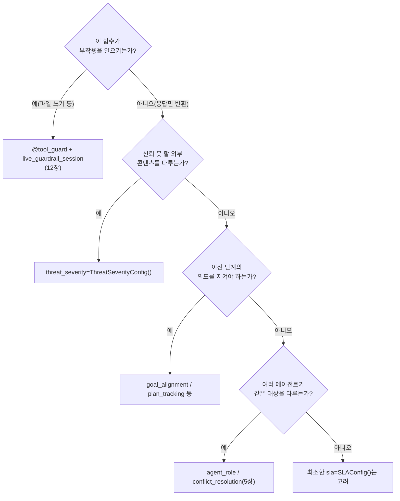

# Chapter 8. `@agent_eval` 데코레이터 해부

> ## Part III. 배치 평가로 품질을 계측한다
> Part II가 "에이전트들이 어떻게 협업하는가"를 다뤘다면, Part III의 4개 챕터는 그 협업이 만든 **결과물의 품질을 어떻게 판정하는가**로 초점을 옮긴다. 이미 2·5·6장에서 스쳐 지나간 `@agent_eval`·Gate·Config를 이제 정면으로 해부하고(8장), Gate A–G가 실제로 무엇을 재는지 정리한다(9장). 이어서 Gate가 손대지 않는 영역인 정적 검증을 보고(10장), 마지막으로 챕터 하나가 아니라 책 전체를 판정하는 집계로 마무리한다(11장).

> **이 챕터에서 배우는 것**
> - Book-forge의 14개 에이전트 전체가 각각 어떤 Harness Config를 골랐는지
> - 같은 데코레이터인데 왜 매번 다른 Config 조합을 쓰는지
> - "이 에이전트가 무엇을 하는가"를 보면 "어떤 Config가 필요한가"를 예측할 수 있는 이유

> **이런 분이 먼저 읽으면 좋습니다**: 2장에서 `@agent_eval`이 무엇을 가로채는지는 봤지만, 데코레이터 안에 들어가는 Config 값들이 왜 에이전트마다 다른지는 아직 궁금한 분.

---

## 8.1 열네 에이전트, 몇 가지 패턴

Book-forge 소스 전체(`agents/*.py`)를 뒤지면 `@agent_eval`이 붙은 함수는 정확히 14개다(`review_panel.py` 한 파일이 `ReviewerAgent`·`ChiefEditorAgent` 두 개를 낸다는 점에 유의). 이 책이 지금까지 이야기·CLI 명령을 통해 자연스럽게 다룬 것은 그중 7개뿐이었다. 나머지 7개(9~14번)는 각자 독립된 CLI 명령에서 조용히 일하는 에이전트라 이야기에 등장할 기회가 없었을 뿐이고, Config 선택 원리는 완전히 같다. 열넷을 나란히 놓고 보면, Config 선택이 무작위가 아니라 **그 에이전트가 정확히 무엇을 하는가**에서 곧바로 도출된다는 사실이 훨씬 뚜렷하게 보인다.

| # | 에이전트 | 파일 · 팩토리 함수 | 핵심 Config | 호출하는 CLI |
|---|---|---|---|---|
| 1 | PlannerAgent | `planner.py::build_propose_plan` | `GoalAlignmentConfig(ignore_no_tool_tasks=False)`, `InstructionConfig`, `ExplainabilityConfig` | `new` |
| 2 | TOCDesignerAgent | `toc_designer.py::build_design_toc` | `PlanConfig`, `SubtaskConfig`, `ContextRetentionConfig` | `new` |
| 3 | ChapterDrafterAgent | `chapter_drafter.py::build_draft_chapter` | `SLAConfig(p95_ms=60_000)`, `ThreatSeverityConfig`, `rag_mode=True` | `draft`(narrative·exercise) |
| 4 | ReferenceTableAgent | `reference_table.py::build_generate_reference_table` | `SLAConfig(p95_ms=60_000)`, `ThreatSeverityConfig`, `rag_mode=True` | `draft`(reference_table) |
| 5 | DiagramGeneratorAgent | `diagram_generator.py::build_generate_diagram` | `SLAConfig(p95_ms=60_000)`, `ThreatSeverityConfig`, `rag_mode=True` | `draft`(diagram) |
| 6 | CapstoneGeneratorAgent | `capstone_generator.py::build_generate_capstone` | `SLAConfig(p95_ms=90_000)`, `ThreatSeverityConfig`, `rag_mode=True` | `draft`(capstone) |
| 7 | ModuleReferenceAgent | `module_reference.py::build_generate_module_reference` | `SLAConfig(p95_ms=90_000)`, `ThreatSeverityConfig`, `rag_mode=True` | `draft`(module_reference) |
| 8 | ChatAgent | `chat_agent.py::build_answer_question` | `SLAConfig(p95_ms=30_000)`, `ThreatSeverityConfig`, `rag_mode=True` | `chat` |
| 9 | ReviewerAgent | `review_panel.py::build_reviewer` | `AgentRoleConfig(role_violation_penalty=0.3)` | `review` |
| 10 | ChiefEditorAgent | `review_panel.py::build_chief_editor` | `ConflictResolutionConfig` | `review` |
| 11 | `revise()` | `review_loop.py::build_revise` | `LoopDetectionConfig(consecutive_repeat_threshold=3)` | `new`·`plan --revise` |
| 12 | ResearchAgent | `research_agent.py::build_generate_search_queries` | `InstructionConfig` | `research` |
| 13 | AlternativeSuggesterAgent | `alternative_suggester.py::build_suggest_alternatives` | `InstructionConfig`, `ExplainabilityConfig` | `draft`(저커버리지 대안 제안) |
| 14 | SlideCondenserAgent | `slide_condenser.py::build_condense_section` | `InstructionConfig`, `ExplainabilityConfig`, `SLAConfig(p95_ms=20_000)` | `build slides` |

## 8.2 패턴 ① — "이 함수가 무엇을 판단하는가"가 Config를 결정한다

`PlannerAgent`와 `TOCDesignerAgent`를 비교하면 흥미로운 지점이 있다. 둘 다 Gate A(목표 달성)에 기여하는 Config를 쓰지만, 정확히 어떤 Config인지는 다르다. `PlannerAgent`는 "주제와 제약을 반영했는가"(`GoalAlignmentConfig`)를 보고, `TOCDesignerAgent`는 "기획안의 결정사항을 목차가 커버하는가"(`PlanConfig`+`SubtaskConfig`)를 본다. 둘 다 넓게 보면 "이전 단계의 의도를 지켰는가"를 채점하지만, 전자는 자유 텍스트 대 자유 텍스트 정렬이고 후자는 목차라는 구조화된 산출물(여러 subtask)의 커버리지 문제다. **입력·출력의 형태가 다르면 같은 목적이라도 다른 Config가 필요하다.**

## 8.3 패턴 ② — 부작용의 종류가 Config를 결정한다

`ChapterDrafterAgent`의 `ThreatSeverityConfig`는 우연이 아니다. `rag_mode=True`인 에이전트(`ChapterDrafterAgent`·`ChatAgent`) **전부**가 이 Config도 함께 쓴다. 둘 다 **외부에서 온, 신뢰할 수 없는 콘텐츠**(RAG 소스로 넘어온 PDF/웹 발췌문)를 프롬프트에 직접 섞기 때문이다. 코드 주석이 명시한다: "외부 PDF/문서(RAG 소스)에 프롬프트 인젝션이 섞여 있을 가능성." `PlannerAgent`는 저자가 CLI로 직접 입력한 `topic`/`constraints`만 받으므로 이 위협이 상대적으로 작다. **에이전트가 어떤 종류의 입력을 받는가가 보안 관련 Config의 필요 여부를 정확히 예측한다.** 실제로 `rag_mode=True`인가로 `threat_severity` 필요 여부를 100% 예측할 수 있다(반례: 이전 버전 `chat_agent.py`는 `rag_mode=True`이면서도 이 Config가 빠져 있었다. 실측으로 발견돼 고쳐진 사례다).

실제 `build_draft_chapter()` 코드를 보면 이 판단이 어디서 나왔는지가 데코레이터 인자 옆 주석에 그대로 남아 있다.

```python
def build_draft_chapter(llm: LLM, monitor: PerformanceMonitor) -> DraftFn:
    @agent_eval(
        monitor,
        task_type="document_creation",
        question_arg="chapter_title",
        rag_mode=True,
        context_arg="sources",
        # Gate D: 소스가 길면 응답이 오래 걸릴 수 있어 여유 있게 설정.
        sla=SLAConfig(p95_ms=60_000, p99_ms=90_000),
        # Gate E: 외부 PDF/문서(RAG 소스)에 프롬프트 인젝션이 섞여 있을 가능성.
        threat_severity=ThreatSeverityConfig(),
    )
    def draft_chapter(
        chapter_title: str, chapter_no: int, sources: str,
        ground_truth: str = "", content_type: str = "narrative",
    ) -> tuple[str, EvalMetadata]:
        template = _CONTENT_TYPE_PROMPTS.get(content_type, DRAFT_PROMPT)
        prompt = template.format(
            chapter_title=chapter_title, chapter_no=chapter_no, sources=sources[:6000]
        )
        draft_md = llm.generate(prompt, system=DRAFT_SYSTEM_PROMPT, max_tokens=3000)
        return draft_md, EvalMetadata(extra={"phase": "drafting", "chapter_no": chapter_no})

    return draft_chapter
```

`content_type` 인자가 하는 일은 여기서는 딱 하나, `exercise`인지 아닌지만 가른다. `_CONTENT_TYPE_PROMPTS`에는 `"exercise"` 키 하나만 있고, 나머지는 전부 `DRAFT_PROMPT`(narrative 기본값)로 떨어진다. `reference_table`/`diagram`/`capstone`/`module_reference` 네 유형은 이 함수까지 오지도 않는다. `draft_cmd.py`가 `content_type`을 보고 애초에 다른 에이전트(`ReferenceTableAgent`/`DiagramGeneratorAgent`/`CapstoneGeneratorAgent`/`ModuleReferenceAgent`, §8.4에서 코드로 확인한다)로 통째로 라우팅해버리기 때문이다. 즉 콘텐츠 유형 6종은 "한 함수 안의 프롬프트 바꿔치기"(narrative·exercise 둘)와 "아예 다른 에이전트로 위임"(나머지 넷)이라는 **두 가지 다른 방식**으로 갈라진다. 겉보기엔 `content_type` 문자열 하나로 통일된 인터페이스처럼 보이지만, 실제 분기 방식은 유형마다 다르다. `sources[:6000]`처럼 소스를 6000자로 자르는 것도 실무적인 선택이다. 프롬프트 길이 제한과 응답 지연(`SLAConfig`가 60초로 여유를 두는 이유) 사이의 균형인 셈이다.

`SLAConfig`의 값 차이도 같은 원리다. `ChapterDrafterAgent`(60초)는 소스 청크를 프롬프트에 실어 긴 응답을 생성하는 무거운 작업이고, `ChatAgent`(30초)는 대화형이라 사용자가 즉시 응답을 기다린다. "얼마나 걸려도 되는가"는 UX 성격에서 직접 도출된다.

## 8.4 아직 안 보여준 코드 — 나머지 6개 에이전트

§8.1 표의 4~7·12~14번은 이 책이 코드로 보여준 적 없는 에이전트다. 다 보여줄 필요는 없다 — 패턴이 몇 개로 수렴하는지 보이면 충분하다.

**RAG 생성기 4·5·6·7번은 §8.3의 `ChapterDrafterAgent`와 사실상 같은 틀이다.** `DiagramGeneratorAgent`를 예로 확인한다.

```python
def build_generate_diagram(llm: LLM, monitor: PerformanceMonitor) -> GenerateFn:
    @agent_eval(
        monitor, task_type="document_creation", question_arg="chapter_title",
        rag_mode=True, context_arg="sources",
        sla=SLAConfig(p95_ms=60_000, p99_ms=90_000),
        threat_severity=ThreatSeverityConfig(),
    )
    def generate_diagram(chapter_title, chapter_no, sources, ground_truth="") -> tuple[str, EvalMetadata]:
        prompt = DIAGRAM_PROMPT.format(chapter_title=chapter_title, chapter_no=chapter_no, sources=sources[:6000])
        return llm.generate(prompt, system=DIAGRAM_SYSTEM_PROMPT, max_tokens=3000), \
            EvalMetadata(extra={"phase": "diagram", "chapter_no": chapter_no})
    return generate_diagram
```

`rag_mode=True` + `SLAConfig` + `ThreatSeverityConfig` 조합에, 프롬프트만 다르게 조립하고 `llm.generate()`를 부르는 세 줄짜리 본문이다. `CapstoneGeneratorAgent`·`ReferenceTableAgent`도 글자 그대로 같은 골격이다(캡스톤만 템플릿+정답을 한 번에 생성하느라 `SLAConfig(p95_ms=90_000)`로 여유를 더 준다). 그래서 **한 에이전트를 이해하면 나머지 셋을 거의 다 이해한 것**이라는 뜻이다. 이것도 8장이 반복해온 원칙의 증거다. 다른 게 아니라 프롬프트와 SLA뿐이면, Config 선택도 그대로 복사된다.

`ModuleReferenceAgent`만 예외다. `rag_mode=True`를 똑같이 쓰지만, `sources`에 RAG **검색** 결과가 아니라 4장(§4.3)의 구조적 코드 인덱싱이 만든 **전체** 모듈/클래스/함수 목록을 그대로 넣는다. 모듈 docstring이 그 이유를 실측 수치로 남겼다.

> "`reference_table.py`는 RAG로 검색된 소스 발췌문에서 '확인되는 값만' 표로 만든다 — 검색이 놓친 항목은 애초에 LLM 눈에 안 보이므로 조용히 빠진다(실측: Book-forge 자신의 `agents/` 13개 파일 중 4개만 우연히 top-k에 뽑혀 다뤄짐). 이 에이전트는 RAG 검색을 거치지 않고, 구조 요약(모든 모듈/클래스/함수를 결정론적으로 나열)을 그대로 `sources`로 받는다."

**"확인되는 값만"(누락 가능)과 "빠짐없이"(날조 가능)라는 정반대 실패 모드**가, 같은 `rag_mode=True` 아래 `sources`에 무엇이 담기느냐로 갈린다. `demonstration_verifier.py`가 이 둘을 반대 방향으로 검증하는 이유(10장)가 바로 여기 있다.

**12~14번(`ResearchAgent`·`AlternativeSuggesterAgent`·`SlideCondenserAgent`)은 `rag_mode`도 `threat_severity`도 없다.** `ResearchAgent`가 특히 흥미롭다. §8.3의 예측("`rag_mode=True`인가로 `threat_severity` 필요 여부를 100% 예측할 수 있다")이 여기서도 거꾸로 확인된다.

```python
def build_generate_search_queries(llm: LLM, monitor: PerformanceMonitor) -> GenerateQueriesFn:
    @agent_eval(
        monitor, task_type="planning", question_arg="chapter_title",
        instructions=InstructionConfig(fail_on_violation=False),
    )
    def generate_search_queries(chapter_title: str, ground_truth: str = "") -> tuple[str, EvalMetadata]:
        prompt = RESEARCH_QUERY_PROMPT.format(chapter_title=chapter_title)
        raw = llm.generate(prompt, system=RESEARCH_QUERY_SYSTEM_PROMPT, max_tokens=300)
        return raw, EvalMetadata(extra={"phase": "research_query_generation"})
    return generate_search_queries
```

이 에이전트는 `chapter_title`(저자가 직접 입력)만 받아 검색 **쿼리**를 만들 뿐이다. 검색된 웹 콘텐츠 자체는 저자가 검토한 뒤에야 지식창고에 들어간다(`knowledge/web_search.py`가 검색 실행을 전담, 관심사 분리). 그래서 프롬프트에 외부 콘텐츠가 섞이는 지점이 아예 없으므로 `threat_severity`가 필요 없다. `InstructionConfig` 하나로 "제약을 어기지 않았는가"만 본다. `AlternativeSuggesterAgent`·`SlideCondenserAgent`도 `InstructionConfig`+`ExplainabilityConfig`(+`SlideCondenserAgent`는 `SLAConfig`) 조합을 쓴다. 둘 다 "저자가 준 텍스트를 다른 형태로 다듬는" 작업이라 외부 신뢰 경계를 건널 일이 없다는 점에서 같은 이유를 공유한다.

## 8.5 패턴 ③ — 부작용이 있는 동작은 `@agent_eval`이 아니다

이 표에 `ScaffoldAgent`(`scaffold.py`)가 없다는 것도 의미가 있다. 3장(§3.5)에서 봤듯 그 모듈은 `@agent_eval`이 아니라 `@tool_guard` + `live_guardrail_session`을 쓴다. `scaffold.py`의 주석이 이 경계를 정확히 그린다.

> "파일 쓰기는 '사후 채점'이 아니라 '실행 전 차단'이 맞는 성격이라 `@agent_eval`이 아니라 `@tool_guard` + `live_guardrail_session`을 쓴다."

이 구분이 이 책의 핵심 축이다. **"결과를 만드는 함수"(LLM 응답을 반환)는 `@agent_eval`로 사후 채점하고, "부작용을 일으키는 함수"(파일을 씀)는 `@tool_guard`로 실행 전에 막는다.** 12장에서 이 두 번째 축을 깊이 다룬다.

## 8.6 Config를 고르는 법 — 이 표를 거꾸로 읽는다

이 챕터의 표는 새 에이전트를 설계할 때 체크리스트로 거꾸로 쓸 수 있다.



> 📋 **QA 관리자 TIP**: 이 책이 다룬 14개 에이전트 중 어느 하나도 33개 Harness Config를 전부 쓰지 않는다. `ReviewerAgent`·`ChiefEditorAgent`·`revise()`·`ResearchAgent` 넷은 각 1개만, RAG 생성기 5개(`ChapterDrafterAgent`·`ReferenceTableAgent`·`DiagramGeneratorAgent`·`CapstoneGeneratorAgent`·`ModuleReferenceAgent`)와 `ChatAgent`·`AlternativeSuggesterAgent`는 2개, `PlannerAgent`·`TOCDesignerAgent`·`SlideCondenserAgent`는 3개를 쓴다. "Config를 많이 켤수록 안전하다"는 것은 이 코드베이스가 보여주는 실제 관례가 아니다. 오히려 "이 에이전트가 정말로 무엇을 할 수 있는가"를 좁게 규정한 뒤, 그 범위에 정확히 맞는 Config만 켜는 것이 Book-forge의 일관된 패턴이다.

---

## 직접 해보기

§8.5의 결정 트리를 여러분의 에이전트(또는 3장 "직접 해보기"에서 점검한 에이전트)에 실제로 적용해보라 — "부작용이 있는가?" → "신뢰 못 할 외부 콘텐츠를 다루는가?" → "이전 단계의 의도를 지켜야 하는가?" → "여러 에이전트가 같은 대상을 다루는가?" 네 질문에 순서대로 답하면, 어떤 Harness Config가 필요한지가 거의 자동으로 나온다. 답이 전부 "아니오"라면 `SLAConfig` 하나만으로 충분할 수도 있다 — 이 챕터가 반복해서 강조했듯, **Config를 적게 쓰는 것 자체가 실패가 아니다.**

## 이 챕터의 핵심

- **Config 선택은 에이전트의 역할에서 직접 도출된다.** 입력 형태(자유 텍스트 vs 구조화 산출물), 신뢰 경계(내부 입력 vs 외부 RAG), 부작용 유무가 그 결정 기준이다.
- **부작용이 있는 함수는 `@agent_eval`을 쓰지 않는다.** `@tool_guard`가 담당하는 완전히 다른 축이다(12장).
- **적게, 정확하게 쓰는 것이 Book-forge의 관례다.** 모든 Config를 켜는 것이 아니라, 이 에이전트에 실제로 필요한 것만 켠다.

## 참고 자료

- 부록 B.3(업계 동향) — `ThreatSeverityConfig`가 대응하는 OWASP LLM01(프롬프트 인젝션) 순위와 최근 RAG 오염 연구
- `src/book_forge/agents/planner.py`·`toc_designer.py`·`chapter_drafter.py`·`chat_agent.py`·`review_panel.py`·`review_loop.py`
- `src/book_forge/agents/reference_table.py`·`diagram_generator.py`·`capstone_generator.py`·`module_reference.py` — RAG 생성기 4종
- `src/book_forge/agents/research_agent.py`·`alternative_suggester.py`·`slide_condenser.py` — `rag_mode` 없는 나머지 3종
- `src/book_forge/agents/scaffold.py` — `@tool_guard`로 갈라지는 경계

---

> **다음 챕터**는 이 Config들이 실제로 어떤 Gate A–G 점수로 이어지는지, Book-forge가 실제로 쓰는 항목만 추려 정리한다.
