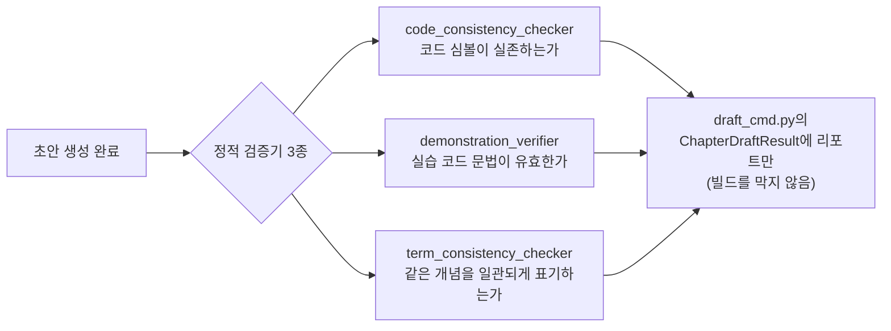

# Chapter 10. LLM 없이 잡아내는 환각 — 정적 검증기 3종

> **이 챕터에서 배우는 것**
> - Gate 점수에 전혀 반영되지 않는 검증이 왜 필요한지
> - 코드 심볼·실습 코드·용어 표기, 세 가지를 각각 어떤 방식으로 대조하는지
> - 검증 도구 자신의 버그가 실제로 어떻게 발견되고 고쳐졌는지

> **이런 분이 먼저 읽으면 좋습니다**: 9장에서 Gate C(신뢰성)가 환각을 채점한다고 배웠는데, 그거로 충분하지 않은 이유가 궁금한 분.

---

## 10.1 Gate C만으로는 부족한 이유

Gate C의 `HallucinationDetector`는 통계적·의미적 방법으로 "근거 없는 서술이 섞였을 확률"을 점수화한다 — 확률이다, **확정적 판정이 아니다.** 반면 "본문이 `BranchGuardConfig`라는 클래스를 언급했는데, 실제 소스에 그 이름이 존재하는가"는 예/아니오로 정확히 답할 수 있는 질문이다. Book-forge는 이런 종류의 질문을 위해 LLM을 전혀 호출하지 않는 정적 검증기 3종을 별도로 둔다 — 셋 다 `@agent_eval`이 없다. Gate 점수를 전혀 바꾸지 않는, Book-forge 자체 도메인 신호다.



## 10.2 코드-본문 정합성 — 실제로 존재하는 이름인가

`code_consistency_checker.py`는 본문의 백틱 심볼(`` `ClassName` ``)과 import 문을 뽑아, 실제 대상 패키지(설치된 패키지 또는 로컬 디렉토리)에 그 이름이 진짜 존재하는지 `importlib`로 대조한다. 3장(§3.2)에서 다룬 `BranchGuard`(실제로는 `BranchGuardConfig`) 사례가 바로 이 검증기가 실제로 걸러낸 오류다.

이 검증기 자신도 한 번 버그가 있었다는 사실이 중요하다 — 최상위 패키지 네임스페이스에 재노출되지 않은 클래스(`Settings`·`KoreanRAGDatasetGenerator`·`LiveGuardrail`)를 "존재하지 않는다"고 오탐했다. 고친 방법은 `_walk_package_symbols()`라는 새 함수다.

```python
_package_symbol_cache: dict[str, set[str]] = {}

def _walk_package_symbols(root_module) -> set[str]:
    """target_package 산하 전체 서브모듈을 순회해 공개 멤버 이름을 평평하게 모은다."""
    name = getattr(root_module, "__name__", None)
    if name is not None and name in _package_symbol_cache:
        return _package_symbol_cache[name]

    symbols: set[str] = set(n for n in dir(root_module) if not n.startswith("_"))
    package_path = getattr(root_module, "__path__", None)
    if package_path is not None:
        prefix = root_module.__name__ + "."
        for _finder, module_name, _is_pkg in pkgutil.walk_packages(package_path, prefix):
            try:
                module = importlib.import_module(module_name)
            except Exception:
                continue  # 선택적 의존성 등으로 로드 실패한 서브모듈은 건너뛴다
            symbols.update(n for n in dir(module) if not n.startswith("_"))

    if name is not None:
        _package_symbol_cache[name] = symbols
    return symbols
```

최상위 네임스페이스만 보는 대신, 서브모듈 전체를 `pkgutil.walk_packages()`로 순회해 "평평한 심볼 테이블"을 만든다 — 어느 서브모듈에 있는지는 몰라도, 프로젝트 전체 어딘가에 그 이름이 존재하기만 하면 통과시킨다. 이 수정은 정확히 검증을 느슨하게(정밀도를 낮춰) 만든 것처럼 보일 수 있지만, 실제로는 **오탐(존재하는데 없다고 잘못 보고)을 없애는 방향**의 수정이다 — 검증기의 목표는 "정확히 어디 있는지"가 아니라 "존재하는지"이기 때문이다.

로컬 프로젝트(pip install 안 된 분석 대상 디렉토리)를 검사할 때는 `verify_code_consistency_local()`이 같은 발상을 재사용한다 — `importlib` 대신 `knowledge/code_index.py`(4장에서 다룬 구조적 코드 인덱싱)로 만든 평평한 심볼 테이블을 쓴다.

## 10.3 실습 코드 검증 — 문법이 유효한가

`demonstration_verifier.py`는 `content_type="exercise"`인 챕터가 생성한 `` ```python `` 코드 블록을 `ast.parse()`로 검사한다.

```python
def verify_exercise_code(draft_md: str) -> VerificationResult:
    blocks = _CODE_FENCE_RE.findall(draft_md)
    if not blocks:
        return VerificationResult(content_type="exercise", passed=False,
            detail="python 코드 블록이 없습니다 — exercise 유형인데 실습 코드가 생성되지 않았습니다.")
    ...
```

이 모듈의 docstring이 명시적으로 밝히는 경계가 있다 — **LLM이 생성한 임의 코드를 자동으로 실행하지 않는다.** 문법이 파싱 가능한가(구문 오류가 없는가)까지만 확인하고, "실제로 의도대로 동작하는가"는 저자가 직접 돌려봐야 한다. 부작용·행 없이 안전하게 확인할 수 있는 최소한의 근사만 취하는 결정이다 — 코드를 진짜 실행하는 검증은 `--execute-examples`(옵트인, 위험을 인지하고 켜야 함)라는 완전히 별도의 경로로 분리돼 있다.

같은 모듈은 다이어그램(mermaid 펜스가 알려진 타입으로 시작하고 실제 노드/엣지가 있는가), 참조표(표 셀 값이 실제 소스 발췌문에 등장하는가), 캡스톤(템플릿에 TODO 마커가 있고 정답 코드는 TODO 없이 유효한가)도 각각 정적으로 검증한다 — 넷 다 LLM 호출 없이 콘텐츠 유형별로 다른 정적 규칙을 적용한다.

이 책 자체가 mermaid 다이어그램을 챕터마다 여러 개 쓰고 있으니, `verify_diagram()`을 직접 확인해보면 그 검증이 정확히 무엇을 대조하는지 감이 잡힌다.

```python
def verify_diagram(
    draft_md: str, sources_text: str = "", *, min_grounding_ratio: float = 0.3
) -> VerificationResult:
    blocks = _MERMAID_FENCE_RE.findall(draft_md)
    if not blocks:
        return VerificationResult(content_type="diagram", passed=False,
            detail="mermaid 코드 블록이 없습니다 — diagram 유형인데 다이어그램이 생성되지 않았습니다.")
    issues = []
    node_labels: list[str] = []
    for i, block in enumerate(blocks, 1):
        lines = [line for line in block.strip().splitlines() if line.strip()]
        first_line = lines[0] if lines else ""
        if not any(first_line.strip().startswith(kw) for kw in _MERMAID_DIAGRAM_KEYWORDS):
            issues.append(f"다이어그램 블록 {i}: 알려진 mermaid 타입으로 시작하지 않음")
        elif len(lines) < 2:
            issues.append(f"다이어그램 블록 {i}: 내용이 비어 있음(타입 선언만 있음)")
        else:
            node_labels.extend(_MERMAID_NODE_LABEL_RE.findall(block))

    if sources_text and node_labels and not issues:
        identifiers = {tok for label in node_labels for tok in _IDENTIFIER_TOKEN_RE.findall(label)}
        if identifiers:
            grounded = sum(1 for tok in identifiers if tok in sources_text)
            ratio = grounded / len(identifiers)
            if ratio < min_grounding_ratio:
                issues.append(
                    f"노드 라벨의 식별자 {len(identifiers)}개 중 {grounded}개만 소스에서 확인됨"
                    f"({ratio:.0%} < 기준 {min_grounding_ratio:.0%})"
                )
    passed = not issues
    detail = (
        f"다이어그램 블록 {len(blocks)}개 구조 검증 통과" if passed
        else f"다이어그램 블록 {len(blocks)}개 중 {len(issues)}개 구조 문제"
    )
    return VerificationResult(content_type="diagram", passed=passed, detail=detail, issues=issues)
```

앞부분(`flowchart`/`sequenceDiagram` 같은 알려진 타입으로 시작하는가, 타입 선언만 있고 내용이 비어 있진 않은가)은 문법 검증이다. 뒷부분이 이 함수의 진짜 목적이다 — `sources_text`가 주어지면, 노드 라벨(`node_labels`)에서 뽑은 식별자(클래스명·함수명처럼 보이는 토큰)가 실제 RAG 소스에 등장하는 비율을 계산한다. 함수 docstring이 이 검사를 추가한 이유를 실측 사례로 남겨뒀다 — "패키지 구조"를 요청했는데 파일 하나의 내부 관계만 그려진 스코프 불일치가 실제로 있었다. 다이어그램은 코드 심볼(§10.2)이나 표 셀(참조표)과 달리 **100% LLM이 그래프 구조 자체를 새로 구성**하므로, 실제 코드와 무관한 노드·엣지를 만들어낼 위험이 더 크다 — `min_grounding_ratio=0.3`은 "적어도 30%의 식별자는 소스에서 확인돼야 한다"는 최소 방어선이다.

## 10.4 용어 일관성 — 같은 것을 다르게 부르지 않는가

3장(§3.3)의 "드리프트" 문제와는 별개로, `term_consistency_checker.py`는 **한 챕터 안 또는 여러 챕터 사이**에서 같은 개념이 다른 표기로 등장하는지 확인한다(`book-forge lint`, SPEC.md의 AK 항목).

```python
def _fold_key(term: str) -> str:
    """대소문자·구두점을 지운 '접힌' 형태 — 같은 개념의 서로 다른 표기를 묶는 키."""
    return "".join(ch for ch in term.lower() if ch.isalnum())
```

`ToolCallAnalyzer`와 `tool_call_analyzer`는 겉보기엔 다른 문자열이지만, `_fold_key()`를 거치면 같은 키(`toolcallanalyzer`)로 묶인다 — 같은 키에 서로 다른 실제 표기가 2개 이상 나타나면 "표기 불일치 후보"로 보고한다. 이 검사도 자동으로 통일하지 않는다 — 후보만 보여주고 최종 판단은 저자가 한다는 원칙이 §10.2·§10.3과 동일하게 반복된다.

> 👨‍💻 **개발자 TIP**: 이 세 검증기는 모두 "발견해서 보고만 한다, 자동 수정하지 않는다"는 원칙을 공유한다 — `draft_cmd.py`는 이 결과를 `ChapterDraftResult`에 실어 CLI 요약에 노출할 뿐, `book-forge gate`처럼 빌드를 막지 않는다. Gate 점수 노출과 같은 철학이다(9장 §9.5의 "참고용" 문구를 떠올려보라).

---

## 직접 해보기

이미 집필된 챕터 파일 하나를 열어, 백틱으로 감싼 실제 코드 심볼(`` `SomeClass` ``) 하나를 일부러 존재하지 않는 이름으로 바꿔보고 `book-forge draft <slug> <ch> --check-package book_forge`를 실행해보라 — `code_consistency_checker.py`가 이 오류를 실제로 잡아내는지 확인할 수 있다.

**적용 체크리스트**: 여러분의 프로젝트에는 문서·주석이 실제 코드를 정확히 인용하는지 자동으로 확인하는 장치가 있는가? 없다면 `_walk_package_symbols()`(§10.2)처럼 "정확한 위치"가 아니라 "존재 여부"만 평평하게 확인하는 가벼운 검증기 하나가, LLM 호출 없이도 상당한 신뢰도를 벌어준다는 것을 기억해두라.

## 이 챕터의 핵심

- **정적 검증은 확률이 아니라 예/아니오로 답할 수 있는 질문을 담당한다.** Gate C(통계적 환각 탐지)와 역할이 명확히 나뉜다.
- **검증기 자신도 버그가 있을 수 있다.** `Settings`/`KoreanRAGDatasetGenerator`/`LiveGuardrail` 오탐 사례가 이를 실제로 보여줬고, `_walk_package_symbols()`로 고쳐졌다.
- **코드를 실행하는 검증과 문법만 확인하는 검증은 완전히 다른 위험 수준이다.** 기본은 안전한 정적 확인, 실행 검증은 옵트인이다.
- **셋 다 자동 수정하지 않는다.** 발견·보고만 하고 저자가 최종 판단한다.

## 참고 자료

- 부록 A.6(Harness Config 사용 현황) — 이 챕터가 검증만 다룬 diagram/capstone/module_reference 콘텐츠 유형의 **생성 코드** 자체
- 부록 C.1(업계 동향) — RAG·자기일관성·불확실성 추정을 조합하는 업계의 환각 대응과, Book-forge가 그중 가장 단순한 축만 쓰는 이유
- `src/book_forge/agents/code_consistency_checker.py`
- `src/book_forge/agents/demonstration_verifier.py`
- `src/book_forge/agents/term_consistency_checker.py`
- `src/book_forge/cli/commands/lint_cmd.py`

---

> **다음 챕터**는 개별 챕터 단위 채점을 넘어, "책 전체가 배포 가능한가"를 어떻게 판정하는지 — `book-forge gate`의 집계 게이팅을 다룬다.
