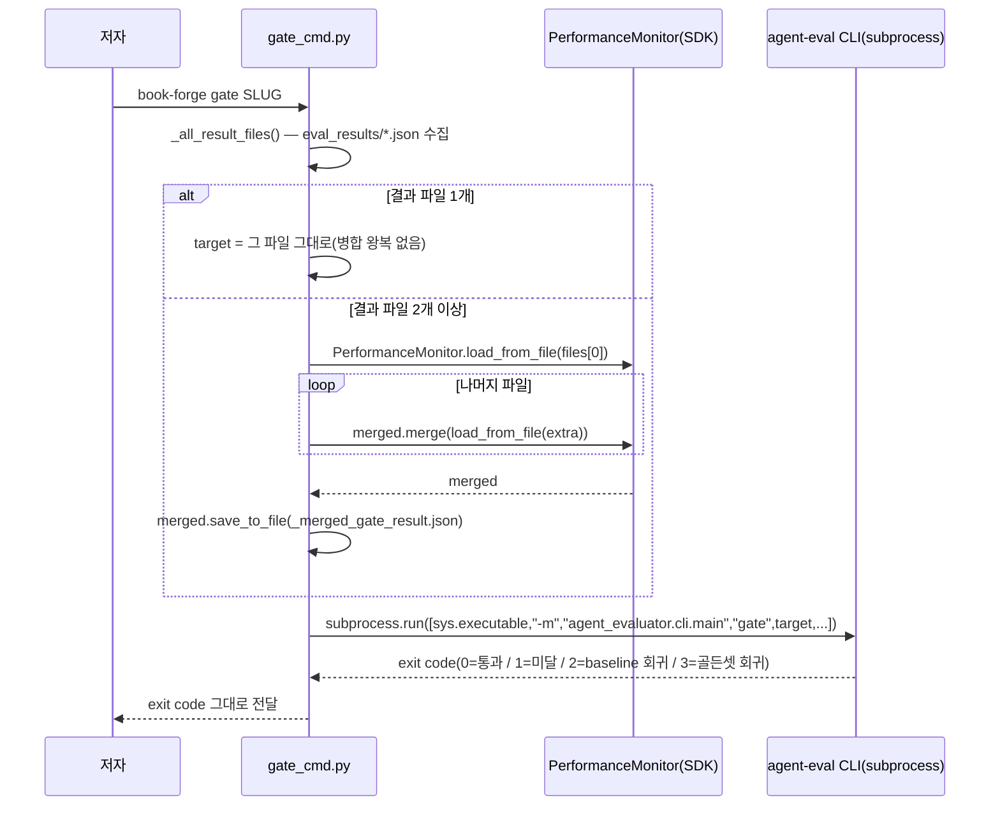

# Chapter 12. 책 전체를 하나로 — `book-forge gate`의 집계 게이팅

> **이 챕터에서 배우는 것** (이런 분이 먼저 읽으면 좋다: 9장에서 "한 챕터의 Gate 점수"를 봤는데, 그럼 "이 책 전체는 배포해도 되는가"는 누가 어떻게 답하는지 궁금한 분)
> - "챕터 하나만 판정되는" 문제가 실제로 어떻게 재현됐는지
> - `PerformanceMonitor.merge()`가 이미 SDK에 있던 기능을 어떻게 재사용하는지
> - 병합 결과가 다시 병합 입력으로 들어가는 피드백 루프를 어떻게 막는지

---

## 12.0 `book-forge gate` 전체 흐름 먼저 조망하기

이 챕터의 세부 내용(병합 로직·피드백 루프 방지)으로 들어가기 전에, `book-forge gate` 명령 하나가 실행될 때 전체적으로 어떤 순서로 호출이 일어나는지 먼저 그려둔다.



이 다이어그램에서 가장 중요한 점은, `gate_cmd.py` 안 어디에도 Gate A–G 점수를 실제로 계산하는 코드가 없다는 것이다. 병합(아래 §12.1~§12.3이 이 부분을 다룬다)만 직접 하고, 최종 판정은 `agent-eval` CLI subprocess에 완전히 위임한다. Book-forge가 "품질 판정 로직을 만들지 않고, agent-evaluator가 이미 제공하는 계측·게이팅 기능을 가져다 쓰는 응용 프로그램"이라는 이 책 전체의 전제(서문·CLAUDE.md)가 코드 레벨에서 가장 명확하게 드러나는 지점이 바로 여기다. exit code 2·3(baseline·골든셋 회귀)이 무엇을 뜻하는지, 이 플래그들을 CI에 실제로 어떻게 연결하는지는 13장에서 이어서 다룬다.

## 12.1 실제로 재현된 문제

`draft_cmd.py`는 챕터마다 새 `PerformanceMonitor`를 만들어 `draft_ch{N}.json`으로 각각 저장한다(2장 §2.2에서 다룬 "monitor는 프로젝트마다 새로 생성된다"는 원칙이 여기서는 챕터마다 반복된다). 문제는 여기서 시작한다. `book-forge gate <slug>`가 `--file`을 안 받으면, 예전 코드는 `eval_results/`에서 **mtime 기준 가장 최근 파일 하나만** 골랐다.

실제 6챕터 프로젝트(`AI_에이전트_평가_입문`)로 재현한 결과는 이렇다.

> 🖥️ **실행 로그**: 실제 6챕터 프로젝트로 재현한 터미널 출력(소스 코드가 아니다)

```
$ book-forge gate "AI_에이전트_평가_입문" --min-gate-score 0.0
🚦 게이팅 대상: .../eval_results/draft_ch05.json
```

Chapter 5 하나만 게이팅되고, 1·2·3·4·6은 완전히 무시됐다. 저자가 자연스럽게 `book-forge gate`를 실행하면 "책 전체 판정"이 아니라 "가장 최근에 건드린 챕터 하나 판정"이 매번 나왔다. 이 문제는 가정이 아니라 실측으로 확인된 것이다.

## 12.2 새 병합 로직을 만들지 않는다 — 이미 SDK에 있는 것을 쓴다

Agent-Evaluator SDK의 `PerformanceMonitor`에는 이미 `merge()`와 `load_from_file()`이 있었다(`core/trackers/monitor.py`). Book-forge 어디서도 이 함수들을 쓰지 않았을 뿐이다. `gate_cmd.py`가 고친 방식은 새 채점 로직을 짜는 게 아니라, 이미 검증된 SDK 기능을 처음으로 실제로 연결하는 것이었다.

> 📄 **파일**: `src/book_forge/cli/commands/gate_cmd.py`

```python
def _merge_result_files(files: list[Path]) -> Path:
    """여러 챕터 결과 파일을 하나의 PerformanceMonitor로 합쳐 저장하고 그 경로를 반환한다."""
    from agent_evaluator import PerformanceMonitor

    merged = PerformanceMonitor.load_from_file(str(files[0]))
    for extra in files[1:]:
        merged = merged.merge(PerformanceMonitor.load_from_file(str(extra)))
    output_path = files[0].parent / "_merged_gate_result.json"
    merged.save_to_file(str(output_path))
    return output_path
```

`load_from_file()`이 저장된 JSON에서 `PerformanceMonitor`를 복원하고, `merge()`가 다른 인스턴스의 태스크를 모두 흡수한 **새** 인스턴스를 반환한다(원본을 변형하지 않는다). `files[0]`부터 순서대로 접어(fold) 하나로 합친다.

## 12.3 자기 자신을 다시 삼키지 않게 막는다

병합 결과(`_merged_gate_result.json`)를 다음 집계에서 다시 입력으로 읽으면, 병합할 때마다 이전 병합 결과가 또 병합돼 태스크가 기하급수적으로 중복되는 피드백 루프가 생긴다. `gate_cmd.py`는 이를 사전에 설계 시점부터 막는다.

> 📄 **파일**: `src/book_forge/cli/commands/gate_cmd.py`

```python
_MERGED_RESULT_FILENAME = "_merged_gate_result.json"
_NON_REPORT_FILENAMES = {"baseline.json", _MERGED_RESULT_FILENAME}

def _all_result_files(eval_dir: Path) -> list[Path]:
    if not eval_dir.is_dir():
        return []
    return sorted(p for p in eval_dir.glob("*.json") if p.name not in _NON_REPORT_FILENAMES)
```

`baseline.json`(별도 비교 기준 파일)과 자기 자신의 병합 산출물, 둘 다 다음 집계 대상에서 제외한다. 이 방어는 버그가 실제로 터진 뒤 추가한 것이 아니다. **설계 단계에서 미리 예상해 만든 것**이다(3장에서 다룬 사전 설계 원칙과 같은 계보다).

## 12.4 실측 — 재현된 문제가 실제로 고쳐졌는가

같은 프로젝트로 수정 후 다시 실행한 결과다.

> 🖥️ **실행 로그**: 같은 프로젝트로 수정 후 재실행한 터미널 출력(소스 코드가 아니다)

```
$ book-forge gate "AI_에이전트_평가_입문" --min-gate-score 0.0
📚 7개 결과 파일을 책 전체로 집계했습니다: draft_ch01.json, draft_ch02.json, ...,
   draft_ch06.json, planning.json
🚦 게이팅 대상: .../eval_results/_merged_gate_result.json
```

7개 파일(챕터 6개 + `planning.json`)이 자동으로 집계됐다. 병합된 Gate 점수는 어떤 단일 챕터의 점수와도 달랐다(A 0.286 fail, D 0.164 fail, G 0.000 fail). 이 차이 자체가 이 기능의 존재 의미다. **책 전체를 봐야만 보이는 문제가 실제로 있었다.** 같은 명령을 두 번 연속 실행해도 매번 정확히 7개 파일만 입력으로 잡혔다. `_merged_gate_result.json`이 자기 자신을 다시 삼키지 않는다는 것도 실측으로 확인했다.

## 12.5 하위 호환 — 파일이 하나뿐이면 그대로 통과한다

> 📄 **파일**: `src/book_forge/cli/commands/gate_cmd.py`

```python
files = _all_result_files(eval_dir)
if len(files) == 1:
    target = files[0]
else:
    target = _merge_result_files(files)
```

새 기본 동작은 "파일이 여러 개일 때만" 병합 왕복을 거친다. 단일 챕터 프로젝트에서는 병합 로직 자체가 실행되지 않고 그 파일을 그대로 쓴다. `--file`을 명시하면 예전처럼 단일 파일 게이팅도 여전히 지원한다(특정 챕터만 다시 확인하고 싶을 때).

> 📋 **QA 관리자 TIP**: `book-forge gate`를 CI에 연결한다면, `--file` 없이 부르는 기본 동작이 이제 "책 전체"라는 것을 팀 전체가 알아야 한다. 예전 관례(가장 최근 파일)를 기대하고 있었다면 이 변경이 놀라울 수 있다. 특정 챕터만 검사하고 싶다면 반드시 `--file`을 명시해야 한다. CI 연동 자체는 13장에서 다룬다.

---

## 직접 해보기

1장(§1.9)에서 만든 프로젝트에 챕터를 2~3개 더 집필한 뒤, `book-forge gate <slug>`를 `--file` 없이 실행해보자. `eval_results/`의 파일이 몇 개 잡히는지, `_merged_gate_result.json`이 실제로 생기는지 확인할 수 있다. 그 상태에서 `book-forge gate`를 한 번 더 실행해도 병합 대상 파일 개수가 늘지 않는다는 것(§12.3의 자기 자신을 다시 삼키지 않는 방어)도 직접 확인해보라. **여러 결과 파일을 하나로 합산해 판정해야 하는 상황이 있다면**: 병합 산출물 자체를 다음 병합의 입력에서 제외하는 규칙을 처음부터 설계에 넣어야 한다. 사후에 발견하기 훨씬 어려운 종류의 버그이기 때문이다.

## 이 챕터의 핵심

- **"챕터 하나만 판정"은 실측으로 재현된 실제 문제였다.** 6챕터 중 5개가 무시되는 게이팅이 실제로 일어났다.
- **새 병합 로직을 짜지 않고 SDK에 이미 있던 `merge()`/`load_from_file()`을 처음 연결했다.**
- **병합 산출물이 다음 집계에 다시 들어가는 피드백 루프를 설계 시점에 미리 막았다.**
- **단일 파일 상황에서는 완전히 하위 호환이다.** 병합 왕복 없이 기존과 동일하게 동작한다.
- **`gate_cmd.py`는 판정 로직을 짜지 않는다.** 병합까지만 직접 하고, 최종 채점은 `agent-eval` CLI subprocess에 위임한다.

## 참고 자료

- `src/book_forge/cli/commands/gate_cmd.py` — 전체
- `Agent-Evaluator/agent_evaluator/core/trackers/monitor.py` — `PerformanceMonitor.merge()`/`load_from_file()`

---

> **다음 챕터**는 이 병합·판정 과정을 사람이 매번 손으로 실행하는 대신, CI/CD 파이프라인이 자동으로 돌리게 만드는 방법을 다룬다 — `gate_cmd.py`에 이미 있는 `--fail-on-regression`·`--golden-set` 같은 플래그가 그 재료다.
