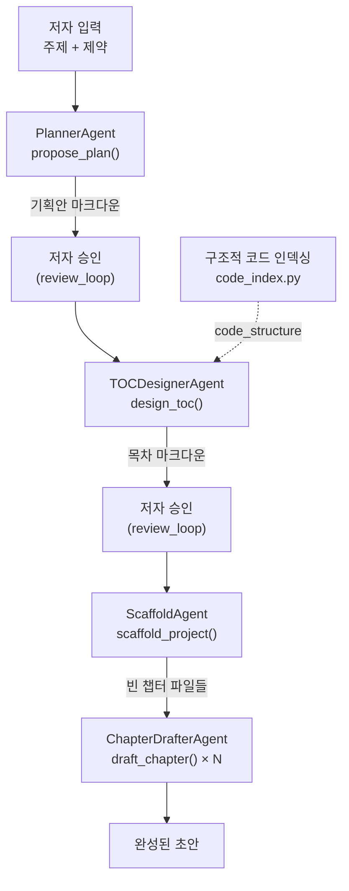

# Chapter 4. 순차 파이프라인 협업 — 기획에서 집필까지

> ## Part II. Book-forge의 멀티 에이전트 협업
> Part I이 에이전트 하나의 해부였다면, 이제부터 4개 챕터는 **여러 에이전트가 서로 다른 방식으로 협업하는 네 가지 패턴**을 다룬다. 순서대로 데이터만 넘기는 협업(4장), 여럿이 같은 대상을 동시에 검토하는 협업(5장), 사람이 루프 안에 있는 협업(6장), 세션을 넘어 파일로 이어지는 간접 협업(7장) 순이다. 네 패턴 모두 실제 Book-forge 코드에 존재한다. "멀티에이전트"라는 말이 하나의 정형화된 그림이 아니라는 것을 이 네 패턴이 보여준다.

> **이 챕터에서 배우는 것**
> - `book-forge new`가 4개 에이전트를 어떤 순서로 호출하는지
> - 한 에이전트의 출력이 다음 에이전트의 입력으로 어떻게 넘어가는지
> - "협업"이 대화가 아니라 데이터 전달로 이뤄지는 경우

> **이런 분이 먼저 읽으면 좋습니다**: "멀티에이전트"라고 하면 에이전트끼리 서로 메시지를 주고받는 그림을 떠올렸던 분. 이 챕터는 그보다 훨씬 단순하지만 실제로 잘 동작하는 협업 방식을 보여준다.

---

## 4.1 협업의 가장 단순한 형태 — 순서와 데이터 전달

`cli/commands/new_cmd.py`의 `new()` 함수는 4개의 서로 다른 에이전트를 순서대로 호출한다. 이들은 서로의 존재를 모른다 — 각자 "입력을 받아 출력을 낸다"는 계약만 지킨다. 협업은 함수 하나(`new()`)가 이전 에이전트의 출력을 다음 에이전트의 입력으로 그대로 전달하는 것으로 이뤄진다.



이 다이어그램은 요약이다. `new_cmd.py`의 `new()` 함수에서 CLI 옵션 처리·에러 분기를 걷어내고 핵심 오케스트레이션만 남기면 이렇게 된다. 이후 장에서 개별 조각(2장 `propose_plan()`, 6장 `run_review_loop()`, 12장 `scaffold_project()`)을 다시 만나면, 이 발췌로 돌아와 "전체 흐름의 어디였는지" 확인하면 된다.

```python
load_config()
...
project_dir = ensure_project_dir(slug)

llm = create_llm()
monitor = build_book_monitor(
    output_dir=str(project_dir / "eval_results"),
    enable_llm_judge=enable_llm_judge, judge_model=judge_model,
)

propose_plan = build_propose_plan(llm, monitor)
design_toc = build_design_toc(llm, monitor)
revise = build_revise(llm, monitor)

# --source가 코드 저장소면 목차 설계 *이전에* AST 정적 분석으로
# 실제 모듈/클래스/함수 목록을 미리 뽑아둔다(§4.3).
code_structure = ""
if sources:
    code_structure = _build_structure_summary_from_sources(sources) or ""

proposal_md = propose_plan(
    topic=title, constraints=constraints, ground_truth=f"{title} {constraints}"
)
proposal_md = run_review_loop(
    kind="plan", initial_md=proposal_md, revise_fn=revise,
    render=render, ask_feedback=lambda: ask_feedback("기획안 검토"),
)
(project_dir / "00_기획안.md").write_text(f"# {title}\n\n{proposal_md}", encoding="utf-8")

toc_md = design_toc(proposal_md=proposal_md, code_structure=code_structure)
toc_md = run_review_loop(
    kind="toc", initial_md=toc_md, revise_fn=revise,
    render=render, ask_feedback=lambda: ask_feedback("목차 검토"),
)
chapters = parse_toc_manifest(toc_md)
(project_dir / "01_목차.md").write_text(toc_md, encoding="utf-8")

results = scaffold_project(project_dir, chapters)
monitor.save_to_file("planning")
```

이 20줄 남짓한 코드에 이 책이 다룰 개념 대부분이 모여 있다. `create_llm()`(1장), `@agent_eval` 적용 함수(2장), `run_review_loop()`(6장), `parse_toc_manifest()`(§4.2), `scaffold_project()`(12장)이 전부 이 안에 등장한다. **순차 파이프라인의 "협업"이란 결국 이 코드가 하는 일 그 자체다.** 메시지 버스나 이벤트 큐 없이, 한 함수 안에서 변수를 다음 호출의 인자로 넘기는 것이 전부다.

## 4.2 넘겨주는 데이터가 계약이다

각 화살표가 실제로 무엇을 옮기는지 코드로 확인하면, "협업"이 얼마나 구체적인 데이터 전달인지 드러난다.

| 단계 | 넘기는 것 | 코드 근거 |
|---|---|---|
| 저자 입력 → Planner | `topic`, `constraints` | `new()`의 CLI 인자 |
| Planner → 저자 승인 | 기획안 마크다운(`proposal_md`) | `run_review_loop(kind="plan", initial_md=proposal_md, ...)` |
| 저자 승인 → TOCDesigner | 확정된 `proposal_md` + `code_structure`(선택) | `design_toc(proposal_md=proposal_md, code_structure=code_structure)` |
| TOCDesigner → 저자 승인 | 목차 마크다운(사람이 읽는 부분 + ` ```toc ` 매니페스트 블록) | `run_review_loop(kind="toc", initial_md=toc_md, ...)` |
| 저자 승인 → Scaffold | `parse_toc_manifest(toc_md)`로 파싱한 `ChapterSpec` 목록 | `chapters = parse_toc_manifest(toc_md)` |
| Scaffold → Drafter | 생성된 빈 챕터 파일 경로들(`ResolvedChapter`) | `load_toc(project_dir)`로 재조회 |

특히 눈여겨볼 지점은 TOCDesigner의 출력 형식이다. 목차는 사람이 읽는 마크다운(제목·소개)과, 코드가 파싱하는 ` ```toc ` 코드 펜스 블록을 **한 문서 안에 함께** 담는다. 이는 "사람이 검토하기 편한 형식"과 "다음 에이전트가 안정적으로 소비할 수 있는 형식"이 다를 수 있다는 것을 보여준다. 이 둘을 하나의 문서에 공존시키는 것이 Book-forge가 택한 해법이다.

`toc_designer.py`의 `build_design_toc()`는 2장에서 본 `build_propose_plan()`과 뼈대가 완전히 같다.

```python
def build_design_toc(llm: LLM, monitor: PerformanceMonitor) -> DesignTocFn:
    @agent_eval(
        monitor,
        task_type="planning",
        question_arg="proposal_md",
        # Gate A: 챕터(subtask)들이 기획안의 커버리지를 충족하는지,
        # 기획안의 결정사항(대상독자·차별점 등)을 목차가 이어받는지.
        plan_tracking=PlanConfig(),
        subtask_tracking=SubtaskConfig(),
        context_retention=ContextRetentionConfig(),
    )
    def design_toc(
        proposal_md: str, code_structure: str = "", ground_truth: str = ""
    ) -> tuple[str, EvalMetadata]:
        code_structure_block = (
            _CODE_STRUCTURE_BLOCK.format(code_structure=code_structure[:6000])
            if code_structure else ""
        )
        prompt = TOC_PROMPT.format(proposal=proposal_md, code_structure_block=code_structure_block)
        toc_md = llm.generate(prompt, system=TOC_SYSTEM_PROMPT, max_tokens=6000)
        return toc_md, EvalMetadata(
            extra={"phase": "toc_design", "code_structure_used": bool(code_structure)}
        )

    return design_toc
```

`code_structure`가 빈 문자열이면 `code_structure_block`도 빈 문자열이 되고, 프롬프트는 `--source` 없이 실행했을 때와 완전히 동일해진다. 이것이 "하위 호환"이라는 말이 코드로는 정확히 무엇을 뜻하는지 보여주는 사례다. `EvalMetadata`의 `extra`에 `code_structure_used`를 남겨두는 것도 실무적이다. 나중에 `eval_results/planning.json`을 열어보면, 이 특정 실행이 구조적 코드 인덱싱을 실제로 썼는지 아닌지를 Gate 점수와 별개로 바로 확인할 수 있다.

목차가 파싱되는 쪽(`ScaffoldAgent`가 소비하는 쪽)도 실제 코드로 확인해두면 "계약"이라는 말이 더 구체적으로 다가온다. `models.py`의 `parse_toc_manifest()`는 ` ```toc ` 블록 한 줄 한 줄을 `ChapterSpec`으로 바꾼다.

```python
def parse_toc_manifest(toc_markdown: str) -> list[ChapterSpec]:
    match = _TOC_BLOCK_RE.search(toc_markdown)
    if not match:
        raise TocParseError("```toc 코드 블록을 찾을 수 없습니다. LLM 응답이 형식을 지키지 않았을 수 있습니다.")

    chapters: list[ChapterSpec] = []
    for line in match.group(1).strip().splitlines():
        line = line.strip()
        if not line:
            continue
        parts = [p.strip() for p in line.split("|")]
        if len(parts) not in (4, 5):
            raise TocParseError(
                f"목차 항목 형식 오류 (파트번호|파트제목|챕터번호|챕터제목[|콘텐츠유형] 필요): {line!r}"
            )
        part_no_s, part_title, chapter_no_s, chapter_title = parts[:4]
        content_type = "narrative"
        if len(parts) == 5 and parts[4] in KNOWN_CONTENT_TYPES:
            content_type = parts[4]
        # ... (파싱한 값으로 ChapterSpec을 만들어 chapters에 추가)
    return chapters
```

이 함수가 `raise TocParseError`를 던지는 두 지점이 바로 `new()`가 `except BookForgeError`로 잡아 "LLM이 ```toc 블록 형식을 지키지 않았습니다"라고 안내하는 지점이다(§4.1 발췌의 마지막 부분). 다만 5번째 필드(`content_type`)는 다르게 다룬다. 없거나 `KNOWN_CONTENT_TYPES`에 없는 값이면 예외를 던지지 않고 조용히 `"narrative"`로 폴백한다. 4개 필드(필수 구조)는 엄격하게, 5번째 필드(부가 정보)는 관대하게 다룬다. **어떤 파싱 오류를 예외로 취급하고 어떤 것을 안전한 기본값으로 흡수할지가 이 함수 하나에 이미 정책으로 녹아 있다.**

## 4.3 구조적 코드 인덱싱 — 코드가 정적 분석으로 세 번째 에이전트에 끼어든다

`--source`로 코드 저장소 디렉토리가 주어지면, `new_cmd.py`는 목차 설계 **이전에** `knowledge/code_index.py`의 정적 분석으로 실제 모듈/클래스/함수 목록을 미리 뽑아 `code_structure`라는 문자열로 만든다.

```python
code_structure = ""
if sources:
    from book_forge.cli.commands.draft_cmd import _build_structure_summary_from_sources
    code_structure = _build_structure_summary_from_sources(sources) or ""
```

이 값은 LLM 호출이 아니라 **순수 AST 파싱**으로 만들어진다. 세 번째 "협업자"가 있다면 그것은 LLM 에이전트가 아니라 결정론적 정적 분석 도구다. 3장(§3.2)에서 다룬 환각 문제의 첫 방어선이 여기 있다. `design_toc()`가 실제로 존재하는 모듈 목록을 프롬프트에 받으면, 존재하지 않는 서브시스템을 목차에 지어낼 여지가 크게 줄어든다.

`_build_structure_summary_from_sources()` 안에서 실제로 파일을 읽어 구조를 뽑는 것은 `knowledge/code_index.py`다. 먼저 한 파일을 어떤 형태로 요약하는지부터 본다.

```python
@dataclass
class ClassSummary:
    name: str
    bases: list[str]
    docstring: Optional[str]
    methods: list[str]

@dataclass
class FunctionSummary:
    name: str
    args: list[str]
    docstring: Optional[str]

@dataclass
class ModuleSummary:
    path: str
    imports: list[str] = field(default_factory=list)
    classes: list[ClassSummary] = field(default_factory=list)
    functions: list[FunctionSummary] = field(default_factory=list)
```

파일 하나가 결국 "이름·상속 관계·독스트링 첫 줄·공개 메서드 목록을 가진 클래스들"과 "이름·인자·독스트링 첫 줄을 가진 함수들"의 목록으로 요약된다. 이 요약을 실제로 뽑는 함수가 표준 라이브러리 `ast` 모듈만 쓴다.

```python
def _extract_classes(tree: ast.Module) -> list[ClassSummary]:
    classes: list[ClassSummary] = []
    for node in tree.body:
        if not isinstance(node, ast.ClassDef):
            continue
        bases = [ast.unparse(b) for b in node.bases]
        methods = [
            n.name for n in node.body
            if isinstance(n, (ast.FunctionDef, ast.AsyncFunctionDef))
            and not n.name.startswith("_")
        ]
        classes.append(ClassSummary(
            name=node.name, bases=bases,
            docstring=_first_line(ast.get_docstring(node)), methods=methods,
        ))
    return classes


def extract_module_summary(rel_path: str, source_text: str) -> Optional[ModuleSummary]:
    """단일 .py 파일 내용을 파싱해 ModuleSummary를 만든다.

    문법 오류가 있으면 예외를 던지지 않고 None을 반환한다 — 저장소 전체
    인덱싱이 파일 하나 때문에 중단되지 않게 한다.
    """
    try:
        tree = ast.parse(source_text)
    except SyntaxError:
        return None
    return ModuleSummary(
        path=rel_path, imports=_extract_imports(tree),
        classes=_extract_classes(tree), functions=_extract_functions(tree),
    )
```

`ast.parse(source_text)`가 이 기능의 핵심이다. 파이썬 인터프리터가 코드를 실행하기 전에 만드는 것과 같은 구문 트리(AST)를 만든 뒤, `tree.body`를 순회하며 클래스·함수 정의만 골라낸다. **코드를 한 줄도 실행하지 않는다.** `import`문이 실행되지 않으므로 어떤 부작용도 없고, 문법만 유효하면 의존성이 하나도 설치되지 않은 저장소도 인덱싱할 수 있다. `except SyntaxError: return None`이 3장·10장에서 반복된 원칙과 같은 자리에 있다는 것도 눈여겨볼 만하다. 파일 하나가 깨져 있어도(다른 언어 파일에 `.py` 확장자가 잘못 붙는 등) 저장소 전체 인덱싱이 죽지 않는다.

> 👨‍💻 **개발자 TIP**: `code_index.py` 모듈 docstring이 이 기능의 범위를 명확히 긋는다. "`ast`가 표준 라이브러리라 새 의존성이 필요 없다는 게 이유다(tree-sitter 등 다국어 파서는 추가하지 않는다)." Python(`.py`) 파일만 지원하고, 다른 언어 파일은 이 인덱서를 건너뛰고 기존 텍스트 청킹(`knowledge/sources.py`)으로만 처리된다. "모든 언어를 지원하는 완벽한 인덱서"가 아니라 "가장 흔한 경우(Python 저장소)를 새 의존성 없이 잘 처리하는 인덱서"를 택한 것이다.

## 4.4 승인 게이트 — 사람이 파이프라인에 끼어드는 두 지점

이 파이프라인에는 순수 자동 단계만 있는 게 아니다. Planner와 TOCDesigner의 출력 사이에는 각각 `run_review_loop()`가 있다. 저자가 Enter를 누르면(승인) 다음 단계로 넘어가고, 피드백을 입력하면 `revise()`가 그 피드백을 반영해 다시 만든다(6장에서 이 루프 자체를 자세히 다룬다). 즉 이 파이프라인은 순수하게 자동인 것이 아니라, **두 개의 사람 승인 게이트가 순차 흐름 중간에 끼어 있는 구조**다.

> 📋 **QA 관리자 TIP**: `--source`가 있으면 스캐폴딩 직후 곧바로 전체 챕터 배치 초안까지 이어진다(`new_cmd.py` 마지막 블록). 승인 게이트는 기획·목차 두 곳에만 있고, 챕터 집필 자체는 저자 확인 없이 진행된다. "주제 입력 → 완성된 초안까지 한 번에"라는 이 도구의 목표와, "위험한 단계에서는 반드시 사람이 확인한다"는 원칙 사이의 실제 트레이드오프 지점이 여기다.

---

## 직접 해보기

0장(§0.6)에서 만든 프로젝트 디렉토리를 열어 `01_목차.md`의 ` ```toc ` 블록을 직접 한 줄 고쳐보자(예: 챕터 제목을 바꾸거나 `content_type`을 `exercise`로 바꿔보기). 그다음 `book-forge draft <slug> --all`을 실행하면, `parse_toc_manifest()`(§4.2)가 그 수정을 실제로 어떻게 반영하는지 눈으로 확인할 수 있다.

여러 단계로 이어지는 파이프라인을 설계할 때 이 장에서 가져갈 교훈은 하나다. 각 단계 사이에 오가는 값이 "사람이 검토하기 편한 형식"과 "다음 단계가 파싱하기 쉬운 형식" 중 어느 쪽을 우선해야 하는지 미리 정하라. 목차 매니페스트가 그 둘을 한 문서에 공존시킨 것처럼, 두 요구가 충돌한다면 하나를 포기하지 말고 공존시킬 방법부터 찾는다.

## 이 챕터의 핵심

- **순차 파이프라인의 협업은 데이터 전달이다.** 에이전트끼리 대화하지 않는다 — 한 함수(`new()`)가 출력을 다음 입력으로 넘긴다.
- **출력 형식은 다음 소비자의 필요에 맞춰 설계된다.** 목차 마크다운이 사람이 읽는 부분과 파싱 가능한 코드 블록을 함께 담는 것이 그 예다.
- **정적 분석 도구도 협업자다.** `code_index.py`는 LLM이 아니지만, TOCDesigner에게 "진짜 존재하는 것"을 알려주는 역할을 한다.
- **사람이 파이프라인 중간에 끼어드는 지점이 명시적으로 설계돼 있다.** 기획·목차 두 곳의 승인 게이트가 그것이다.

## 참고 자료

- `src/book_forge/cli/commands/new_cmd.py` — 전체 흐름
- `src/book_forge/agents/toc_designer.py` — `build_design_toc()`
- `src/book_forge/models.py` — `parse_toc_manifest()`
- `src/book_forge/knowledge/code_index.py` — `ClassSummary`·`extract_module_summary()`·`build_structure_index()` 전체

---

> **다음 챕터**는 순차 협업과 완전히 다른 패턴 — 여러 에이전트가 **같은 결과물을 놓고 동시에 검토**한 뒤 한 에이전트가 종합 판정하는 검토자-편집장 구조를 다룬다.
