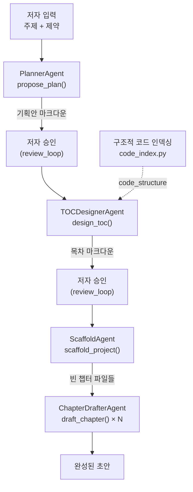

# Chapter 4. 순차 파이프라인 협업 — 기획에서 집필까지

> **이 챕터에서 배우는 것**
> - `book-forge new`가 4개 에이전트를 어떤 순서로 호출하는지
> - 한 에이전트의 출력이 다음 에이전트의 입력으로 어떻게 넘어가는지
> - "협업"이 대화가 아니라 데이터 전달로 이뤄지는 경우

> **이런 분이 먼저 읽으면 좋습니다**: "멀티에이전트"라고 하면 에이전트끼리 서로 메시지를 주고받는 그림을 떠올렸던 분. 이 챕터는 그보다 훨씬 단순하지만 실제로 잘 동작하는 협업 방식을 보여준다.

---

## 4.1 협업의 가장 단순한 형태 — 순서와 데이터 전달

`cli/commands/new_cmd.py`의 `new()` 함수는 4개의 서로 다른 에이전트를 순서대로 호출한다. 이들은 서로의 존재를 모른다 — 각자 "입력을 받아 출력을 낸다"는 계약만 지킨다. 협업은 함수 하나(`new()`)가 이전 에이전트의 출력을 다음 에이전트의 입력으로 그대로 전달하는 것으로 이뤄진다.



## 4.2 넘겨주는 데이터가 계약이다

각 화살표가 실제로 무엇을 옮기는지 코드로 확인하면, "협업"이 얼마나 구체적인 데이터 전달인지 드러난다.

| 단계 | 넘기는 것 | 코드 근거 |
|---|---|---|
| 저자 입력 → Planner | `topic`, `constraints` | `new()`의 CLI 인자 |
| Planner → 저자 승인 | 기획안 마크다운(`proposal_md`) | `run_review_loop(kind="plan", initial_md=proposal_md, ...)` |
| 저자 승인 → TOCDesigner | 확정된 `proposal_md` + `code_structure`(선택) | `design_toc(proposal_md=proposal_md, code_structure=code_structure)` |
| TOCDesigner → 저자 승인 | 목차 마크다운(사람이 읽는 부분 + ` ```toc ` 매니페스트 블록) | `run_review_loop(kind="toc", initial_md=toc_md, ...)` |
| 저자 승인 → Scaffold | `parse_toc_manifest(toc_md)`로 파싱한 `ChapterSpec` 목록 | `chapters = parse_toc_manifest(toc_md)` |
| Scaffold → Drafter | 생성된 빈 챕터 파일 경로들(`ResolvedChapter`) | `load_toc(project_dir)`로 재조회 |

특히 눈여겨볼 지점은 TOCDesigner의 출력 형식이다 — 목차는 사람이 읽는 마크다운(제목·소개)과, 코드가 파싱하는 ` ```toc ` 코드 펜스 블록을 **한 문서 안에 함께** 담는다. 이는 "사람이 검토하기 편한 형식"과 "다음 에이전트가 안정적으로 소비할 수 있는 형식"이 다를 수 있다는 것을 보여준다 — 이 둘을 하나의 문서에 공존시키는 것이 Book-forge가 택한 해법이다.

## 4.3 구조적 코드 인덱싱 — 코드가 정적 분석으로 세 번째 에이전트에 끼어든다

`--source`로 코드 저장소 디렉토리가 주어지면, `new_cmd.py`는 목차 설계 **이전에** `knowledge/code_index.py`의 정적 분석으로 실제 모듈/클래스/함수 목록을 미리 뽑아 `code_structure`라는 문자열로 만든다.

```python
code_structure = ""
if sources:
    from book_forge.cli.commands.draft_cmd import _build_structure_summary_from_sources
    code_structure = _build_structure_summary_from_sources(sources) or ""
```

이 값은 LLM 호출이 아니라 **순수 AST 파싱**으로 만들어진다 — 세 번째 "협업자"가 있다면 그것은 LLM 에이전트가 아니라 결정론적 정적 분석 도구다. 3장(§3.2)에서 다룬 환각 문제의 첫 방어선이 여기 있다 — `design_toc()`가 실제로 존재하는 모듈 목록을 프롬프트에 받으면, 존재하지 않는 서브시스템을 목차에 지어낼 여지가 크게 줄어든다.

## 4.4 승인 게이트 — 사람이 파이프라인에 끼어드는 두 지점

이 파이프라인에는 순수 자동 단계만 있는 게 아니다. Planner와 TOCDesigner의 출력 사이에는 각각 `run_review_loop()`가 있다 — 저자가 Enter를 누르면(승인) 다음 단계로 넘어가고, 피드백을 입력하면 `ReviseAgent`가 그 피드백을 반영해 다시 만든다(6장에서 이 루프 자체를 자세히 다룬다). 즉 이 파이프라인은 순수하게 자동인 것이 아니라, **두 개의 사람 승인 게이트가 순차 흐름 중간에 끼어 있는 구조**다.

> 📋 **QA 관리자 TIP**: `--source`가 있으면 스캐폴딩 직후 곧바로 전체 챕터 배치 초안까지 이어진다(`new_cmd.py` 마지막 블록) — 승인 게이트는 기획·목차 두 곳에만 있고, 챕터 집필 자체는 저자 확인 없이 진행된다. "주제 입력 → 완성된 초안까지 한 번에"라는 이 도구의 목표와, "위험한 단계에서는 반드시 사람이 확인한다"는 원칙 사이의 실제 트레이드오프 지점이 여기다.

---

## 이 챕터의 핵심

- **순차 파이프라인의 협업은 데이터 전달이다.** 에이전트끼리 대화하지 않는다 — 한 함수(`new()`)가 출력을 다음 입력으로 넘긴다.
- **출력 형식은 다음 소비자의 필요에 맞춰 설계된다.** 목차 마크다운이 사람이 읽는 부분과 파싱 가능한 코드 블록을 함께 담는 것이 그 예다.
- **정적 분석 도구도 협업자다.** `code_index.py`는 LLM이 아니지만, TOCDesigner에게 "진짜 존재하는 것"을 알려주는 역할을 한다.
- **사람이 파이프라인 중간에 끼어드는 지점이 명시적으로 설계돼 있다.** 기획·목차 두 곳의 승인 게이트가 그것이다.

## 참고 자료

- `src/book_forge/cli/commands/new_cmd.py` — 전체 흐름
- `src/book_forge/knowledge/code_index.py` — `build_structure_index()`
- `src/book_forge/models.py` — `parse_toc_manifest()`

---

> **다음 챕터**는 순차 협업과 완전히 다른 패턴 — 여러 에이전트가 **같은 결과물을 놓고 동시에 검토**한 뒤 한 에이전트가 종합 판정하는 검토자-편집장 구조를 다룬다.
