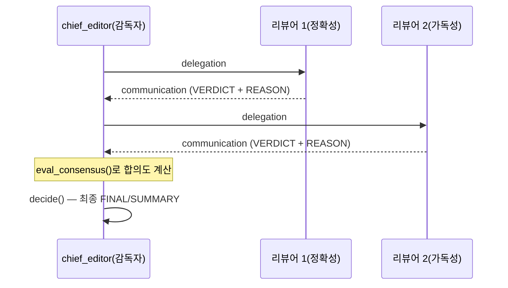

# Chapter 5. 검토자-편집장 협업 — ReviewPanel

> **이 챕터에서 배우는 것**
> - "감독자-작업자"(supervisor-worker) 패턴이 코드에서 정확히 어떻게 구현되는지
> - 여러 검토자의 판정이 어떻게 하나의 "합의도" 숫자로 계산되는지
> - 이 협업 구조가 왜 Gate F(다중 에이전트 조정)를 실제로 채점할 수 있는 유일한 지점인지

> **이런 분이 먼저 읽으면 좋습니다**: Book-forge가 지금까지 "에이전트가 순서대로 실행된다"는 얘기만 했는데, 정말 여러 에이전트가 **동시에 같은 대상**을 다루는 사례가 있는지 궁금했던 분.

---

## 5.1 왜 이 패턴이 특별한가

4장의 파이프라인은 에이전트 A의 출력이 그대로 에이전트 B의 입력이 되는 구조였다. 순서만 있으면 됐다. `review_panel.py`는 다르다. **여러 리뷰어가 같은 챕터를 각자 독립적으로 검토하고, 그 결과를 종합해 한 명(편집장)이 최종 판정을 내린다.** 이 구조가 바로 `agents/review_panel.py` 최상단 주석이 "감독자-작업자 패턴"이라 부르는 것이다. Book-forge 전체에서 Gate F(다중 에이전트 조정) 4개 지표(coordination·consensus·agent_role·conflict_resolution)가 실제 값을 얻는 **유일한** 지점이기도 하다.

## 5.2 리뷰어 하나 — 역할이 Harness Config로 강제된다

각 리뷰어는 `build_reviewer()`로 만들어지고, `AgentRoleConfig`로 자신의 역할을 벗어나지 못하게 계측된다.

> 📄 **파일**: `src/book_forge/agents/review_panel.py` (`build_reviewer()`)

```python
@agent_eval(
    monitor,
    task_type="document_review",
    question_arg="chapter_title",
    agent_role=AgentRoleConfig(
        role_name=role_name,
        allowed_action_keywords=allowed_action_keywords,
        forbidden_action_keywords=forbidden_action_keywords,
        role_violation_penalty=0.3,
    ),
)
def review(chapter_title: str, chapter_md: str, ground_truth: str = "") -> tuple[str, EvalMetadata]:
    ...
```

`role_name`은 이 리뷰어의 역할 이름(예: "정확성 검토자")이고, `allowed_action_keywords`/`forbidden_action_keywords`는 그 역할이 검토 의견에서 써도 되는/쓰면 안 되는 키워드 목록이다(예: 정확성 담당이라면 "오탈자"·"어투" 같은 가독성 관련 단어가 `forbidden_action_keywords`에 들어간다). `AgentRoleConfig`는 리뷰어의 응답 텍스트에 금지 키워드가 등장하는지를 이 목록으로 대조해 역할 이탈 여부를 판정한다. `role_violation_penalty=0.3`은 "이 리뷰어가 자기 역할(예: 정확성 검토)을 벗어난 말을 하면 Gate F 점수에 30% 페널티를 준다"는 뜻이다. 정확성 담당 리뷰어가 갑자기 문체를 지적하기 시작하면, 그건 그 자체로 품질 신호(역할 이탈)로 잡힌다.

## 5.3 위임과 응답 — 협업이 명시적 이벤트로 기록된다

`run_review_panel()`은 각 리뷰어를 부르기 **전후**로 `monitor.agent_coordination_tracker.track_interaction()`을 명시적으로 호출한다.

> 📄 **파일**: `src/book_forge/agents/review_panel.py` (`run_review_panel()`)

```python
monitor.agent_coordination_tracker.track_interaction(
    task_id=task_id, from_agent="chief_editor", to_agent=cfg["role_name"],
    interaction_type="delegation", success=True,
)
review = build_reviewer(llm, monitor, **cfg)
raw_text = review(chapter_title=chapter_title, chapter_md=chapter_md, ground_truth=chapter_title)
verdict, reason = _parse_reviewer_output(raw_text)
verdicts.append(ReviewerVerdict(role_name=cfg["role_name"], verdict=verdict, reason=reason, raw_text=raw_text))
monitor.agent_coordination_tracker.track_interaction(
    task_id=task_id, from_agent=cfg["role_name"], to_agent="chief_editor",
    interaction_type="communication", success=True,
)
```

이 두 번의 `track_interaction()` 호출("delegation"→"communication")이 바로 **협업이라는 사건을 코드로 기록하는 방식**이다. 4장의 순차 파이프라인에는 이런 기록이 없었다(그냥 함수를 순서대로 불렀을 뿐이다). 여기서는 "누가 누구에게 무엇을 위임했고, 누가 응답했는가"가 명시적 데이터로 남는다. Gate F의 `AgentCoordinationTracker`가 이 기록을 근거로 협업 점수를 계산한다.

## 5.4 합의도 — 판정 자체를 구조화 신호로 쓴다

각 리뷰어는 `_parse_reviewer_output()`으로 `VERDICT:`(approve/revise)와 `REASON:`을 자유 텍스트에서 관대하게 파싱한다. 형식을 어겨도 예외를 던지지 않고 "revise"로 안전하게 폴백한다(3장 §3.2의 교훈과 같은 원칙 — 파싱 실패가 파이프라인 전체를 죽이면 안 된다).

> 📄 **파일**: `src/book_forge/agents/review_panel.py`

```python
def _parse_reviewer_output(text: str) -> tuple[str, str]:
    """``VERDICT:``/``REASON:`` 을 관대하게 파싱한다. 형식을 어겨도 예외를 던지지
    않고 안전한 폴백(REVISE, 원문 앞부분)으로 처리한다."""
    v_match = _VERDICT_RE.search(text)
    verdict = v_match.group(1).lower() if v_match else "revise"
    r_match = _REASON_RE.search(text)
    reason = r_match.group(1).strip().splitlines()[0].strip() if r_match else text.strip()[:200]
    return verdict, reason
```

`_VERDICT_RE`/`_REASON_RE`는 각각 `VERDICT:`/`REASON:` 뒤의 텍스트를 뽑는 정규식이다. LLM이 `VERDICT:` 줄 자체를 빼먹거나 오타를 내도, 이 함수는 예외를 던지는 대신 조용히 `"revise"`(더 보수적인 쪽)로 fallback한다. 리뷰 결과를 "잘 모르겠으니 통과"가 아니라 "잘 모르겠으니 다시 검토"로 기울이는 선택이다.

이 판정들은 `eval_consensus()`로 합의도 점수가 된다. 코드 주석이 이 설계의 이유를 명확히 밝힌다.

> "VERDICT를 그대로 intent로 넘겨 자유 텍스트 어휘 유사도가 아니라 **판정 자체의 일치 여부**로 합의를 계산한다."

즉 두 리뷰어가 완전히 다른 문장으로 검토 의견을 썼더라도, 둘 다 "approve"라고 판정했다면 합의도는 높게 계산된다. 문장이 비슷한지가 아니라 **결론이 같은지**를 본다. 이 구조화 신호 방식은 자유 텍스트 유사도 비교보다 훨씬 신뢰할 수 있는 합의 측정이다.

## 5.5 편집장 — 리뷰를 넘겨받아 최종 판정을 내린다

편집장(`build_chief_editor()`)은 리뷰어들의 텍스트를 요약한 `reviews_text`와 합의도 결과(`consensus`)를 함께 받아 최종 판정을 낸다. `ConflictResolutionConfig()`가 붙는 이유는 명확하다. 리뷰어들의 판정이 서로 엇갈릴 때(한 명은 approve, 한 명은 revise) 편집장이 그 갈등을 어떻게 조정하는지가 Gate F의 conflict_resolution 지표가 채점하는 대상이기 때문이다.

> 📄 **파일**: `src/book_forge/agents/review_panel.py`

```python
def build_chief_editor(llm: LLM, monitor: PerformanceMonitor) -> DecideFn:
    @agent_eval(
        monitor,
        task_type="document_review",
        question_arg="chapter_title",
        conflict_resolution=ConflictResolutionConfig(),
    )
    def decide(
        chapter_title: str, reviews_text: str, consensus: dict, ground_truth: str = ""
    ) -> tuple[str, EvalMetadata]:
        prompt = CHIEF_EDITOR_PROMPT.format(chapter_title=chapter_title, reviews_text=reviews_text)
        text = llm.generate(prompt, system=CHIEF_EDITOR_SYSTEM_PROMPT, max_tokens=500)
        return text, EvalMetadata(extra={"phase": "chief_editor", "consensus": consensus})

    return decide
```

이 코드는 2장에서 확인한 `build_propose_plan()`과 뼈대가 완전히 같다. 팩토리 함수, `@agent_eval` 데코레이터, 세 줄짜리 본문(프롬프트 조립 → `llm.generate()` → 반환) 구조가 그대로다. 다른 것은 딱 하나, 데코레이터에 들어가는 Harness Config뿐이다(`goal_alignment` 대신 `conflict_resolution`). `consensus`(합의도 계산 결과)가 `decide()`의 인자로 그대로 들어간다는 점도 눈여겨볼 지점이다. 편집장은 리뷰어들의 원문뿐 아니라 "그 판정들이 서로 얼마나 일치했는가"라는 이미 계산된 신호까지 프롬프트 조립 이전에 받아본다.



> 👨‍💻 **개발자 TIP**: `run_review_panel()`의 반환값 `ReviewPanelResult`에는 `reviewer_verdicts`(개별 판정 전부), `consensus_score`, `final_verdict`, `final_summary`가 모두 담긴다. 최종 판정만 쓰고 개별 리뷰어 의견을 버리지 않는다는 것은, 나중에 "왜 이 챕터가 반려됐는가"를 리뷰어 단위로 거슬러 올라가 확인할 수 있다는 뜻이다(Gate G의 설명 가능성과 맞닿는 지점 — 9장에서 다시 다룬다).

---

## 직접 해보기

`book-forge review <slug> <챕터번호>`를 실제로 실행해 리뷰어 2명(정확성/가독성)과 편집장의 판정을 직접 받아보라.

**스스로 점검해볼 질문**: 리뷰 패널을 직접 설계한다면, 리뷰어 역할을 몇 개로 나누고 각 역할의 `allowed_action_keywords`/`forbidden_action_keywords`를 무엇으로 정할지 먼저 종이에 적을 수 있는가? "정확성 담당이 문체를 지적하면 역할 이탈"이라는 §5.2의 예시처럼, 역할을 명확히 가르는 키워드를 미리 정해두지 않으면 `AgentRoleConfig`를 붙여도 역할 이탈을 잡아낼 기준 자체가 없다.

## 이 챕터의 핵심

- **감독자-작업자 패턴은 여러 에이전트가 같은 대상을 동시에 다루는 유일한 구조다.** 4장의 순차 협업과는 근본적으로 다르다.
- **협업은 `track_interaction()` 호출로 명시적 이벤트가 된다.** "위임"과 "응답"이 코드로 기록되지 않으면 Gate F는 채점할 신호 자체가 없다.
- **합의는 문장 유사도가 아니라 판정(intent) 일치 여부로 계산한다.** 자유 텍스트를 구조화 신호로 바꾸는 이 원칙이 신뢰할 수 있는 측정을 만든다.

## 참고 자료

- `src/book_forge/agents/review_panel.py` — 전체(특히 `run_review_panel()`)
- `src/book_forge/cli/commands/review_cmd.py` — 실제 호출 지점

---

> **다음 챕터**는 여러 에이전트가 아니라, **에이전트와 사람**이 반복적으로 주고받는 협업 — 저자 피드백을 반영해 다시 쓰는 루프를 다룬다.
