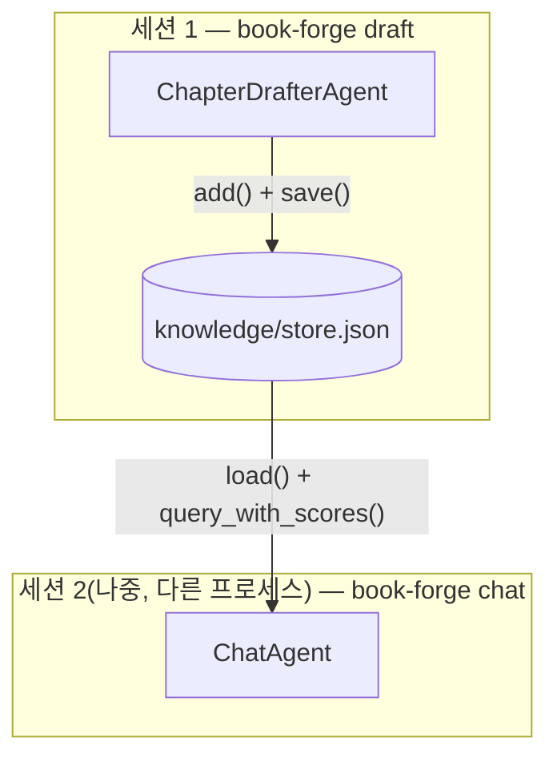

# Chapter 7. 지식창고를 매개로 한 협업

> **이 챕터에서 배우는 것**
> - 집필 에이전트와 대화 에이전트가 같은 파일을 어떻게 공유하는지
> - "간접 협업"이 직접 호출 협업과 무엇이 다른지
> - 한 소스가 검색 결과를 독점하는 문제를 코드가 어떻게 막는지

> **이런 분이 먼저 읽으면 좋습니다**: 지금까지 다룬 협업은 전부 "같은 세션 안"이었다. 세션이 끝난 뒤에도 이어지는 협업이 가능한지 궁금한 분.

---

## 7.1 파일이 곧 공유 상태다

`chapter_drafter.py`(집필)와 `chat_agent.py`(대화)는 서로를 호출하지 않는다 — 심지어 같은 CLI 명령에서 실행되지 않을 수도 있다(`book-forge draft`로 집필하고, 나중에 다른 세션에서 `book-forge chat`으로 질문한다). 이 둘을 잇는 것은 `knowledge/store.py`가 관리하는 JSON 파일 하나다.

```python
def default_store_path(project_dir: Path) -> Path:
    """draft/chat이 공유하는 프로젝트별 영속 지식창고 경로."""
    return project_dir / "knowledge" / "store.json"
```

이 파일에는 청크(텍스트 조각)와 그 임베딩 벡터가 함께 저장된다. `draft_cmd.py`가 소스를 수집할 때 이 파일에 쓰고, `chat_cmd.py`가 나중에 이 파일을 읽는다 — **두 에이전트가 직접 통신한 적은 한 번도 없지만, 같은 지식을 공유한다.** 이것이 4장의 순차 파이프라인, 5장의 감독자-작업자와 구분되는 세 번째 협업 형태다.

## 7.2 벡터 DB 프로세스 없이 — 의도적으로 단순한 설계

`store.py` 최상단 docstring이 이 설계를 왜 택했는지 밝힌다.

> "챕터 한 편의 집필 보조에 필요한 소스 규모(PDF 몇 개~수십 개 청크)에는 ChromaDB 같은 별도 벡터 DB가 과한 인프라라는 판단 — 별도 프로세스나 스키마 없이 평범한 JSON 파일 하나로 저장/로드한다."

`query_with_scores()`는 `numpy`만으로 코사인 유사도를 계산한다.

```python
query_vec = np.array(embed_text(text))
matrix = np.array(self._vectors)
norms = np.linalg.norm(matrix, axis=1) * np.linalg.norm(query_vec) + 1e-10
scores = matrix @ query_vec / norms
```

벡터 DB 서버를 띄우지 않고, 파이썬 프로세스 하나 안에서 행렬 연산 한 줄로 검색이 끝난다 — 이 단순함이 Book-forge의 "로컬 파일 하나로 완결된다"는 원칙과 정확히 맞물린다(15장에서 이 선택의 한계도 정직하게 다룬다).

## 7.3 한 소스가 검색을 독점하는 문제 — 3장에서 예고한 방어

3장(§3.3)에서 다룬 "챕터 드리프트" 문제를 여기서 코드로 확인할 수 있다. `query_with_scores()`의 `max_per_source` 인자는 한 소스가 검색 결과 상위를 독점하는 것을 막는다.

```python
selected: list[int] = []
per_source_count: dict[str, int] = {}
for i in np.argsort(-scores):
    if len(selected) >= top_k:
        break
    label = _source_label(self.chunks[i])
    if label is not None:
        if per_source_count.get(label, 0) >= max_per_source:
            continue
        per_source_count[label] = per_source_count.get(label, 0) + 1
    selected.append(i)
```

코드 주석에 실측 근거가 남아 있다 — "파일 하나가 청크의 61%를 차지하면 관련성과 무관하게 검색 결과를 지배한다." `_source_label()`은 `knowledge/sources.py`가 청크마다 붙이는 `"# 파일: xxx"`/`"# 출처: url"` 태그를 역파싱해 이 청크가 어느 소스에서 왔는지 식별한다 — 소스를 식별할 수 없는 청크(태그 없는 PDF 등)는 이 균형 조정에서 예외로 그대로 통과한다.

## 7.4 대화 에이전트도 같은 계약을 따른다

`chat_agent.py`의 `answer_question()`은 집필 에이전트와 계측 방식이 사실상 동일하다 — `rag_mode=True`, `context_arg="sources"`로 `HallucinationDetector`가 자동으로 켜진다. 차이는 산출물의 형태뿐이다.

```python
CHAT_SYSTEM_PROMPT = (
    "당신은 이 프로젝트의 지식창고를 근거로 질문에 답하는 도우미입니다. "
    "제공된 발췌문에 없는 내용은 지어내지 말고, 모르면 모른다고 답하세요. "
)
```

집필 에이전트는 결과를 파일로 저장하고, 대화 에이전트는 결과를 REPL에 즉시 출력한다 — 하지만 둘 다 "제공된 발췌문에 없는 내용을 지어내지 말라"는 같은 제약 아래, 같은 지식창고를 근거로 답한다. `conversation_history`는 `rag_mode`의 `context_arg`(근거 판정용)와는 별개다 — 대화 이력은 순수하게 "방금 말한 그거" 같은 지시대명사를 이해하게 돕는 용도로만 프롬프트에 얹힌다.



> 👨‍💻 **개발자 TIP**: `KnowledgeStore.merge()`는 임베딩을 다시 계산하지 않고 청크·벡터를 이어붙이기만 한다 — `draft`가 새 소스를 추가할 때마다 기존 저장된 스토어를 덮어쓰지 않고 누적하기 위해서다. 지식창고에 소스를 계속 더해도 이미 임베딩된 청크를 다시 계산하는 낭비가 없다.

---

## 이 챕터의 핵심

- **파일 하나가 두 에이전트를 잇는 간접 협업 채널이다.** 직접 호출도, 메시지 교환도 없다 — `knowledge/store.json`이 공유 상태의 전부다.
- **단순함은 의도된 설계다.** ChromaDB 같은 별도 벡터 DB 없이 numpy 인메모리 계산만으로 이 규모의 문제를 푼다.
- **한 소스의 검색 독점은 실측으로 확인된 문제였고, `max_per_source`로 고쳐졌다.** 코드 설계가 실제 관측 결과를 반영해 진화한 사례다.

## 참고 자료

- `src/book_forge/knowledge/store.py` — `KnowledgeStore` 전체
- `src/book_forge/agents/chat_agent.py` — `build_answer_question()`
- `src/book_forge/cli/commands/draft_cmd.py` — `collect_sources_into_store()`

---

> **Part III**부터는 협업 그 자체가 아니라, 이 모든 협업이 만든 결과물의 **품질을 어떻게 계측하는가**로 초점을 옮긴다 — Book-forge가 실제로 적용하는 Harness Engineering의 첫 번째 축, 배치 평가다.
