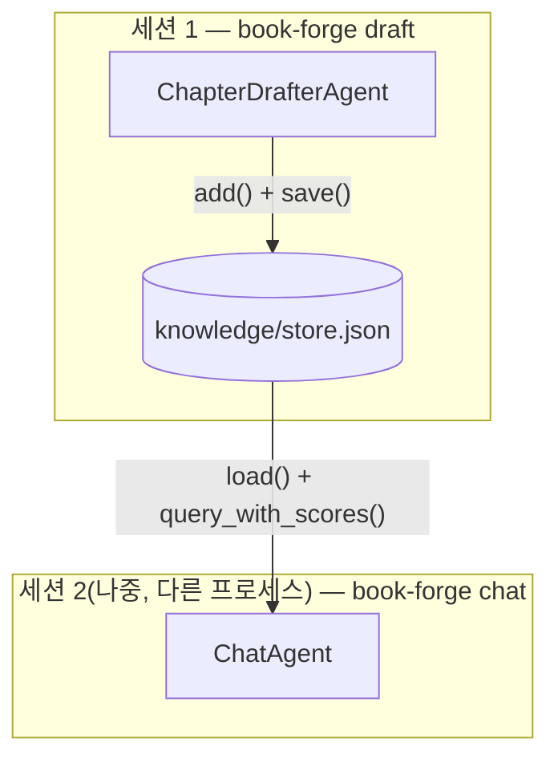

# Chapter 7. 지식창고를 매개로 한 협업

> **이 챕터에서 배우는 것**
> - 집필 에이전트와 대화 에이전트가 같은 파일을 어떻게 공유하는지
> - "간접 협업"이 직접 호출 협업과 무엇이 다른지
> - 한 소스가 검색 결과를 독점하는 문제를 코드가 어떻게 막는지
> - 질문 하나하나의 채점(`@agent_eval`)과 대화 전체의 흐름 채점(`ConversationSession`)이 왜 서로 다른 메커니즘인지

> **이런 분이 먼저 읽으면 좋습니다**: 지금까지 다룬 협업은 전부 "같은 세션 안"이었다. 세션이 끝난 뒤에도 이어지는 협업이 가능한지 궁금한 분.

---

## 7.1 파일이 곧 공유 상태다

`chapter_drafter.py`(집필)와 `chat_agent.py`(대화)는 서로를 호출하지 않는다 — 심지어 같은 CLI 명령에서 실행되지 않을 수도 있다(`book-forge draft`로 집필하고, 나중에 다른 세션에서 `book-forge chat`으로 질문한다). 이 둘을 잇는 것은 `knowledge/store.py`가 관리하는 JSON 파일 하나다.

```python
def default_store_path(project_dir: Path) -> Path:
    """draft/chat이 공유하는 프로젝트별 영속 지식창고 경로."""
    return project_dir / "knowledge" / "store.json"
```

이 파일에는 청크(텍스트 조각)와 그 임베딩 벡터가 함께 저장된다. `draft_cmd.py`가 소스를 수집할 때 이 파일에 쓰고, `chat_cmd.py`가 나중에 이 파일을 읽는다 — **두 에이전트가 직접 통신한 적은 한 번도 없지만, 같은 지식을 공유한다.** 이것이 4장의 순차 파이프라인, 5장의 감독자-작업자와 구분되는 세 번째 협업 형태다.

## 7.2 벡터 DB 프로세스 없이 — 의도적으로 단순한 설계

`store.py` 최상단 docstring이 이 설계를 왜 택했는지 밝힌다.

> "챕터 한 편의 집필 보조에 필요한 소스 규모(PDF 몇 개~수십 개 청크)에는 ChromaDB 같은 별도 벡터 DB가 과한 인프라라는 판단 — 별도 프로세스나 스키마 없이 평범한 JSON 파일 하나로 저장/로드한다."

`query_with_scores()`는 `numpy`만으로 코사인 유사도를 계산한다.

```python
query_vec = np.array(embed_text(text))
matrix = np.array(self._vectors)
norms = np.linalg.norm(matrix, axis=1) * np.linalg.norm(query_vec) + 1e-10
scores = matrix @ query_vec / norms
```

벡터 DB 서버를 띄우지 않고, 파이썬 프로세스 하나 안에서 행렬 연산 한 줄로 검색이 끝난다 — 이 단순함이 Book-forge의 "로컬 파일 하나로 완결된다"는 원칙과 정확히 맞물린다(15장에서 이 선택의 한계도 정직하게 다룬다).

## 7.3 한 소스가 검색을 독점하는 문제 — 3장에서 예고한 방어

3장(§3.3)에서 다룬 "챕터 드리프트" 문제를 여기서 코드로 확인할 수 있다. `query_with_scores()`의 `max_per_source` 인자는 한 소스가 검색 결과 상위를 독점하는 것을 막는다.

```python
selected: list[int] = []
per_source_count: dict[str, int] = {}
for i in np.argsort(-scores):
    if len(selected) >= top_k:
        break
    label = _source_label(self.chunks[i])
    if label is not None:
        if per_source_count.get(label, 0) >= max_per_source:
            continue
        per_source_count[label] = per_source_count.get(label, 0) + 1
    selected.append(i)
```

코드 주석에 실측 근거가 남아 있다 — "파일 하나가 청크의 61%를 차지하면 관련성과 무관하게 검색 결과를 지배한다." `_source_label()`은 `knowledge/sources.py`가 청크마다 붙이는 `"# 파일: xxx"`/`"# 출처: url"` 태그를 역파싱해 이 청크가 어느 소스에서 왔는지 식별한다 — 소스를 식별할 수 없는 청크(태그 없는 PDF 등)는 이 균형 조정에서 예외로 그대로 통과한다.

그 태그를 애초에 붙이는 쪽(`_tag_each_chunk()`)도 실제 코드로 보면 왜 "매 청크마다" 다시 붙이는지가 분명해진다.

```python
def _tag_each_chunk(chunks: list[str], tag: str) -> list[str]:
    """모든 청크 앞에 태그를 반복해서 붙인다.

    기존엔 태그가 붙은 원문 전체를 자르기 전에 한 번만 붙였다 — 그러면 파일
    하나가 여러 청크로 쪼개질 때 첫 청크만 태그를 갖고 나머지는 태그 없이
    잘려나간다. max_per_source는 이 태그로 소스를 식별하므로, 태그 없는
    청크가 많으면 정작 균형을 잡아야 할 대형 파일의 청크 대부분이 식별
    불가능해 무력화된다(실측 확인: 195개 청크로 쪼갰을 때 태그가 남은 건
    첫 청크 1개뿐이었다). 매 청크 앞에 태그를 다시 붙이면 이 문제가 사라진다.
    """
    return [tag + c for c in chunks]
```

함수 본문은 리스트 컴프리헨션 한 줄이다 — 이 짧은 코드 뒤에 붙은 긴 docstring이 이 챕터의 핵심 교훈을 그대로 보여준다. **"태그를 한 번만 붙이면 될 것 같다"는 직관은 파일이 여러 청크로 쪼개진다는 사실 앞에서 틀렸다** — 텍스트를 자르기 *전*에 태그를 붙이면, 자른 조각 중 태그가 실제로 남아 있는 것은 첫 조각뿐이다. `max_per_source`(바로 위 코드)가 소스를 식별하는 유일한 근거가 이 태그이므로, 태그가 사라진 청크는 균형 조정에서 사실상 보이지 않는 존재가 된다 — 195개 청크 중 태그가 살아남은 게 1개뿐이었다는 실측 수치가 그 심각성을 보여준다. 수정은 "자르기 전 1회"에서 "자른 뒤 매 조각"으로 바꾼 것뿐이지만, 그 차이가 `max_per_source`라는 방어 전체가 실제로 작동하는지 여부를 갈랐다.

## 7.4 대화 에이전트도 같은 계약을 따른다

`chat_agent.py`의 `answer_question()`은 집필 에이전트와 계측 방식이 사실상 동일하다 — `rag_mode=True`, `context_arg="sources"`로 `HallucinationDetector`가 자동으로 켜진다. 차이는 산출물의 형태뿐이다. 이 책이 지금까지 이 함수의 시스템 프롬프트만 보여줬으니, 여기서 팩토리 함수 전체를 확인한다.

```python
CHAT_SYSTEM_PROMPT = (
    "당신은 이 프로젝트의 지식창고를 근거로 질문에 답하는 도우미입니다. "
    "제공된 발췌문에 없는 내용은 지어내지 말고, 모르면 모른다고 답하세요. "
    "이전 대화가 주어지면 맥락을 참고해 일관되게 답하세요."
)

def build_answer_question(llm: LLM, monitor: PerformanceMonitor) -> AnswerFn:
    @agent_eval(
        monitor,
        task_type="information_retrieval",
        question_arg="question",
        rag_mode=True,
        context_arg="sources",
        sla=SLAConfig(p95_ms=30_000, p99_ms=60_000),
        # Gate E: ChapterDrafterAgent와 동일하게, sources가 외부 PDF/문서일 수 있어
        # 프롬프트 인젝션 위협이 동일하게 존재한다(산출물이 REPL 출력이라는 점은
        # 이 위협 자체와 무관하다) — 8장(§8.3)에서 이 대칭을 자세히 다룬다.
        threat_severity=ThreatSeverityConfig(),
    )
    def answer_question(
        question: str, sources: str, conversation_history: str = "", ground_truth: str = ""
    ) -> tuple[str, EvalMetadata]:
        history_block = (
            _HISTORY_BLOCK_TEMPLATE.format(history=conversation_history)
            if conversation_history else ""
        )
        prompt = CHAT_PROMPT.format(
            sources=sources[:6000], history_block=history_block, question=question,
        )
        answer = llm.generate(prompt, system=CHAT_SYSTEM_PROMPT, max_tokens=1500)
        return answer, EvalMetadata(extra={"phase": "chat"})

    return answer_question
```

`task_type="information_retrieval"`이 `ChapterDrafterAgent`의 `"document_creation"`(8장에서 확인한다)과 다르다는 점, `SLAConfig(p95_ms=30_000)`가 30초로 `ChapterDrafterAgent`의 60초보다 짧다는 점이 이 함수의 성격을 그대로 드러낸다 — 대화형 응답은 사용자가 화면 앞에서 기다리므로 지연 허용치가 더 짧다(8장 §8.3에서 이 차이를 다시 다룬다). 반대로 `threat_severity=ThreatSeverityConfig()`는 `ChapterDrafterAgent`와 **완전히 동일**하다 — `sources`가 지식창고(RAG)에서 온 이상, 산출물이 파일이든 REPL 출력이든 "외부의 신뢰할 수 없는 콘텐츠를 프롬프트에 섞는다"는 위협 자체는 달라지지 않기 때문이다. 집필 에이전트는 결과를 파일로 저장하고, 대화 에이전트는 결과를 REPL에 즉시 출력한다 — 하지만 둘 다 "제공된 발췌문에 없는 내용을 지어내지 말라"는 같은 제약 아래, 같은 지식창고를 근거로 답한다. `conversation_history`는 `rag_mode`의 `context_arg`(근거 판정용)와는 별개다 — 대화 이력은 순수하게 "방금 말한 그거" 같은 지시대명사를 이해하게 돕는 용도로만 프롬프트에 얹힌다.



> 👨‍💻 **개발자 TIP**: `KnowledgeStore.merge()`는 임베딩을 다시 계산하지 않고 청크·벡터를 이어붙이기만 한다 — `draft`가 새 소스를 추가할 때마다 기존 저장된 스토어를 덮어쓰지 않고 누적하기 위해서다. 지식창고에 소스를 계속 더해도 이미 임베딩된 청크를 다시 계산하는 낭비가 없다.

## 7.5 대화 "세션" 자체를 계측하는 또 다른 층

지금까지 이 챕터가 다룬 `@agent_eval`(§7.4)은 질문 **하나하나**를 독립적으로 채점한다. 그런데 `book-forge chat`은 질문을 여러 번 주고받는 **대화**다 — "방금 그 얘기 좀 더 해줘" 같은 흐름 전체의 질이 좋은지는 질문 하나만 봐서는 알 수 없다. `chat_cmd.py`는 이 문제를 위해 Agent-Evaluator SDK의 `ConversationSession`(`monitor.conversation()`)이라는, 이 책이 지금까지 다루지 않은 **세 번째 계측 축**을 쓴다.

```python
monitor = build_book_monitor(output_dir=str(config.project_dir / "eval_results"))
answer_question = build_answer_question(llm, monitor)

history: list[tuple[str, str]] = []
conv = monitor.conversation(f"chat_{slug}")
with conv:
    while True:
        question = click.prompt("질문", prompt_suffix="> ")
        ...
        answer = answer_question(
            question=stripped, sources=sources_text,
            conversation_history=_format_history(history), ground_truth=stripped,
        )
        history.append((stripped, answer))
        conv.turn(user=stripped, agent=answer)   # 매 턴마다 세션에 기록

if conv.metrics is not None:
    m = conv.metrics
    click.echo(f"맥락 유지: {m.context_retention:.2f}  |  주제 일관성: {m.topic_coherence:.2f}  |  "
               f"심화도: {m.progressive_depth:.2f}  |  완결성: {m.session_completion:.2f}")
```

`answer_question()`(`@agent_eval`)이 질문 하나를 Gate A~G로 채점하는 동안, `conv.turn(user=..., agent=...)`는 그 질문·답변 쌍을 **세션**(`with conv:` 블록 전체)에 별도로 쌓는다 — 둘은 같은 대화에서 동시에 일어나지만 완전히 다른 것을 잰다. 세션이 끝나면(`/exit` 또는 EOF) `conv.metrics`에서 4개 지표를 읽을 수 있다 — 맥락 유지(`context_retention`, 이전 대화를 실제로 참고했는가), 주제 일관성(`topic_coherence`), 심화도(`progressive_depth`, 대화가 점점 구체적으로 들어가는가), 완결성(`session_completion`).

> 📋 **QA 관리자 TIP**: `chat_cmd.py`의 모듈 docstring이 이 지표들의 위치를 명확히 못박는다 — "Gate A-G 점수에는 반영되지 않는 운영 지표"다. `book-forge gate`가 집계하는 것은 어디까지나 `@agent_eval`이 만든 `TaskResult`들이고, `ConversationSession`의 세션 지표는 그 옆에서 **참고용으로만** CLI에 출력된다. 두 축을 섞으면 안 되는 이유는 6장(§6.3)에서 `conversation_eval` 대신 라운드별 `@agent_eval`을 쓴 이유와 정확히 같은 자리에 있다 — 이 SDK에서 "여러 번의 상호작용을 하나로 묶어 보는 것"과 "낱개 호출을 정확히 채점하는 것"은 서로 다른 메커니즘이 담당한다.

---

## 직접 해보기

`book-forge chat <slug>`로 질문을 5번 이상 이어서 던져보고, `/exit`로 나올 때 출력되는 `맥락 유지`·`주제 일관성`·`심화도`·`완결성` 4개 지표(§7.5)를 직접 확인해보라 — 앞뒤가 안 이어지는 질문을 던졌을 때와, 앞 질문을 이어받는 질문을 던졌을 때 `context_retention` 값이 실제로 달라지는지 비교해보면 이 지표가 무엇을 재는지 체감할 수 있다.

**이 챕터가 남기는 설계 원칙**: 대화형 에이전트를 만들 때, 질문 하나하나의 품질(`@agent_eval`)과 대화 전체 흐름의 품질(`ConversationSession`)을 같은 지표로 섞지 않는다 — 이 둘은 완전히 다른 것을 잰다.

## 이 챕터의 핵심

- **파일 하나가 두 에이전트를 잇는 간접 협업 채널이다.** 직접 호출도, 메시지 교환도 없다 — `knowledge/store.json`이 공유 상태의 전부다.
- **단순함은 의도된 설계다.** ChromaDB 같은 별도 벡터 DB 없이 numpy 인메모리 계산만으로 이 규모의 문제를 푼다.
- **한 소스의 검색 독점은 실측으로 확인된 문제였고, `max_per_source`로 고쳐졌다.** 코드 설계가 실제 관측 결과를 반영해 진화한 사례다.

## 참고 자료

- `src/book_forge/knowledge/store.py` — `KnowledgeStore` 전체
- `src/book_forge/knowledge/sources.py` — `_tag_each_chunk()`
- `src/book_forge/agents/chat_agent.py` — `build_answer_question()`
- `src/book_forge/cli/commands/chat_cmd.py` — `monitor.conversation()`, `conv.turn()`, `conv.metrics`
- `src/book_forge/cli/commands/draft_cmd.py` — `collect_sources_into_store()`

---

> **Part III**부터는 협업 그 자체가 아니라, 이 모든 협업이 만든 결과물의 **품질을 어떻게 계측하는가**로 초점을 옮긴다 — Book-forge가 실제로 적용하는 Harness Engineering의 첫 번째 축, 배치 평가다.
