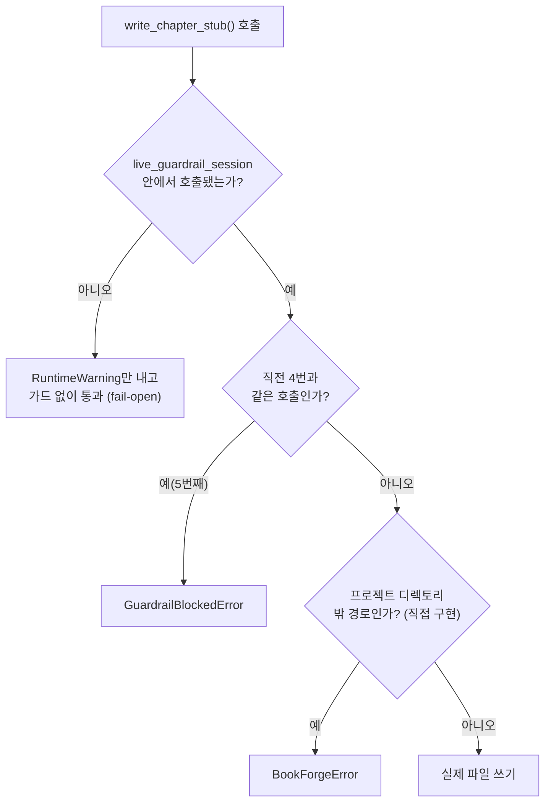

# Chapter 12. LiveGuardrail과 tool_guard — 실행 전 차단

> ## Part IV. 실행 전에 막고, 조정한다
> Part III까지가 전부 **사후 채점**(결과가 나온 뒤 점수를 매기는)이었다면, 이 Part의 4개 챕터는 완전히 다른 축이다. 파일 쓰기 같은 되돌리기 어려운 동작을 실행 **전에** 막고(12장), 그 메커니즘이 여러 저자의 동시 편집 충돌을 막는 데도 재사용되며(13장), 품질 기준 자체를 프로젝트마다 다르게 조정하는 설정을 다룬다(14장). 마지막으로 이 모든 것에도 불구하고 Book-forge가 아직 못 하는 것을 정직하게 정리한다(15장).

> **이 챕터에서 배우는 것**
> - `@agent_eval`과 `@tool_guard`가 왜 같은 함수에 함께 붙을 수 없는지
> - `live_guardrail_session`이 세션 단위로 무엇을 묶는지
> - 이 방어가 실제로 막아주는 것과, 명시적으로 못 막아주는 것

> **이런 분이 먼저 읽으면 좋습니다**: 지금까지 이 책은 "결과가 나온 뒤 채점"만 다뤘다. 결과가 나오기 **전에** 막는 메커니즘이 궁금한 분.

---

## 12.1 두 축의 경계 — 다시 확인한다

8장(§8.5)에서 이미 이 경계를 예고했다. 결과(응답 문자열)를 반환하는 함수는 `@agent_eval`로 사후 채점하고, 파일 쓰기 같은 부작용이 있는 함수는 `@tool_guard`로 실행 전에 막는다. `scaffold.py`의 `write_chapter_stub()`가 그 실제 사례다.

```python
@tool_guard(audit_blocked=True)
def write_chapter_stub(
    project_dir: str, part_dir_name: str, chapter_file_name: str,
    chapter_no: int, chapter_title: str,
) -> str:
    """단일 챕터 스텁 파일 + images/ 디렉토리를 생성한다."""
    project_path = Path(project_dir)
    part_path = project_path / part_dir_name
    chapter_path = part_path / chapter_file_name

    resolved_project = project_path.resolve()
    resolved_target = chapter_path.resolve()
    if resolved_project not in resolved_target.parents:
        raise BookForgeError(f"프로젝트 디렉토리 밖 경로 쓰기 시도 차단: {resolved_target}")

    part_path.mkdir(parents=True, exist_ok=True)
    (part_path / "images").mkdir(exist_ok=True)

    if chapter_path.exists():
        return f"skipped (exists): {chapter_path}"

    chapter_path.write_text(
        CHAPTER_TEMPLATE.format(chapter_no=chapter_no, chapter_title=chapter_title),
        encoding="utf-8",
    )
    return f"created: {chapter_path}"
```

`@tool_guard`가 감싸는 함수는 **원시 타입(str/int)만 인자로 받는다**. 코드 주석이 이유를 밝힌다: "LiveGuardrail 내부 로직이 도구 호출 인자를 로깅/직렬화할 수 있어, 임의의 dataclass보다 JSON-safe한 값만 넘기는 편이 안전하다." 계측이 인자를 그대로 기록·감사할 수 있어야 하므로, 함수 시그니처 자체가 그 요구에 맞춰 설계됐다. 경로 검사(3장 §3.5에서 이미 확인한 코드)는 함수 맨 앞에 있는데, **가드가 아직 실행되지 않은 상태에서도 함수 자신이 제일 먼저 하는 일이 위험 검사**라는 뜻이다. 그 뒤로는 평범한 파일 시스템 작업뿐이다. 디렉토리를 만들고, 이미 있으면 건너뛰고(`skipped`), 없으면 템플릿을 채워 쓴다(`created`).

반환값이 예외가 아니라 문자열(`"skipped: ..."`/`"created: ..."`)인 이유도 실무적이다. `scaffold_project()`의 호출자는 이 문자열을 그대로 CLI에 출력해, 챕터 15개 중 몇 개가 새로 만들어지고 몇 개가 기존 파일이라 건너뛰었는지 한눈에 보여준다(목차를 재조정해도 기존 챕터 본문이 지워지지 않는 이유이기도 하다).

## 12.2 세션이 반복을 판정하는 단위다

`@tool_guard`가 붙은 함수를 단독으로 부르는 것만으로는 아무 검사도 일어나지 않는다. `live_guardrail_session`으로 감싸야 검사가 시작된다.

```python
def scaffold_project(project_dir: Path, chapters: list[ChapterSpec]) -> list[str]:
    """승인된 목차 전체를 스캐폴딩한다. 세션 하나로 묶어 loop_detection이 작동하게 한다."""
    guardrail = LiveGuardrail(loop_detection=LoopDetectionConfig(consecutive_repeat_threshold=5))
    results: list[str] = []
    with live_guardrail_session(guardrail, task_id=f"scaffold_{project_dir.name}"):
        for spec in chapters:
            results.append(write_chapter_stub(str(project_dir), spec.part_dir_name, spec.chapter_file_name, spec.chapter_no, spec.chapter_title))
    return results
```

함수 docstring이 이 구조의 이유를 명시한다: "세션 하나로 묶어 `loop_detection`이 작동하게 한다." `LoopDetectionConfig(consecutive_repeat_threshold=5)`는 **같은 세션 안에서** 같은 호출이 5번 연속 반복되면 차단한다. 세션 경계 밖에서는 "반복"이라는 개념 자체가 성립하지 않는다. 챕터 여러 개를 스캐폴딩하는 반복문 전체가 `with live_guardrail_session(...)` 블록 하나 안에 있는 것도 이 때문이다. 챕터마다 새 세션을 열면 "직전 호출과 같은가"를 비교할 기준 자체가 리셋된다.

## 12.3 실제로 막아주는 것 — 그리고 못 막아주는 것

`scaffold.py` 최상단 주석은 이례적으로 정직하게, 이 방어가 못 하는 것까지 밝힌다.

> "주의 — 정확히 밝혀둘 것: `ScopeConfig`는 파일 경로가 아니라 *도구 이름* allow/forbid 목록이다... '프로젝트 디렉토리 밖 쓰기 금지'는 Harness Config가 대신 해주는 기능이 아니라 이 모듈이 직접 구현하는 방어 코드다. LiveGuardrail이 실제로 막아주는 것은 `LoopDetectionConfig` 기반의 폭주(동일 호출 반복) 탐지뿐이다."

즉 `write_chapter_stub()` 함수 본문에 있는 경로 검사(3장 §3.5에서 이미 확인한 코드)는 SDK의 `LiveGuardrail`이 대신 해주는 게 아니라 **개발자가 직접 짠 방어 코드**다. `@tool_guard`와 `live_guardrail_session`이 자동으로 처리하는 것은 오직 반복 탐지뿐이다.

| 위험 | 막는 주체 | 코드 위치 |
|---|---|---|
| 같은 호출이 5번 연속 반복 | `LiveGuardrail`(`LoopDetectionConfig`) | 자동, `@tool_guard`에 내장 |
| 프로젝트 디렉토리 밖 경로 쓰기 | 직접 짠 방어 코드 | `write_chapter_stub()` 본문의 `if resolved_project not in resolved_target.parents` |

이 표가 이 챕터의 핵심 교훈이다. **"LiveGuardrail을 붙였다"는 사실만으로 모든 위험이 자동으로 막힌다고 가정하면 안 된다.** SDK가 제공하는 것과 애플리케이션이 직접 짜야 하는 것을 정확히 구분해야 한다.



## 12.4 세션 밖 호출 — fail-open이 기본값이다

`@tool_guard`가 붙은 함수를 `live_guardrail_session` 없이 호출하면 어떻게 될까? 예외가 나지 않는다. `RuntimeWarning`만 내고 가드 없이 원본 함수를 그대로 실행한다(`fail_closed=False`가 기본값). 이 선택은 다른 `fail_on_*` 계열 플래그들과 반대 방향이다. 대부분의 검증 플래그는 "지정 안 하면 안전하게 막는다"인데, `tool_guard`는 "지정 안 하면 조용히 통과시키되 경고만 낸다"를 기본으로 삼는다. 이는 기존 코드(가드를 아직 안 붙인 호출부)를 깨뜨리지 않기 위한 하위 호환 우선 설계다. 정말로 강제하고 싶다면 `tool_guard(fail_closed=True)`로 명시적으로 켜야 한다.

---

## 직접 해보기

`tests/test_scaffold.py`를 실행해 나오는 `RuntimeWarning: tool_guard(...): 활성 live_guardrail_session()이 없습니다`를 직접 눈으로 읽어보라. §12.4에서 설명한 "fail-open이 기본값"이라는 문장이 실제 경고 메시지로 나타난 것이다. **여러분이 부작용 있는 함수(파일 쓰기·외부 API 호출 등)에 반복 탐지를 걸고 싶다면** `@tool_guard`만 붙이는 것으로는 부족하다. 그 함수를 부르는 코드 전체를 `live_guardrail_session()` 블록으로 감싸야 한다 — 이 둘이 한 세트라는 것이 이 챕터의 핵심이다.

## 이 챕터의 핵심

- **`@tool_guard`는 결과가 아니라 부작용을 막는 축이다.** `@agent_eval`(9장 이전 챕터들)과 서로 겹치지 않는 완전히 다른 검사 시점이다.
- **`live_guardrail_session`이 "반복"을 판정하는 경계다.** 세션 밖에서는 비교 기준이 없다.
- **SDK가 자동으로 막는 것과 애플리케이션이 직접 짜야 하는 것은 다르다.** `scaffold.py`는 이 경계를 주석으로 명시적으로 밝혀둔다.
- **세션 없이 호출해도 기본은 fail-open이다.** 강제하려면 `fail_closed=True`를 명시해야 한다.

## 참고 자료

- `src/book_forge/agents/scaffold.py` — 전체
- `Agent-Evaluator/agent_evaluator/gates/live_guardrail.py` — `tool_guard`·`live_guardrail_session`

---

> **다음 챕터**는 같은 `LiveGuardrail`이 완전히 다른 위험 — 여러 저자가 동시에 같은 챕터를 저장하려 할 때의 충돌 — 을 막는 데 어떻게 재사용되는지 다룬다.
