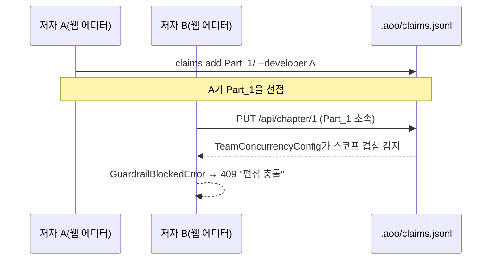

# Chapter 13. 팀 동시성과 편집 충돌 방지

> **이 챕터에서 배우는 것** (이런 분이 먼저 읽으면 좋다: 12장의 `LiveGuardrail`이 "반복"을 막는 걸 봤는데, 같은 도구가 "동시 편집 충돌"이라는 완전히 다른 문제도 막을 수 있는지 궁금한 분)
> - 웹 에디터에서 두 저자가 동시에 저장하면 무슨 일이 일어나는지
> - `TeamConcurrencyConfig`가 "누가 무엇을 쓰려 하는지"를 어떻게 알아내는지
> - 이 방어가 새 클레임 관리 로직을 만들지 않고 기존 SDK 관례를 재사용하는 이유

---

## 13.1 웹 에디터가 여는 새로운 위험

지금까지 다룬 모든 협업(Part II)은 한 번에 한 저자만 상정했다. `book-forge edit`(웹 에디터)는 다르다. 여러 저자가 동시에 같은 프로젝트를 열어놓고 각자 다른 챕터(또는 같은 챕터)를 편집할 수 있다. `editor/server.py`의 주석이 이 파일이 다루는 문제를 정확히 짚는다.

> "저장은 `LiveGuardrail(team_concurrency=...)`을 거친다. 공동 저자는 `agent-eval claims add <절대경로> --developer <이름>`으로 자신이 작업할 Part 디렉토리를 미리 선점(claim)해두면, 다른 저자가 같은 스코프를 저장하려 할 때 409로 차단된다."

## 13.2 저장 경로에 가드레일을 끼운다

12장에서 본 `@tool_guard` + `live_guardrail_session` 조합이 여기서도 그대로 재사용된다. 다만 이번엔 `LoopDetectionConfig`가 아니라 `TeamConcurrencyConfig`가 핵심이다.

```python
@tool_guard(tool_name="write", audit_blocked=True)
def _write_chapter_file(path: str, content: str) -> str:
    """실제 파일 쓰기. 매개변수 이름 ``path``는 TeamConcurrencyConfig의
    path_param_candidates 기본값과 일치해야 스코프 충돌 검사가 인자에서
    경로를 뽑아낼 수 있다."""
    Path(path).parent.mkdir(parents=True, exist_ok=True)
    Path(path).write_text(content, encoding="utf-8")
    return "ok"


def _team_guardrail(project_dir: Path) -> LiveGuardrail:
    claims_path = project_dir / ".aoo" / "claims.jsonl"
    return LiveGuardrail(
        team_concurrency=TeamConcurrencyConfig(claims_path=str(claims_path), owner="auto")
    )
```

인자 이름 `path`가 우연이 아니라는 점이 이 코드의 핵심 디테일이다. `TeamConcurrencyConfig`가 도구 호출 인자에서 "이 호출이 어느 파일 경로를 건드리려 하는가"를 자동으로 추출하려면, 그 인자 이름이 SDK가 기대하는 후보 이름(`path_param_candidates` 기본값)과 일치해야 한다. 함수 시그니처 자체가 SDK와의 암묵적 계약을 지키도록 설계돼 있다.

## 13.3 실제 저장 흐름 — 충돌하면 409

`api_put_chapter()`(챕터 저장 API)는 이 가드레일을 매 저장 요청마다 새로 만들어 씌운다.

```python
@app.put("/api/chapter/<int:chapter_no>")
def api_put_chapter(chapter_no: int):
    ...
    guardrail = _team_guardrail(project_dir)
    try:
        with live_guardrail_session(guardrail, task_id=f"edit_ch{chapter_no}"):
            _write_chapter_file(path=str(rc.path), content=content)
    except GuardrailBlockedError as exc:
        return jsonify({"error": f"편집 충돌: {exc.verdict.reason}"}), 409
    return jsonify({"saved": True})
```

`GuardrailBlockedError`를 잡아 HTTP 409(Conflict)로 변환하는 이 부분이 이 챕터의 핵심이다. **가드레일이 예외를 던지는 것과, 그 예외를 애플리케이션이 사용자에게 의미 있는 신호(상태 코드 409, 이유 메시지)로 바꾸는 것은 별개의 책임이다.** SDK는 "차단해야 한다"까지만 판단한다. "차단됐을 때 사용자에게 뭐라고 보여줄지"는 애플리케이션(`editor/server.py`)의 몫이다.



## 13.4 새 클레임 로직을 만들지 않는다

`.aoo/claims.jsonl`이라는 파일 이름과 형식은 Book-forge가 새로 발명한 게 아니다. Agent-Evaluator SDK가 이미 제공하는 관례(`agent-eval claims add/list/release/audit`)를 프로젝트 디렉토리 안(`<project>/.aoo/claims.jsonl`)에 그대로 재사용한 것이다. 이 챕터 전체를 관통하는 원칙이 여기서도 반복된다(11장의 `merge()`/`load_from_file()` 재사용과 같은 정신). **새 판정 로직을 만들지 않고, 이미 검증된 SDK 기능을 정확한 지점에 연결하는 것.**

`owner="auto"`는 `TeamConcurrencyConfig`가 생성 시점에 `git config user.name`을 조회해 자동으로 채우는 예약 값이다. 지정하면 `developer==owner`인 자기 자신의 클레임을 충돌 후보에서 제외한다(자기가 이미 선점한 자기 영역을 자기가 다시 저장하는 것은 충돌이 아니다).

> 👨‍💻 **개발자 TIP**: 이 메커니즘은 "서버가 강제하는 락"이 아니라 "클라이언트가 자발적으로 선언하는 클레임"이다. 저자가 `claims add`를 안 하면 충돌 감지 자체가 일어나지 않는다(선점된 스코프가 없으니 겹칠 것도 없다). 팀 전체가 이 관례를 실제로 지켜야 효과가 있다는 뜻이다. 15장에서 이런 "클라이언트 opt-in의 한계"를 다시 다룬다.

---

## 직접 해보기

`book-forge edit <slug>`로 웹 에디터를 띄우고, 다른 터미널에서 `agent-eval claims add <프로젝트경로>/Part_1_... --developer 나` 로 스코프를 선점해보라. 그 상태에서 같은 Part의 챕터를 웹 에디터에서 저장하면 무슨 일이 일어나는지 관찰할 수 있다(자기 자신의 클레임이므로 충돌 없이 통과해야 정상이다, §13.4). **여러 사람이 같은 프로젝트를 동시에 건드릴 수 있는 도구를 만든다면** 이 챕터가 보여준 "클라이언트 자발적 선언" 모델이 서버 강제 락보다 구현은 훨씬 간단하다는 것을 알아두자. 다만 팀 전체가 그 관례를 실제로 지켜야만 효과가 있다는 트레이드오프를 미리 알고 선택해야 한다.

## 이 챕터의 핵심

- **`LiveGuardrail`은 루프 탐지(12장)뿐 아니라 팀 동시성 충돌도 같은 메커니즘으로 막는다.** `TeamConcurrencyConfig`를 끼우는 것만 다르다.
- **함수 인자 이름이 SDK와의 암묵적 계약이다.** `path`라는 이름 자체가 `TeamConcurrencyConfig`가 경로를 추출하는 방식과 맞물려 있다.
- **SDK의 예외를 의미 있는 사용자 신호로 바꾸는 것은 애플리케이션의 책임이다.** `GuardrailBlockedError` → HTTP 409가 그 예다.
- **`.aoo/claims.jsonl`은 서버 강제력이 아니라 자발적 선언이다.** 팀이 실제로 `claims add`를 쓰지 않으면 보호받지 못한다.

## 참고 자료

- `src/book_forge/editor/server.py` — 전체
- `Agent-Evaluator/agent_evaluator/gates/team_concurrency.py` — `TeamConcurrencyConfig`

---

> **다음 챕터**는 지금까지 다룬 모든 메커니즘(Gate 가중치·LLM Judge·검증 임계값)을 프로젝트마다 다르게 조정하는 실제 설정 배선을 다룬다.
