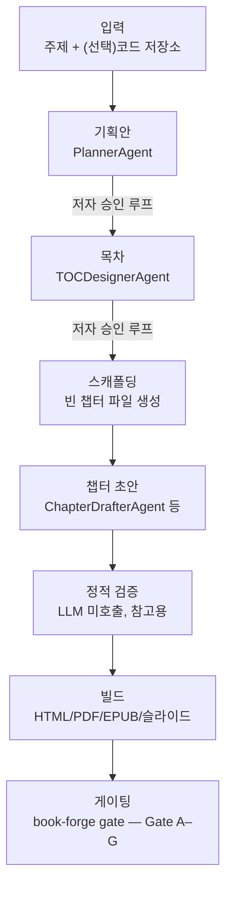

# Chapter 1. Book-forge라는 에이전트 파이프라인, 그리고 그 최소 정의

> ## Part I. Book-forge와 AI 에이전트란 무엇인가
> 이제부터 3개 챕터 동안, 먼저 Book-forge라는 도구 전체를 한 바퀴 둘러보고(1장 앞부분), 그 도구를 이루는 "AI 에이전트"라는 말이 실제 코드에서 정확히 무엇을 가리키는지 확인한 뒤(1장 뒷부분), 그 최소 단위 하나가 어떻게 동작하는지 한 줄씩 따라가고(2장), 마지막으로 그게 실제로 어떻게, 왜 실패하는지(3장)까지 확인한다. Part II부터는 "여러 에이전트가 어떻게 협업하는가"로 넘어가므로, Part I은 그 전에 필요한 **Book-forge 전체 그림 + 에이전트 하나**에 대한 그림을 완성하는 구간이다.

> **이 챕터에서 배우는 것**
> - Book-forge가 무엇을 하는 CLI 도구인지, 실행하면 실제로 무슨 일이 일어나는지
> - 업계에서 "AI 에이전트"를 설명할 때 공통으로 등장하는 요소(추론 엔진·도구·메모리·오케스트레이션)와 자율성 스펙트럼
> - "AI 에이전트"라는 말이 Book-forge 실제 코드에서는 무엇을 가리키는지
> - Book-forge의 `LLM` Protocol이 왜 OpenAI/Anthropic/Ollama를 똑같은 인터페이스로 감싸는지
> - 에이전트를 최소로 정의하면 무엇이 남고 무엇이 빠지는지

> **이런 분이 먼저 읽으면 좋습니다**: Book-forge도, "에이전트"라는 단어도 처음 접하는 분. 이 챕터는 도구 소개와 개념 정의를 한 번에 끝내, 2장부터는 곧바로 실제 코드를 한 줄씩 따라갈 수 있게 준비해준다.

---

## 1.0 여섯 단어로 시작하기 — AI 에이전트 개발이 처음이라면

이 책은 AI 에이전트나 Agent-Evaluator를 접해본 적 없는 개발자도 읽을 수 있게 썼다. 다만 아래 여섯 단어는 이 챕터부터 설명 없이 그대로 쓰인다. 처음 보는 단어라면 여기서 한 번 짚고 넘어가자. 이미 아는 단어라면 1.1로 건너뛰어도 된다.

| 용어 | 무엇을 가리키는가 |
|---|---|
| **LLM**(거대 언어 모델) | 텍스트를 입력받아 텍스트를 출력하는 통계 모델(GPT·Claude·Llama 등). "생각"해서 답하는 게 아니라, 학습한 데이터를 근거로 "다음에 올 가능성이 가장 높은 단어"를 이어 붙인다 — 이 챕터 뒷부분이 이 사실을 코드 한 줄(`prompt: str → str`)로 정확히 보여준다. |
| **프롬프트**(prompt) | LLM에 입력으로 주는 텍스트. Book-forge의 모든 에이전트는 결국 "어떤 프롬프트를 조립해 LLM에 넘기는가"로 요약된다(1~2장). |
| **환각**(hallucination) | LLM이 근거 없는 내용을 마치 사실인 것처럼 자신 있게 답하는 현상을 가리키는 AI 업계 용어다. "모른다"고 답하는 대신 그럴듯한 답을 지어내는 LLM의 구조적 특성에서 나온다 — 3장이 Book-forge에서 실제로 관측된 사례를 보여준다. |
| **RAG**(Retrieval-Augmented Generation, 검색 증강 생성) | LLM에 질문만 던지는 대신, 관련 자료(문서 조각)를 먼저 검색해 그 내용을 프롬프트에 함께 넣어주는 기법. LLM이 "아는 척"하지 않고 실제 자료를 근거로 답하게 만들어 환각을 줄이는 것이 목적이다 — 7장이 Book-forge의 RAG 구현(`knowledge/store.py`)을 다룬다. |
| **데코레이터**(decorator) | 파이썬에서 함수의 코드를 직접 고치지 않고, 그 함수를 감싸 부가 기능(로깅·계측 등)을 덧붙이는 문법(`@무언가` 형태). Book-forge는 이 문법으로 "이 LLM 호출을 측정해서 기록해줘"를 덧붙인다 — 2장이 이 동작을 한 줄씩 따라간다. |
| **Harness**(하네스) / **Harness Engineering** | 원래는 말이나 장비를 몸에 고정하는 "안전벨트·고정장치"를 뜻하는 단어다. 이 책에서는 **AI 에이전트의 실행 결과를 계측·판정하거나, 위험한 동작을 실행 전에 막는 장치 전체**를 가리키는 이름으로 쓰인다 — Agent-Evaluator SDK가 제공하는 배치 평가(Gate A–G)와 실시간 가드레일(LiveGuardrail)이 이 "하네스"를 이루는 두 축이며, 이 책 3~4부 전체의 주제다. |

> 이후 장에서 이 단어들이 다시 나올 때 뜻이 가물가물하면 이 표로 돌아오면 된다. 더 많은 용어(개별 Harness Config 이름 등)는 [부록 A. 용어집](../Appendix/A_용어집.md)에 정리돼 있다.

## 1.1 Book-forge는 무엇을 하는 도구인가

한 줄로: **주제 하나(또는 코드 저장소 경로)를 주면, 기획안·목차를 저자와 함께 확정한 뒤, 챕터 초안을 자동으로 쓰고, 그 결과를 HTML·PDF·EPUB·발표자료로 만들어내는 CLI 도구.** 이 책의 핵심 관심사인 "품질을 어떻게 보장하는가"라는 질문에 대한 답도 여기 있다. 이 파이프라인의 매 단계에 계측이 이미 배선돼 있기 때문이다.



이 다이어그램의 화살표 하나하나가 이 책의 특정 파트에 대응한다. 지금은 "입력 하나가 여러 에이전트를 순서대로 거쳐 출력물이 된다"는 전체 모양만 눈에 담아두면 된다. 각 화살표가 정확히 어느 챕터에서 다뤄지는지는 1.2의 CLI 표, 그리고 Part II~IV를 진행하며 하나씩 확인하게 된다.

## 1.2 CLI로 본 전체 파이프라인

Book-forge는 위 흐름을 아래 명령들로 나눠 노출한다. 이 표는 코드베이스의 실제 `cli/main.py` 배선을 그대로 옮긴 것이다. 이 책이 다루는 모든 소스 코드는 결국 이 명령 중 하나가 호출하는 함수다.

| 명령 | 하는 일 | 이 책에서 주로 다루는 곳 |
|---|---|---|
| `book-forge new "<제목>"` | 기획→목차 대화형 루프 + 스캐폴드. `--source`를 주면 전체 챕터 자동 초안까지 | 1~4장 |
| `book-forge draft <slug> <ch\|--all>` | RAG 보조 챕터 초안 생성(narrative/reference_table/diagram/exercise/capstone/module_reference) | 7장 |
| `book-forge review <slug> <ch>` | 정확성/가독성 검토자 2명 + 편집장 종합 판정 | 5장 |
| `book-forge plan <slug> --revise` | 기획/목차 재검토(사람-에이전트 개정 루프) | 6장 |
| `book-forge chat <slug>` | 프로젝트 지식창고에 대화형 질의 | 7장 |
| `book-forge research <slug> <ch>` | 검색 쿼리 생성 → 웹 검색 → 저자 선택 → 지식창고 추가 | 7장 |
| `book-forge lint <slug>` | 챕터 간 기술 용어 표기 불일치 발견 | 11장 |
| `book-forge build html\|pdf\|epub\|slides <slug>` | 산출물 빌드 | (이 책의 범위 밖 — README 참고) |
| `book-forge gate <slug>` | `eval_results/`를 책 전체로 병합해 Gate A–G 판정, CI 연동 플래그(`--fail-on-regression` 등) 제공 | 9·12·13장 |
| `book-forge edit <slug>` | 웹 에디터(팀 저장 충돌 실시간 차단) | 15장 |

나머지 `init`/`home`/`knowledge`는 설정·탐색용 보조 명령이라 이 책에서 별도로 다루지 않는다. 필요하면 `book-forge <명령> --help`로 확인하면 된다.

## 1.3 실행하면 실제로 무엇이 생기는가

`book-forge new "제목" --source ./repo`를 실행하면 `~/Documents/BookForge/projects/<slug>/`에 아래 구조가 만들어진다. 이 책의 여러 장이 이 경로 중 하나를 근거로 삼으므로, 처음 한 번은 실제 형태를 눈에 담아두는 편이 낫다.

```
<slug>/
├── 00_기획안.md            # PlannerAgent 산출물, 저자 승인 완료본
├── 01_목차.md              # TOCDesignerAgent 산출물(사람이 읽는 부분 + ```toc 매니페스트)
├── Part_X_.../
│   └── Chapter_XX_....md   # 챕터 본문 — 스캐폴딩이 빈 파일로 만들고 Drafter가 채운다
├── knowledge/store.json    # RAG 지식창고 — draft가 쌓고 chat이 재사용(7장)
├── eval_results/           # PerformanceMonitor가 챕터별로 남기는 계측 결과(8~9장)
│   └── _merged_gate_result.json  # gate 명령이 만드는 병합 산출물(12장)
└── outputs/                # html · pdf/ · epub · *_slides.html
```

`01_목차.md`의 ` ```toc ` 코드 블록은 4장에서, `eval_results/`의 JSON 파일들이 어떻게 쌓이는지는 8~9장에서, 그것들이 어떻게 병합되는지는 12장에서 각각 자세히 다룬다.

지금까지 살펴본 파이프라인의 화살표 하나하나는 결국 **에이전트 하나**다. 그 "에이전트"라는 말이 코드에서 정확히 무엇을 가리키는지, 지금부터 확인한다.

## 1.4 일반적으로 "AI 에이전트"란 무엇을 가리키는가

Book-forge의 정의로 들어가기 전에, 업계에서 "AI 에이전트"라는 말이 대략 어떤 공통 요소를 가리키는지부터 정리해보자. 이렇게 정리해두면, 이후 Book-forge의 선택이 이 스펙트럼 어디에 있는지 판단할 기준이 생긴다.

**공통으로 등장하는 네 가지 구성 요소.** 문헌마다 용어는 다르지만, "AI 에이전트"를 설명할 때 대체로 이 네 요소의 조합으로 이야기한다.

| 요소 | 하는 일 | Book-forge의 대응(1~2장에서 확인) |
|---|---|---|
| **추론 엔진**(reasoning core) | 입력을 이해하고 다음 행동을 결정한다 — 보통 LLM이 이 역할을 맡는다 | `LLM` Protocol의 `generate()`(§1.5) |
| **도구**(tools) | 에이전트가 세계에 영향을 미치는 수단 — 함수 호출, 파일 쓰기, 웹 검색 등 | 이 책의 개별 에이전트에는 거의 없다(§1.8) — 파일 쓰기는 별도 `@tool_guard` 축(14장)이 담당 |
| **메모리**(memory) | 이전 상호작용이나 축적된 지식을 다음 판단에 반영하는 저장소 | `conversation_history`(7장), `KnowledgeStore`(7장) |
| **오케스트레이션**(orchestration/planning) | 여러 단계·여러 에이전트를 어떤 순서로 실행할지 결정하는 상위 로직 | `new_cmd.py`의 `new()`(4장), 승인 루프(6장) |

**자율성은 스펙트럼이다.** 이 네 요소를 얼마나 갖췄는가에 따라 "에이전트"라 불리는 것들은 실제로 매우 다른 자율성 수준에 있다. 한쪽 끝에는 "프롬프트 하나 → 응답 하나"로 끝나는 단순 래퍼가 있다. 반대쪽 끝에는 스스로 목표를 여러 하위 작업으로 쪼개고, 어떤 도구를 쓸지 매 단계 스스로 판단하고, 실패하면 다른 방법을 시도하는 완전 자율 에이전트가 있다. 대부분의 실무 시스템은 이 둘 사이 어딘가에 있다. **그리고 그 위치를 정확히 아는 것이, "에이전트"라는 한 단어보다 훨씬 중요한 정보다.** 3장(§3.6)에서 다시 확인하겠지만, 어떤 방어 메커니즘이 필요한가는 정확히 이 위치에서 결정된다. 도구를 안 쓰는 에이전트에는 도구 오남용 방어가 필요 없고, 반복 루프가 없는 에이전트에는 무한 루프 방어가 필요 없다.

**단일 에이전트와 멀티 에이전트.** 위 네 요소는 에이전트 하나의 내부 구조를 말한다. 그런데 실무에서는 에이전트 하나로 끝나는 경우보다, 여러 에이전트가 각자 다른 역할을 맡아 협업하는 경우가 더 흔하다(검색 전담, 코드 작성 전담, 검토 전담처럼 역할을 나누는 방식). "협업"이 정확히 어떤 형태를 띠는지는 시스템마다 다르다. 정해진 순서로 결과를 넘기기만 하는 파이프라인일 수도 있고, 여러 에이전트가 동시에 같은 문제를 보고 토론하는 구조일 수도 있다. Part II(4~7장) 전체가 이 "여러 에이전트의 협업"이 Book-forge에서 실제로 어떤 네 가지 형태로 나타나는지 다룬다.

이 책은 위 개념들에 대한 논쟁(어디까지가 "진짜 에이전트"인가 같은)에 끼어들지 않는다. 대신 Book-forge가 실제로 코드로 구현한 선택에서 출발해, 그 선택이 왜 이 스펙트럼의 그 위치에 있는지를 실제 코드로 보여준다. 가장 작은 단위(에이전트 하나)부터 시작해보자.

## 1.5 가장 작은 정의부터 시작한다

"AI 에이전트"라는 말은 문맥마다 다른 것을 가리킨다. 어떤 글은 자율적으로 도구를 골라 쓰는 시스템을 뜻하고, 어떤 글은 단순히 "LLM을 호출하는 함수"를 그렇게 부른다. 이 책은 Book-forge가 실제로 코드로 구현한 정의에서 출발한다. 그 출발점은 `src/book_forge/llm/provider.py`다.

> 📄 **파일**: `src/book_forge/llm/provider.py`

```python
@runtime_checkable
class LLM(Protocol):
    """모든 provider 구현체가 만족해야 하는 최소 인터페이스."""

    model: str

    def generate(
        self, prompt: str, *, system: Optional[str] = None, max_tokens: int = 4000
    ) -> str: ...
```

이게 전부다. 문자열 하나(`prompt`)를 받아 문자열 하나(`generate()`의 반환값)를 돌려주는 것, 그게 전체 계약이다. Book-forge의 모든 에이전트는 이 인터페이스 위에 얇게 쌓은 껍데기일 뿐이다. "에이전트가 무엇을 하는가"는 이 `generate()` 호출 앞뒤에 무엇을 붙이느냐로 결정된다. 어떤 프롬프트를 조립해 넘기는지, 응답을 어떻게 파싱하는지, 그 결과로 무엇을 하는지가 에이전트마다 다를 뿐이다.

## 1.6 세 개의 구현체, 하나의 계약

`LLM` Protocol을 실제로 만족하는 구현체는 세 개다.

| 구현체 | 실제로 호출하는 것 | 기본 모델 |
|---|---|---|
| `OpenAILLM` | OpenAI Chat Completions API | `gpt-5-nano` |
| `AnthropicLLM` | Anthropic Messages API | `claude-haiku-4-5-20251001` |
| `OllamaLLM` | 로컬 `http://localhost:11434/api/generate` | `llama3.2` |

세 클래스의 `generate()` 시그니처는 동일하지만, 내부에서 실제로 하는 일은 서로 다른 HTTP 요청 형식을 조립하는 것이다. 예를 들어 `OllamaLLM.generate()`는 이렇게 페이로드를 만든다.

> 📄 **파일**: `src/book_forge/llm/provider.py` (`OllamaLLM.generate()`)

```python
payload = {
    "model": self.model,
    "prompt": prompt,
    "system": system or "",
    "stream": False,
    "think": False,   # 추론 모델이 "생각"만 하고 답을 안 내는 문제 방지
    "options": {"num_predict": max_tokens},
}
response = requests.post(f"{self._base_url}/api/generate", json=payload, timeout=180)
```

`think: False` 옵션 하나가 이 책 전체에서 반복해 등장할 "에이전트는 왜 실패하는가"(3장)의 첫 사례다. `qwen3.6:35b-mlx` 같은 추론(thinking) 모델은 사고 과정을 별도 필드에 담고 최종 응답(`response`)은 비워둘 수 있다. `num_predict`(토큰 예산)를 추론에 다 써버리면 챕터 파일이 통째로 빈 채 저장되는 사고가 실제로 있었다(`provider.py`의 주석에 이 실측 경위가 그대로 남아 있다). `think: False`는 그 사고 과정을 건너뛰고 바로 답을 채우게 강제하는, 코드 한 줄로 막은 실패 사례다. 다만 이 옵션은 "추론 모델이 침묵하는" 원인 하나만 막는다 — provider가 빈 문자열을 돌려주는 다른 경로(콘텐츠 필터링, 네트워크 이상 등)까지 전부 막으려면, "빈 응답은 무조건 예외로 전파한다"는 별도의 일반 원칙이 `generate()` 자체에 있어야 한다. `llm/provider.py`의 `_require_non_empty()`가 세 구현체 전체에 이 원칙을 적용한다.

나머지 두 구현체(`OpenAILLM`·`AnthropicLLM`)도 `provider.py`에서 그대로 확인할 수 있다. 각자 다른 SDK(`openai`/`anthropic` 패키지)를 감싸지만, 바깥에서 보이는 모양은 정확히 같은 `generate(prompt, *, system=None, max_tokens=4000) -> str`이다.

> 📄 **파일**: `src/book_forge/llm/provider.py`

```python
class OpenAILLM:
    def __init__(self, api_key: str, model: str = DEFAULT_OPENAI_MODEL) -> None:
        from openai import OpenAI  # lazy import

        self._client = OpenAI(api_key=api_key)
        self.model = model

    def generate(
        self, prompt: str, *, system: Optional[str] = None, max_tokens: int = 4000
    ) -> str:
        messages = []
        if system:
            messages.append({"role": "system", "content": system})
        messages.append({"role": "user", "content": prompt})
        response = self._client.chat.completions.create(
            model=self.model, messages=messages, max_tokens=max_tokens,
        )
        return _require_non_empty(response.choices[0].message.content or "", "openai")


class AnthropicLLM:
    def __init__(self, api_key: str, model: str = DEFAULT_ANTHROPIC_MODEL) -> None:
        from anthropic import Anthropic  # lazy import

        self._client = Anthropic(api_key=api_key)
        self.model = model

    def generate(
        self, prompt: str, *, system: Optional[str] = None, max_tokens: int = 4000
    ) -> str:
        response = self._client.messages.create(
            model=self.model, max_tokens=max_tokens,
            system=system or "", messages=[{"role": "user", "content": prompt}],
        )
        text = "".join(block.text for block in response.content if hasattr(block, "text"))
        return _require_non_empty(text, "anthropic")
```

세 구현체를 나란히 놓고 보면 "Protocol을 만족한다"는 말이 코드로 무엇을 뜻하는지 뚜렷해진다. `OpenAILLM`은 `messages` 리스트(역할별 딕셔너리)를 조립하고, `AnthropicLLM`은 `system`을 별도 인자로 넘기고, `OllamaLLM`은 순수 JSON 페이로드를 만든다. 세 API의 요청 형식은 서로 판이하게 다르지만, 세 클래스 모두 `prompt`와 `system`을 받아 문자열 하나를 돌려준다는 점, 그리고 그 문자열이 비어 있으면 안 된다는 점(`_require_non_empty()`)만은 동일하다. 이 책의 나머지 부분(2장부터)은 "LLM을 어떤 provider가 서비스하는지"를 단 한 번도 신경 쓰지 않는다. 그 이유는 바로 여기, `provider.py` 안에서 그 차이가 이미 흡수됐기 때문이다.

## 1.7 provider 선택 — 환경변수 하나가 전체 파이프라인을 바꾼다

`create_llm()` 팩토리 함수가 어떤 구현체를 만들지 결정한다.

> 📄 **파일**: `src/book_forge/llm/provider.py`

```python
def create_llm(provider: Optional[str] = None, model: Optional[str] = None) -> LLM:
    resolved = (provider or os.environ.get("LLM_PROVIDER") or "ollama").lower()
    ...
```

우선순위는 명시적 인자 → `LLM_PROVIDER` 환경변수 → 기본값 `"ollama"` 순이다. 기본값을 클라우드가 아니라 로컬로 둔 이유는 코드 주석에 명시돼 있다. "API 키 없이 바로 동작해 오프라인/로컬 개발을 1급 경로로 만든다." 이 한 줄의 설계 결정이 Book-forge 전체의 성격을 규정한다. 그래서 이 책의 모든 실측 예제도 API 키 없이 로컬 Ollama로 재현할 수 있다.

> 👨‍💻 **개발자 TIP**: 에이전트를 새로 만들 때 "이 함수가 Protocol을 만족하는가"만 확인하면 provider 걱정 없이 코드를 짤 수 있다. `planner.py`·`chapter_drafter.py`·`chat_agent.py` 어디에도 `if provider == "openai"` 같은 분기가 없다 — 전부 `llm.generate(...)` 한 줄만 호출한다.

## 1.8 이 정의에 일부러 넣지 않은 것

§1.4의 네 요소로 돌아가 보면, 이 최소 정의에는 "도구를 자율적으로 선택한다"거나 "여러 단계를 스스로 계획한다"는 요건이 없다. Book-forge의 개별 에이전트(`propose_plan()`, `design_toc()` 등)는 정확히 한 번 `generate()`를 호출하고 끝난다. 도구 호출도, 반복 루프도 없다. **에이전트 하나만 놓고 보면 자율성 스펙트럼의 가장 단순한 쪽 끝에 있다.** 오케스트레이션(여러 에이전트를 어떤 순서로 부를지)과 메모리(무엇을 다음 에이전트에 넘길지)는 에이전트 자신이 아니라 그 바깥(`new_cmd.py`, `KnowledgeStore`)이 담당한다. Part II(4~7장)가 정확히 이 "바깥" 구조를 다룬다.

그런데도 이 책은 이들을 "에이전트"라 부른다. 왜 그럴까. 다음 장에서 확인하겠지만, 이 함수들을 실제 시스템으로 만드는 것은 LLM 호출 자체가 아니라 **그 호출 앞뒤에 계측(`@agent_eval`)이 붙어 있다는 사실**이다. "에이전트"와 "그냥 LLM을 부르는 함수"를 가르는 경계가 바로 이 책의 3부·4부가 다루는 Harness Engineering이다.

## 1.9 직접 재현해보기 — 설치부터 첫 Gate 점수까지

이 책은 "실측으로 재현 가능하다"는 말을 여러 번 쓴다. 말로만 남기지 않고, 여기서 그 재현 절차를 실제 명령 순서로 적어둔다. Book-forge 저장소를 로컬에 클론했다는 것을 전제로 한다.

```bash
# 1. 설치 — RAG(--source)까지 쓰려면 [rag] extra 포함
pip install -e ".[dev,rag]"

# 2. LLM Provider 설정 — 기본값 Ollama는 API 키가 필요 없다
#    (Ollama가 로컬에 없다면 https://ollama.com 에서 설치 후 `ollama pull llama3.2`)
book-forge init

# 3. 첫 프로젝트 생성 — 기획안 승인 루프가 뜨면 Enter만 눌러 그대로 승인
book-forge new "테스트 프로젝트"

# 4. 스캐폴딩된 챕터 하나를 직접 열어 집필(또는 --source로 자동 초안)
book-forge draft "테스트 프로젝트" 1

# 5. Gate A–G 판정 — 9장(§9.5)에서 본 것과 같은 형식의 출력을 직접 확인한다
book-forge gate "테스트 프로젝트" --min-gate-score 0.0
```

5번 명령의 출력이 정확히 9장(§9.5)에서 인용한 형식(`✅ A (목표 달성): 0.663` 같은 줄들)으로 나온다면, 이 책이 지금부터 다룰 모든 실측 예제(`eval_results/*.json`, Gate 점수 로그, 병합 결과)가 여러분의 화면에서도 똑같이 재현됐다는 뜻이다. 결과 숫자는 여러분이 쓴 프롬프트·모델에 따라 이 책의 예시와 다를 수 있다. 다만 **숫자 자체가 아니라, "이런 형식·이런 구조의 결과가 나온다"는 것을 직접 확인하는 것**이 이 절의 목적이다.

> ⚠️ **로컬 실행 환경(Ollama 등)이 없다면**: 이 5단계, 그리고 이후 챕터의 "직접 해보기" 상자 중 CLI 실행을 요구하는 것들은 건너뛰어도 이 책을 읽는 데 지장이 없다. 모든 챕터 본문이 실제 실행 로그·소스 코드를 이미 인용해 보여주므로, 코드를 읽는 것만으로도 각 장의 핵심 주장은 그대로 따라갈 수 있다. "직접 해보기"는 이해를 검증하고 손에 익히는 보너스지, 본문 이해의 전제 조건이 아니다.

> 👨‍💻 **개발자 TIP**: 이후 각 챕터의 "직접 해보기" 상자는 이 5단계를 이미 마쳤다는 전제로, 그 챕터가 다루는 메커니즘 하나를 더 깊이 파고들 작은 실험을 제안한다. Book-forge 소스 전체의 패키지 구조·파일별 책임·모듈 관계는 [부록 C. 프로젝트 아키텍처 지도](../Appendix/C_프로젝트_아키텍처_지도.md)에 정리해뒀다 — 낯선 파일 이름이 나올 때 찾아보는 용도다.

---

## 직접 해보기

`provider.py`를 보지 않고, `LLM` Protocol(§1.5)만 기억한 채로 4번째 구현체를 직접 스케치해보라 — 예를 들어 `class FakeLLM: model = "fake"` 하나에 `generate(self, prompt, *, system=None, max_tokens=4000) -> str` 메서드만 채워 넣으면(실제로 `tests/test_chat_agent.py`가 정확히 이 패턴을 쓴다), 그 클래스는 아무 상속 선언 없이도 Book-forge의 모든 에이전트에 그대로 꽂힌다.

이 질문 하나로 이 장의 핵심을 스스로 테스트할 수 있다. 지금 만들고 있는(또는 만들 예정인) 에이전트가 실제로 호출하는 LLM API를, 이런 최소 Protocol 하나로 추상화할 수 있는가? "예"라고 답할 수 있다면, provider를 나중에 바꿀 때(OpenAI→로컬 모델 등) 에이전트 코드를 한 줄도 안 고쳐도 된다.

여유가 있다면 §1.9의 5단계도 실제로 실행해보라 — 이 책이 인용하는 실측 로그가 여러분의 화면에서도 같은 형식으로 나오는지 직접 확인하는 것이 이후 모든 챕터를 읽는 방식을 바꿔준다.

## 이 챕터의 핵심

- **Book-forge는 입력 하나가 여러 에이전트를 순서대로 거쳐 출력물이 되는 파이프라인이다.** §1.1의 다이어그램이 이 책 전체의 뼈대이고, §1.2의 CLI 표로 "지금 읽는 장이 실제로 어떤 명령을 설명하는가"를 확인할 수 있다.
- **"AI 에이전트"는 추론 엔진·도구·메모리·오케스트레이션의 조합이며, 자율성은 스펙트럼이다.** Book-forge의 개별 에이전트는 그 스펙트럼의 단순한 쪽에 있다(§1.8).
- **에이전트의 최소 계약은 `prompt: str → str`이다.** Book-forge의 `LLM` Protocol이 이를 코드로 명시하며, 그 문자열은 비어 있으면 안 된다(`_require_non_empty()`).
- **provider(OpenAI/Anthropic/Ollama)는 껍데기일 뿐, 에이전트 코드는 provider를 몰라도 된다.** `create_llm()`이 환경변수로 그 결정을 한 곳에 모은다.
- **작은 구현 디테일(`think: False`, 빈 응답 예외 처리)이 실제 장애로 이어진 사례가 이미 있다.** 에이전트를 다룰 때 "모델이 답을 냈는가"를 당연하게 여기면 안 된다.
- **말로만 "재현 가능하다"고 하지 않는다.** §1.9의 5단계를 그대로 실행하면 이 책이 인용하는 모든 실측 예제의 형식을 직접 확인할 수 있다.

## 참고 자료

- `src/book_forge/llm/provider.py` — `LLM` Protocol, 3개 구현체, `_require_non_empty()` 전체
- `src/book_forge/config.py` — `load_config()`가 `.env`를 읽어 `LLM_PROVIDER` 등을 `os.environ`에 채우는 경로
- `Book-forge/README.md` — CLI 전체 옵션과 설치 방법(§1.1~1.3은 그 축약본)
- `Book-forge/CLAUDE.md` — 프로세스 아키텍처 전체 다이어그램과 파일 구조
- [부록 A. 용어집](../Appendix/A_용어집.md) — 이후 장에서 낯선 용어가 나오면 언제든 돌아와 확인할 수 있다
- [부록 C. 프로젝트 아키텍처 지도](../Appendix/C_프로젝트_아키텍처_지도.md) — Book-forge 소스 전체(8개 패키지·58개 파일)의 지도

---

> **다음 챕터**는 이 `generate()` 호출 하나가 실제 에이전트(`PlannerAgent`) 안에서 어떻게 프롬프트로 조립되고, 응답이 어떻게 파싱되며, `@agent_eval` 계측이 어느 지점에 끼어드는지 한 줄씩 따라간다. 그 전에 먼저, Agent-Evaluator가 반복해서 등장시킬 세 가지 층(Tracker·Config·Gate)부터 정리한다.
