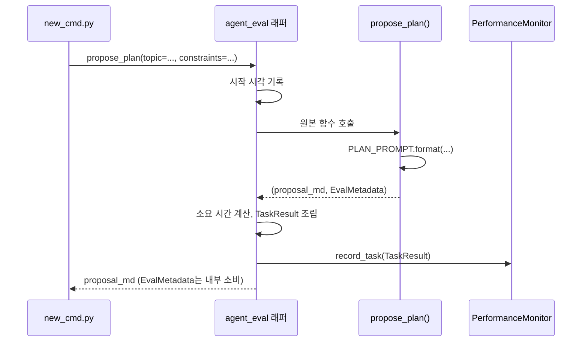

# Chapter 2. 단일 에이전트의 동작 흐름 — PlannerAgent 해부

> **이 챕터에서 배우는 것**
> - 팩토리 함수(`build_propose_plan`)가 왜 에이전트를 그때그때 만드는지
> - 프롬프트가 f-string 하나로 조립되는 과정
> - `@agent_eval` 데코레이터가 정확히 어느 지점에서 무엇을 가로채는지

> **이런 분이 먼저 읽으면 좋습니다**: "데코레이터를 붙이면 계측이 된다"는 말은 들어봤지만, 실제로 함수 호출 시점에 무슨 일이 일어나는지 궁금한 분.

---

## 2.1 팩토리 패턴 — 왜 에이전트를 미리 만들어두지 않는가

Book-forge의 에이전트는 모듈을 import한 순간 존재하는 게 아니라, `build_propose_plan(llm, monitor)`처럼 **호출해야 만들어진다**. `src/book_forge/agents/planner.py`의 주석이 그 이유를 밝힌다.

> "monitor는 프로젝트(책)마다 새로 생성되므로(각자 다른 `eval_results/` 경로), 모듈 import 시점에 고정 데코레이션할 수 없다 — 팩토리 패턴으로 세션마다 데코레이션한다."

`@agent_eval` 데코레이터는 `monitor`(그 프로젝트의 `PerformanceMonitor` 인스턴스)를 받아야 한다. 프로젝트마다 별도 결과 파일(`eval_results/planning.json` 등)에 기록해야 하므로, 데코레이터를 모듈 로드 시점에 한 번만 적용할 수 없다 — `book-forge new`가 실행될 때마다 `build_propose_plan()`을 새로 호출해, **그 세션 전용 `monitor`가 이미 붙은 함수**를 돌려받는다.

```python
def build_propose_plan(llm: LLM, monitor: PerformanceMonitor) -> ProposePlanFn:
    @agent_eval(
        monitor,
        task_type="planning",
        question_arg="topic",
        goal_alignment=GoalAlignmentConfig(ignore_no_tool_tasks=False),
        instructions=InstructionConfig(fail_on_violation=False),
        explainability=ExplainabilityConfig(min_reasoning_length=30),
    )
    def propose_plan(
        topic: str, constraints: str, ground_truth: str = ""
    ) -> tuple[str, EvalMetadata]:
        prompt = PLAN_PROMPT.format(topic=topic, constraints=constraints or "없음")
        proposal_md = llm.generate(prompt, system=PLAN_SYSTEM_PROMPT)
        return proposal_md, EvalMetadata(extra={"phase": "planning", "topic": topic})

    return propose_plan
```

## 2.2 프롬프트 조립 — 템플릿 문자열 그 이상도 이하도 아니다

`propose_plan()`의 실제 본문은 세 줄이다. 프롬프트를 채우고, `llm.generate()`를 부르고, 결과를 돌려준다. `PLAN_PROMPT`(`agents/prompts.py`)는 평범한 f-string 템플릿이다.

```python
PLAN_PROMPT = """다음 주제로 도서 기획안을 작성하세요.

주제: {topic}
저자 제약/요구사항: {constraints}

기획안은 다음 항목을 포함한 마크다운으로 작성하세요:
## 목적
## 대상 독자
## 차별점
## 예상 분량 및 구성 방향
## 톤 앤 매너

각 항목은 2~4문장으로 구체적으로 작성하세요."""
```

이 프롬프트가 왜 "## 목적" 같은 정확한 마크다운 헤딩을 요구하는지는 우연이 아니다 — 이 응답은 나중에 `plan_cmd.py`가 파싱해 재사용하고, `00_기획안.md` 파일로 그대로 저장된다. **프롬프트의 출력 형식은 다음 단계 소비자(다른 코드 또는 다른 에이전트)의 파싱 요구사항에 맞춰 설계된다** — 이 원칙은 이 책 전체에서 반복된다(4장에서 다시 다룬다).

`system=PLAN_SYSTEM_PROMPT`는 "당신은 기술 도서 기획 편집자입니다... 기획안 본문만 마크다운으로 출력하세요"라는 역할 지시를 담당한다. `system`과 `prompt`(user 메시지)를 분리하는 것도 `LLM` Protocol의 계약 그대로다(1장 §1.1) — 세 provider 구현체 모두 이 두 값을 각자의 API 형식에 맞게 재조립한다.

## 2.3 `@agent_eval`이 가로채는 지점

`@agent_eval`은 일반적인 파이썬 데코레이터다 — `propose_plan` 함수를 감싸 새 함수를 만들고, 호출자는 그 차이를 알아채지 못한다. 실제로 가로채는 일은 대략 이런 순서다.



호출자(`new_cmd.py`) 입장에서는 `propose_plan(topic=..., constraints=..., ground_truth=...)`을 부르면 그냥 마크다운 문자열이 돌아온다 — 계측이 붙어 있다는 사실을 호출부 코드는 전혀 몰라도 된다. `EvalMetadata(extra={"phase": "planning", "topic": topic})`로 반환한 부가 정보는 최종 사용자에게 노출되지 않고, `TaskResult`에 실려 나중에 Gate A 채점(§8–9에서 다룬다)의 재료가 된다.

> 📋 **QA 관리자 TIP**: `question_arg="topic"`처럼 데코레이터에 지정한 인자 이름이 실제 함수 시그니처의 인자 이름과 정확히 일치해야 한다 — 오타가 나면 계측이 조용히 빈 값을 기록할 뿐, 에러가 나지 않는다. 새 에이전트를 추가할 때 이 짝이 맞는지 코드 리뷰에서 확인하는 습관이 필요하다.

## 2.4 `EvalMetadata`는 20여 개 필드 중 딱 하나만 쓴다

`EvalMetadata`(Agent-Evaluator SDK, `decorators.py`)는 함수가 데코레이터에게 "자동으로 계산할 수 없는 값"을 되돌려주는 통로다. 실제 정의를 열어보면 LangChain의 `chain_steps`, LangGraph의 `graph_traversal`, AutoGen의 `conversation_turns`처럼 다른 에이전트 프레임워크 통합을 위한 필드가 20개 넘게 있다.

```python
@dataclass
class EvalMetadata:
    attempts: int | None = None
    framework: str | None = None
    tool_calls: list[dict[str, Any]] | None = None
    chain_steps: list[dict[str, Any]] | None = None       # LangChain 전용
    graph_traversal: dict[str, Any] | None = None          # LangGraph 전용
    conversation_turns: list[dict[str, Any]] | None = None # AutoGen 전용
    # ... (그 외 15개 필드 생략, 전부 기본값 None)
    extra: dict[str, Any] | None = None  # 사용자 정의 자유 형식 메타데이터
```

Book-forge는 이 중 **`extra` 하나만** 채운다 — `propose_plan()`의 `EvalMetadata(extra={"phase": "planning", "topic": topic})`이 그 예다. 나머지 필드는 전부 `None`으로 남아 "자동 계산값을 유지하라"는 뜻으로 해석된다. 8장(§8.5)에서 다시 강조할 원칙이 여기서도 그대로 드러난다 — **SDK가 제공하는 표면적을 전부 쓰는 것이 아니라, 이 프로젝트에 실제로 필요한 조각만 정확히 골라 쓴다.** `extra`에 담긴 `phase`/`topic` 같은 값은 Gate 점수 계산에 직접 관여하지 않고, 나중에 `eval_results/*.json`을 사람이 훑어볼 때 "이 태스크가 어느 단계에서 나왔는가"를 알아보기 쉽게 하는 부가 정보다.

## 2.5 실제 호출 지점 — `new_cmd.py`

`propose_plan()`을 실제로 부르는 코드는 `cli/commands/new_cmd.py`의 `new()` 함수 안에 있다(4장에서 `new()` 전체 흐름을 다룬다).

```python
click.echo("📝 기획안 생성 중 (LLM 호출)...")
proposal_md = propose_plan(
    topic=title, constraints=constraints, ground_truth=f"{title} {constraints}"
)
```

호출부는 반드시 **키워드 인자**로 부른다 — `question_arg="topic"`(§2.3)이 함수 시그니처의 `topic` 파라미터 이름과 매칭되려면, 데코레이터가 실제 호출 시점의 인자 값을 이름으로 찾아낼 수 있어야 하기 때문이다. `ground_truth=f"{title} {constraints}"`도 눈여겨볼 값이다 — 저자가 입력한 제목과 제약을 그대로 이어붙여 "이 기획안이 실제로 얼마나 이 입력을 반영했는가"를 채점할 정답 기준으로 쓴다. 이 값을 어떻게 채점에 쓰는지는 9장(§9.4, Gate A의 TCR·Accuracy 블렌딩)에서 다시 다룬다.

## 2.6 이 패턴이 Book-forge 전체에 반복된다

`toc_designer.py`의 `build_design_toc()`, `chapter_drafter.py`의 `build_draft_chapter()`, `chat_agent.py`의 `build_answer_question()` 전부 정확히 같은 구조다 — 팩토리 함수가 `monitor`를 받아 `@agent_eval`이 적용된 내부 함수를 반환한다. 차이는 오직 **어떤 Harness Config를 데코레이터에 넣는가**뿐이다(8장에서 4개 에이전트를 나란히 비교한다).

---

## 직접 해보기

0장(§0.6)에서 만든 프로젝트가 있다면 `eval_results/planning.json`을 열어보라 — `propose_plan()` 호출 한 번이 어떤 `TaskResult` 구조로 기록됐는지 직접 확인할 수 있다. 그다음 여러분만의 함수 하나에 `@agent_eval(monitor, task_type="qa", question_arg="question")`을 그대로 붙여보라(Agent-Evaluator만 설치돼 있으면 Book-forge 없이도 동작한다) — 함수 시그니처의 인자 이름과 `question_arg`가 정확히 일치해야 한다는 것(§2.3의 QA 팁)을 몸으로 확인하는 가장 빠른 방법은, 일부러 오타를 내서 계측이 조용히 빈 값을 기록하는 것을 직접 보는 것이다.

## 이 챕터의 핵심

- **팩토리 패턴은 "프로젝트마다 다른 `monitor`"라는 제약에서 나온 설계다.** 모듈 로드 시점이 아니라 세션 시작 시점에 데코레이션한다.
- **에이전트 함수 본문은 놀라울 만큼 짧다.** 프롬프트 조립 → `llm.generate()` → 반환, 세 단계뿐이다.
- **`@agent_eval`은 호출부 코드를 바꾸지 않고 계측을 끼워 넣는다.** 함수를 부르는 쪽은 계측의 존재를 몰라도 된다.

## 참고 자료

- `src/book_forge/agents/planner.py` — `build_propose_plan()` 전체
- `src/book_forge/agents/prompts.py` — `PLAN_PROMPT`/`PLAN_SYSTEM_PROMPT`
- `src/book_forge/cli/commands/new_cmd.py` — `propose_plan()`을 실제로 호출하는 지점

---

> **다음 챕터**는 이 매끄러운 흐름이 실제로는 어떻게 깨지는지 — Book-forge를 개발하며 실측으로 관측된 5가지 실패 유형을 다룬다.
