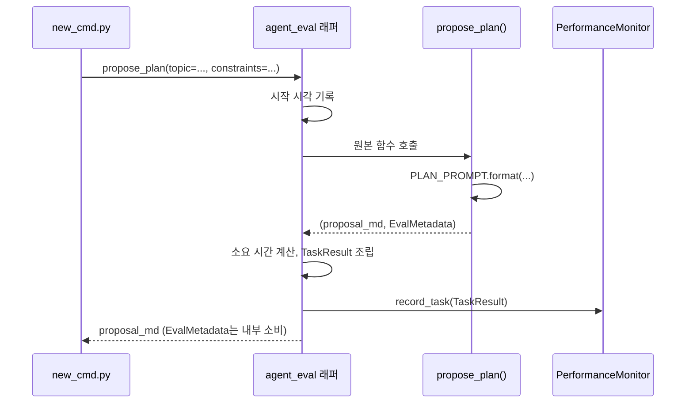

# Chapter 2. 단일 에이전트의 동작 흐름 — PlannerAgent 해부

> **이 챕터에서 배우는 것**
> - Agent-Evaluator를 전통적 QA(로그·테스트·CI 게이트)에 빗대면 무엇에 대응하는지 — Tracker·Config·Gate 세 층
> - 팩토리 함수(`build_propose_plan`)가 왜 에이전트를 그때그때 만드는지
> - 프롬프트가 f-string 하나로 조립되는 과정
> - `@agent_eval` 데코레이터가 정확히 어느 지점에서 무엇을 가로채는지

> **이런 분이 먼저 읽으면 좋습니다**: "데코레이터를 붙이면 계측이 된다"는 말은 들어봤지만, 실제로 함수 호출 시점에 무슨 일이 일어나는지 궁금한 분. Agent-Evaluator라는 SDK 이름은 들어봤어도 그 안이 어떤 층으로 나뉘는지 감이 안 잡히는 분도 이 챕터부터 시작하면 된다.

---

## 2.1 Tracker · Config · Gate — 전통적 QA에 빗대어

**이미 알고 있는 것에서 출발하자.** 전통적인 소프트웨어 개발에서 "품질을 보장한다"는 것은 대략 이런 도구들의 조합이었다. 로그(무슨 일이 있었는지 기록), 단위 테스트(결과가 맞는지 자동 확인), CI 게이트(기준 미달이면 배포를 막음), 이 세 가지다. Agent-Evaluator는 정확히 이 세 가지 각각의 **LLM 에이전트 버전**을 만든 SDK라고 생각하면 된다.

| 여러분이 이미 아는 것 | Agent-Evaluator의 대응 개념 |
|---|---|
| 로그·메트릭 수집(APM 등) | **Tracker** — 데이터를 자동으로 쌓고 계산하는 객체 |
| 단위 테스트의 "이 케이스는 이렇게 채점한다"는 설정 | **Harness Config** — 에이전트별로 채점 기준을 조정하는 dataclass |
| CI 게이트("커버리지 80% 미만이면 머지 금지") | **Gate A–G** — 여러 신호를 모아 0~1 점수로 판정하는 최종 축 |

다만 결정적인 차이가 하나 있다. 전통적 테스트는 "정답이 정확히 하나"인 경우가 많지만(함수가 5를 반환해야 하면 5여야 한다), LLM의 출력은 매번 표현이 달라지는 자유 텍스트다. "정답과 글자가 같은가"가 아니라 "정답이 담고 있어야 할 내용을 담았는가", "근거 없는 말을 지어내지 않았는가" 같은 **확률적·의미적 판정**이 필요하다. Agent-Evaluator의 복잡성 대부분은 이 차이 때문에 생긴다.

> 🧭 **다른 프레임워크를 써봤다면**: LangChain의 콜백/트레이싱, LangGraph의 상태 그래프, AutoGen·CrewAI의 역할 기반 멀티에이전트를 접해봤다면, 이 책에서 다루는 개념들이 그 경험과 느슨하게 겹친다는 것을 눈치챌 수 있다. "실행 경로를 관찰하는 장치"는 Tracker와 비슷한 문제를 다른 각도에서 풀고, "여러 에이전트에게 역할을 부여하고 상호작용을 조율하는 것"은 5장의 검토자-편집장 패턴과 비슷한 문제를 다룬다. 다만 이 책은 그 프레임워크들의 API를 설명하지 않는다. 대신 Book-forge/Agent-Evaluator 하나의 실제 코드로 "이런 문제가 있고, 이런 식으로 풀 수 있다"는 감각만 전달한다. 여러분이 쓰는 프레임워크에서 같은 문제를 어떻게 부르고 어떻게 푸는지는 각 프레임워크의 공식 문서에서 직접 대조해보길 권한다.

이제 세 층의 관계를 정리한다. 이 관계는 9장(§9.1)에서 실제 Tracker 코드(`LatencyTracker.record_latency()` 등)와 함께 훨씬 깊게 다시 다룬다. 여기서는 뼈대만 잡아둔다.

| 층 | 무엇인가 | 켜고 끌 수 있는가 |
|---|---|---|
| **Tracker** | 데이터를 실제로 쌓고 계산하는 객체. `PerformanceMonitor`가 만들어지는 순간 전부 자동으로 켜진다. | **아니오** — 항상 켜져 있다 |
| **Config**(Harness Config) | `@agent_eval`에 넘겨 특정 Tracker의 판정 기준(임계값 등)을 에이전트별로 조정하는 dataclass. | **예** — 필요한 에이전트만 선택 |
| **Gate**(A–G) | 여러 Tracker(+ Config로 조정된 판정)를 7개 축으로 묶어 점수 하나로 집계하는 최종 계층 — 목표 달성(A)·행동 무결성(B)·신뢰성(C)·성능(D)·보안(E)·다중 에이전트(F)·관측성(G) | 결과물(집계) |

정리하면 **"Config를 하나도 안 켜도 Tracker는 이미 데이터를 쌓고 있다"**는 뜻이다. CI 게이트에 빗대면, 로그 수집은 항상 켜져 있고, 그 로그를 어떤 기준으로 통과/실패 판정할지(Config)만 팀마다 다르게 정하는 것과 같은 그림이다.

| 용어 | 한 줄 정의 | 자세히 다루는 곳 |
|---|---|---|
| **`@agent_eval`** | LLM 호출 함수를 감싸 위 Config대로 Gate 점수를 계산·기록하는 배치(사후) 평가 데코레이터 | 이 챕터 §2.4 |
| **`PerformanceMonitor`** | 한 프로젝트(책) 안에서 Tracker들을 갖고 있는 객체. 계측 결과를 `eval_results/*.json`에 쌓고, 여러 챕터 결과를 병합(`merge()`)한다 | 9·12장 |
| **`LiveGuardrail` / `@tool_guard`** | 파일 쓰기처럼 되돌리기 어려운 동작을 **실행 전에** 막는 실시간 축 — 위 표(사후 채점)와는 완전히 다른 축. CI 게이트가 "배포 후 롤백"이 아니라 "배포 자체를 막는" 것과 같은 성격 | 14장 |
| **`HallucinationDetector`** | `rag_mode=True`인 에이전트에서 자동 활성화되는, 근거 없는 서술을 잡아내는 Gate C 하위 채점기(Tracker의 일종) | 7·9장 |

> 이 표에 없는 세부 Config(`ThreatSeverityConfig`, `ConflictResolutionConfig` 등)는 등장하는 장에서 그 자리에 필요한 만큼만 설명한다. 14개 에이전트 전체가 쓰는 Config를 한 표로 보고 싶다면 8장(§8.1)을 참고하고, 개별 용어는 [부록 A](../Appendix/A_용어집.md)에서 찾아보면 된다.

앞으로 어떤 장을 읽든, "지금 1장(§1.1)의 파이프라인 중 어느 화살표를 보고 있는가"를 아래 표로 확인할 수 있다.

| 파이프라인 단계(1장 §1.1 다이어그램) | 대응 챕터 | 대응 Gate/축 |
|---|---|---|
| 입력 → 기획안 → 목차 | 1~4장 | Gate A |
| 목차 → 스캐폴딩 | 14장 | 실시간 가드레일 |
| 스캐폴딩 → 챕터 초안 | 4·7장 | Gate C |
| (초안과 별개) 검토자-편집장 리뷰 | 5장 | Gate F |
| (초안과 별개) 사람-에이전트 개정 루프 | 6장 | Gate B |
| 챕터 초안 → 정적 검증 | 11장 | 별도 축(Gate 미반영) |
| 초안/검증 → 게이팅 | 9·10·12장 | Gate A–G 전체 |
| (게이팅 이후) CI/CD 자동화 | 13장 | Gate 회귀·골든셋 |
| (파이프라인 전반) 팀 동시 저장 | 15장 | 실시간 가드레일 |
| (파이프라인 전반) 품질 기준 조정 | 10·16장 | Gate 가중치 설정 |

이 뼈대를 손에 쥐었으니, 이제 실제 에이전트 하나(`PlannerAgent`)가 이 세 층 중 어디를 어떻게 건드리는지 코드로 확인해보자.

## 2.2 팩토리 패턴 — 왜 에이전트를 미리 만들어두지 않는가

Book-forge의 에이전트는 모듈을 import한 순간 존재하는 게 아니라, `build_propose_plan(llm, monitor)`처럼 **호출해야 만들어진다**. `src/book_forge/agents/planner.py`의 주석이 그 이유를 밝힌다.

> "monitor는 프로젝트(책)마다 새로 생성되므로(각자 다른 `eval_results/` 경로), 모듈 import 시점에 고정 데코레이션할 수 없다 — 팩토리 패턴으로 세션마다 데코레이션한다."

`@agent_eval` 데코레이터는 `monitor`(그 프로젝트의 `PerformanceMonitor` 인스턴스)를 받아야 한다. 프로젝트마다 별도 결과 파일(`eval_results/planning.json` 등)에 기록해야 하므로, 데코레이터를 모듈 로드 시점에 한 번만 적용할 수 없다. 그래서 `book-forge new`가 실행될 때마다 `build_propose_plan()`을 새로 호출해, **그 세션 전용 `monitor`가 이미 붙은 함수**를 돌려받는다.

> 📄 **파일**: `src/book_forge/agents/planner.py`

```python
def build_propose_plan(llm: LLM, monitor: PerformanceMonitor) -> ProposePlanFn:
    @agent_eval(
        monitor,
        task_type="planning",
        question_arg="topic",
        goal_alignment=GoalAlignmentConfig(ignore_no_tool_tasks=False),
        instructions=InstructionConfig(fail_on_violation=False),
        explainability=ExplainabilityConfig(min_reasoning_length=30),
    )
    def propose_plan(
        topic: str, constraints: str, ground_truth: str = ""
    ) -> tuple[str, EvalMetadata]:
        prompt = PLAN_PROMPT.format(topic=topic, constraints=constraints or "없음")
        proposal_md = llm.generate(prompt, system=PLAN_SYSTEM_PROMPT)
        return proposal_md, EvalMetadata(extra={"phase": "planning", "topic": topic})

    return propose_plan
```

데코레이터 안에 나열된 다섯 개 키워드 인자가 바로 §2.1의 Config 층이 실제 코드로 나타난 모습이다. 각각 무엇을 지정하는지 하나씩 풀어보면 이렇다.

- `task_type="planning"`: 이 호출이 어떤 종류의 태스크인지 식별하는 라벨이다. 나중에 `eval_results/planning.json`을 열어보거나 여러 태스크를 종류별로 묶어 집계할 때 이 값으로 필터링한다.
- `question_arg="topic"`: 함수 시그니처의 인자 중 어느 것을 "이 태스크가 답해야 할 질문"으로 취급할지 지정한다. `propose_plan()`의 `topic` 파라미터 이름과 정확히 일치해야 하며(§2.4에서 이 짝이 안 맞으면 무슨 일이 생기는지 다룬다), Gate A가 "이 결과가 질문에 얼마나 부합하는가"를 채점할 때 이 인자 값을 근거로 삼는다.
- `goal_alignment=GoalAlignmentConfig(ignore_no_tool_tasks=False)`: Gate A(목표 달성)의 세부 판정 기준이다. `ignore_no_tool_tasks=False`는 "이 태스크가 도구를 하나도 호출하지 않는 순수 텍스트 생성이라도, 목표 정합성 채점에서 제외하지 말라"는 뜻이다(`propose_plan()`은 실제로 도구를 호출하지 않는다 — §1.8).
- `instructions=InstructionConfig(fail_on_violation=False)`: 프롬프트의 지시사항(예: "## 목적" 헤딩을 포함하라)을 어겼을 때 즉시 태스크 자체를 실패 처리하지 않고, 위반 사실만 기록해 Gate 점수에 반영하라는 설정이다.
- `explainability=ExplainabilityConfig(min_reasoning_length=30)`: 응답에 최소 30자 이상의 근거·설명이 담겨 있어야 "설명 가능성"(Gate G) 기준을 만족한다고 보는 임계값이다.

이 다섯 개는 `PlannerAgent` 하나가 고른 조합일 뿐이다. 다른 에이전트는 왜 다른 조합을 고르는지, Config 선택 자체를 지배하는 원리가 무엇인지는 8장이 14개 에이전트를 나란히 놓고 정리한다.

## 2.3 프롬프트 조립 — 템플릿 문자열 그 이상도 이하도 아니다

`propose_plan()`의 실제 본문은 세 줄이다. 프롬프트를 채우고, `llm.generate()`를 부르고, 결과를 돌려준다. `PLAN_PROMPT`(`agents/prompts.py`)는 평범한 f-string 템플릿이다.

> 📄 **파일**: `src/book_forge/agents/prompts.py`

```python
PLAN_PROMPT = """다음 주제로 도서 기획안을 작성하세요.

주제: {topic}
저자 제약/요구사항: {constraints}

기획안은 다음 항목을 포함한 마크다운으로 작성하세요:
## 목적
## 대상 독자
## 차별점
## 예상 분량 및 구성 방향
## 톤 앤 매너

각 항목은 2~4문장으로 구체적으로 작성하세요."""
```

이 프롬프트가 왜 "## 목적" 같은 정확한 마크다운 헤딩을 요구하는지는 우연이 아니다. 이 응답은 나중에 `plan_cmd.py`가 파싱해 재사용하고, `00_기획안.md` 파일로 그대로 저장된다. **프롬프트의 출력 형식은 다음 단계 소비자(다른 코드 또는 다른 에이전트)의 파싱 요구사항에 맞춰 설계된다.** 이 원칙은 이 책 전체에서 반복된다(4장에서 다시 다룬다).

`system=PLAN_SYSTEM_PROMPT`는 "당신은 기술 도서 기획 편집자입니다... 기획안 본문만 마크다운으로 출력하세요"라는 역할 지시를 담당한다. `system`과 `prompt`(user 메시지)를 분리하는 것도 `LLM` Protocol의 계약 그대로다(1장 §1.5). 세 provider 구현체 모두 이 두 값을 각자의 API 형식에 맞게 재조립한다.

## 2.4 `@agent_eval`이 가로채는 지점

`@agent_eval`은 일반적인 파이썬 데코레이터다. `propose_plan` 함수를 감싸 새 함수를 만들고, 호출자는 그 차이를 알아채지 못한다. 실제로 가로채는 일은 대략 이런 순서다.



호출자(`new_cmd.py`) 입장에서는 `propose_plan(topic=..., constraints=..., ground_truth=...)`을 부르면 그냥 마크다운 문자열이 돌아온다. 계측이 붙어 있다는 사실을 호출부 코드는 전혀 몰라도 된다. `EvalMetadata(extra={"phase": "planning", "topic": topic})`로 반환한 부가 정보는 최종 사용자에게 노출되지 않는다. 대신 `TaskResult`에 실려 나중에 Gate A 채점(9~10장에서 다룬다)의 재료가 된다.

> 📋 **QA 관리자 TIP**: `question_arg="topic"`처럼 데코레이터에 지정한 인자 이름이 실제 함수 시그니처의 인자 이름과 정확히 일치해야 한다. 오타가 나면 계측이 조용히 빈 값을 기록할 뿐, 에러가 나지 않는다. 새 에이전트를 추가할 때 이 짝이 맞는지 코드 리뷰에서 확인하는 습관이 필요하다.

## 2.5 `EvalMetadata`는 20여 개 필드 중 딱 하나만 쓴다

`EvalMetadata`(Agent-Evaluator SDK, `decorators.py`)는 함수가 데코레이터에게 "자동으로 계산할 수 없는 값"을 되돌려주는 통로다. 실제 정의를 열어보면 LangChain의 `chain_steps`, LangGraph의 `graph_traversal`, AutoGen의 `conversation_turns`처럼 다른 에이전트 프레임워크 통합을 위한 필드가 정확히 20개 있다.

> 🔧 **Agent-Evaluator SDK 소스**: `agent_evaluator/decorators.py` (Book-forge 코드가 아니다)

```python
@dataclass
class EvalMetadata:
    attempts: int | None = None
    framework: str | None = None
    tool_calls: list[dict[str, Any]] | None = None
    chain_steps: list[dict[str, Any]] | None = None       # LangChain 전용
    graph_traversal: dict[str, Any] | None = None          # LangGraph 전용
    conversation_turns: list[dict[str, Any]] | None = None # AutoGen 전용
    # ... (그 외 13개 필드 생략, 전부 기본값 None)
    extra: dict[str, Any] | None = None  # 사용자 정의 자유 형식 메타데이터
```

Book-forge는 이 중 **`extra` 하나만** 채운다. `propose_plan()`의 `EvalMetadata(extra={"phase": "planning", "topic": topic})`이 그 예다. 나머지 필드는 전부 `None`으로 남아 "자동 계산값을 유지하라"는 뜻으로 해석된다. 8장(§8.6)에서 다시 강조할 원칙이 여기서도 그대로 드러난다. **SDK가 제공하는 표면적을 전부 쓰는 것이 아니라, 이 프로젝트에 실제로 필요한 조각만 정확히 골라 쓴다.** `extra`에 담긴 `phase`/`topic` 같은 값은 Gate 점수 계산에 직접 관여하지 않는다. 다만 나중에 `eval_results/*.json`을 사람이 훑어볼 때 "이 태스크가 어느 단계에서 나왔는가"를 알아보기 쉽게 하는 부가 정보 역할은 한다.

## 2.6 실제 호출 지점 — `new_cmd.py`

`propose_plan()`을 실제로 부르는 코드는 `cli/commands/new_cmd.py`의 `new()` 함수 안에 있다(4장에서 `new()` 전체 흐름을 다룬다).

> 📄 **파일**: `src/book_forge/cli/commands/new_cmd.py`

```python
click.echo("📝 기획안 생성 중 (LLM 호출)...")
proposal_md = propose_plan(
    topic=title, constraints=constraints, ground_truth=f"{title} {constraints}"
)
```

호출부는 반드시 **키워드 인자**로 부른다. `question_arg="topic"`(§2.4)이 함수 시그니처의 `topic` 파라미터 이름과 매칭되려면, 데코레이터가 실제 호출 시점의 인자 값을 이름으로 찾아낼 수 있어야 하기 때문이다. `ground_truth=f"{title} {constraints}"`도 눈여겨볼 값이다. 저자가 입력한 제목과 제약을 그대로 이어붙여 "이 기획안이 실제로 얼마나 이 입력을 반영했는가"를 채점할 정답 기준으로 쓴다. 이 값을 어떻게 채점에 쓰는지는 9장(§9.4, Gate A의 TCR·Accuracy 블렌딩)에서 다시 다룬다.

## 2.7 이 패턴이 Book-forge 전체에 반복된다

`toc_designer.py`의 `build_design_toc()`, `chapter_drafter.py`의 `build_draft_chapter()`, `chat_agent.py`의 `build_answer_question()` 전부 정확히 같은 구조다. 팩토리 함수가 `monitor`를 받아 `@agent_eval`이 적용된 내부 함수를 반환한다. 차이는 오직 **어떤 Harness Config를 데코레이터에 넣는가**뿐이다(8장에서 4개 에이전트를 나란히 비교한다).

---

## 직접 해보기

1장(§1.9)에서 만든 프로젝트가 있다면 `eval_results/planning.json`을 열어보라. `propose_plan()` 호출 한 번이 어떤 `TaskResult` 구조로 기록됐는지 직접 확인할 수 있다. 그다음 여러분만의 함수 하나에 `@agent_eval(monitor, task_type="qa", question_arg="question")`을 그대로 붙여보라(Agent-Evaluator만 설치돼 있으면 Book-forge 없이도 동작한다). 함수 시그니처의 인자 이름과 `question_arg`가 정확히 일치해야 한다는 것(§2.4의 QA 팁)을 몸으로 확인하는 가장 빠른 방법이 있다. 일부러 오타를 내서, 계측이 조용히 빈 값을 기록하는 모습을 직접 보는 것이다.

## 이 챕터의 핵심

- **Agent-Evaluator는 전통적 QA(로그·테스트·CI 게이트)의 LLM 버전이다.** Tracker(항상 켜짐)·Config(옵트인 조정)·Gate(최종 판정)라는 세 층으로 나뉜다. 이후 장에서 `@agent_eval`이나 `PerformanceMonitor`가 나오면 이 절(§2.1)로 돌아와 확인하면 된다.
- **팩토리 패턴은 "프로젝트마다 다른 `monitor`"라는 제약에서 나온 설계다.** 모듈 로드 시점이 아니라 세션 시작 시점에 데코레이션한다.
- **에이전트 함수 본문은 놀라울 만큼 짧다.** 프롬프트 조립 → `llm.generate()` → 반환, 세 단계뿐이다.
- **`@agent_eval`은 호출부 코드를 바꾸지 않고 계측을 끼워 넣는다.** 함수를 부르는 쪽은 계측의 존재를 몰라도 된다.

## 참고 자료

- `src/book_forge/agents/planner.py` — `build_propose_plan()` 전체
- `src/book_forge/agents/prompts.py` — `PLAN_PROMPT`/`PLAN_SYSTEM_PROMPT`
- `src/book_forge/cli/commands/new_cmd.py` — `propose_plan()`을 실제로 호출하는 지점
- `Agent-Evaluator/CLAUDE.md` — Tracker·Config·Gate 세 층의 SDK 레벨 정의

---

> **다음 챕터**는 이 매끄러운 흐름이 실제로는 어떻게 깨지는지 — Book-forge를 개발하며 실측으로 관측된 5가지 실패 유형을 다룬다.
