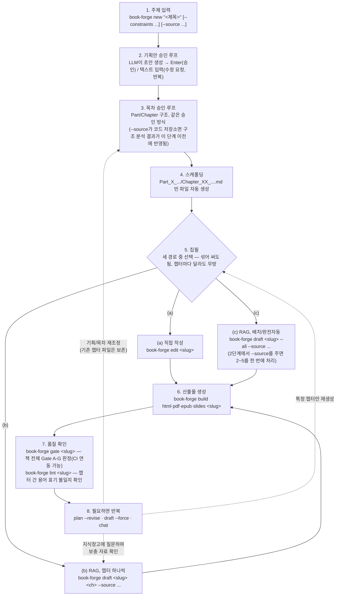

# Book-forge

[](https://pypi.org/project/book-forge/)
[](https://pypi.org/project/book-forge/)
[](LICENSE)

**AI 협업 다권 도서 저술 파이프라인** — 주제 하나(또는 분석하고 싶은 코드 저장소)를 주면
기획안·목차 승인 루프를 거쳐 챕터를 집필하고, HTML·PDF·EPUB·발표자료로 만들어냅니다.
저술 전 과정을 [agent-evaluator](https://pypi.org/project/agent-evaluator/) SDK의
**Harness Gate A–G**로 계측·판정합니다.

기본 LLM Provider는 **Ollama(로컬)** — API 키 없이 바로 시작할 수 있습니다.
OpenAI/Anthropic도 선택할 수 있습니다.

---

## 목차

- [프로젝트 개요](#프로젝트-개요)
- [주요 기능](#주요-기능)
- [설치](#설치)
- [입력 정보](#입력-정보)
- [사용 프로세스](#사용-프로세스)
- [출력 정보](#출력-정보)
- [명령어](#명령어)
- [Agent-Evaluator와의 관계](#agent-evaluator와의-관계)
- [알려진 한계](#알려진-한계)
- [개발](#개발)
- [라이선스](#라이선스)

---

## 프로젝트 개요

기술 서적이나 강의자료를 쓰는 작업은 대체로 같은 순서를 반복합니다 — 기획안을 잡고,
목차를 짜고, 챕터마다 자료를 찾아 초안을 쓰고, 다시 검토하고, 최종적으로 읽을 수 있는
형태(HTML/PDF/슬라이드)로 묶어냅니다. Book-forge는 이 파이프라인 전체를 AI 에이전트로
자동화하되, 저자가 기획·목차 단계에서 반드시 승인하도록 하고, 생성된 결과물의 품질을
**agent-evaluator SDK로 계측**해 "그럴듯해 보이지만 근거 없는 내용"을 걸러낼 수 있게
만든 도구입니다.

특히 코드 저장소를 소스로 지정하면, 텍스트 청크 검색만으로는 잘 안 잡히는 "이 프로젝트에
어떤 모듈이 있고 서로 어떻게 의존하는가" 같은 구조적 관계를 정적 분석(AST)으로 뽑아내
목차 설계와 본문에 반영합니다 — **실제 코드베이스를 분석하는 기술서·강의자료**를 만드는
용도에 특히 강점이 있습니다.

**핵심 특징 3가지**
1. **저자 승인 루프**: 기획안과 목차는 LLM이 초안을 내고 저자가 Enter(승인)하거나 피드백을 주는 반복 과정을 거칩니다 — 전부 자동으로 밀어붙이지 않습니다.
2. **RAG 집필 보조(옵션)**: PDF·코드 저장소·텍스트·URL을 소스로 주면 근거 발췌문 기반으로 챕터 초안을 씁니다.
3. **Harness Gate 품질 계측**: 모든 LLM 호출 에이전트가 agent-evaluator의 `@agent_eval`을 직접 사용해, 생성된 결과물을 Gate A–G(목표 달성/행동 무결성/신뢰성/성능/보안/다중 에이전트/관측성)로 판정합니다.

---

## 주요 기능

| 기능 | 설명 |
|---|---|
| **기획/목차 대화형 루프** | 주제 입력 → 기획안 초안 → 저자 승인(또는 수정 요청 반복) → 목차 설계 → 같은 승인 루프 → 챕터 스캐폴드 자동 생성 |
| **구조적 코드 인덱싱** | `--source`에 코드 저장소를 주면 AST 정적 분석으로 모듈/클래스/함수 인벤토리를 뽑아 목차 설계·본문에 반영 — 존재하지 않는 기능을 지어내는 것을 방지 |
| **RAG 집필 보조(옵션)** | PDF/코드 저장소/텍스트/URL 소스를 Ollama 임베딩으로 검색해 근거 발췌문 기반 챕터 초안·레퍼런스 표·다이어그램·실습 생성 |
| **콘텐츠 유형별 전용 생성기** | 목차에서 챕터마다 `narrative`/`reference_table`/`diagram`/`exercise`/`capstone`/`module_reference` 유형을 지정하면 각각 전용 에이전트가 담당 |
| **근거 검증** | 생성 전 소스 커버리지 점검, 생성 후 코드-본문 정합성 대조(`--check-package`)·코드 실행 검증(`--execute-examples`)·용어 표기 일관성 검사(`lint`) |
| **HTML/PDF/EPUB/발표자료 빌드** | 단일 자기완결 HTML(검색·찾아보기 포함), 챕터별 A4 PDF, EPUB 3, Reveal.js 발표자료 — 전부 표지/저작권 정보 자동 삽입 지원 |
| **웹 에디터** | Part/Chapter 트리 + 마크다운 편집 + 이미지 갤러리, 팀 저장 충돌을 실시간으로 차단 |
| **다관점 리뷰 패널** | 정확성/가독성 검토자 2명이 독립 검토하고 편집장이 종합 판정하는 멀티에이전트 협업 예제 |
| **지식창고 Q&A** | 집필에 쓴 소스를 프로젝트에 영속화해 `book-forge chat`으로 이어서 대화형 질의 |
| **리서치 에이전트** | 챕터 제목에서 검색 쿼리를 생성해 웹을 검색하고, 채택한 자료를 챕터 말미에 자동 인용 |
| **품질 게이팅** | `book-forge gate` — 책 전체(모든 챕터) 결과를 자동 집계해 Gate A–G로 판정, CI 연동 가능 |

---

## 설치

### 사전 준비 (OS 패키지)

pip만으로 해결되지 않는 두 가지가 있습니다 — **Ollama**(기본 LLM Provider, 별도 데몬)와
**Playwright Chromium의 런타임 공유 라이브러리**(`[pdf]` extra 사용 시)입니다. 둘 다
운영체제에 직접 설치해야 합니다.

**1. Python 3.11 이상**

```bash
# Ubuntu/Debian — 기본 저장소에 3.11이 없으면 deadsnakes PPA 추가 필요
sudo apt update
sudo apt install -y python3.11 python3.11-venv python3-pip

# macOS (Homebrew)
brew install python@3.11
```

**2. Ollama (기본 LLM Provider — API 키 불필요)**

Ollama는 apt/pip 패키지가 아니라 로컬에서 상시 실행되는 별도 데몬입니다.

```bash
# Linux (Ubuntu/Debian 포함)
curl -fsSL https://ollama.com/install.sh | sh

# macOS (Homebrew)
brew install ollama
# 또는 https://ollama.com/download 에서 앱으로 설치

ollama serve &            # 데몬 실행(기본 포트 11434) — 이미 실행 중이면 생략
ollama pull llama3.2       # book-forge 기본 모델(DEFAULT_OLLAMA_MODEL) 다운로드
```

OpenAI/Anthropic만 쓸 계획이면 Ollama 설치는 건너뛰고 [공통 설정](#공통-설정)의
`LLM_PROVIDER` 환경변수만 지정하면 됩니다.

**3. Playwright Chromium 런타임 라이브러리 (`[pdf]` extra 사용 시)**

`playwright install chromium`은 브라우저 바이너리만 받습니다 — 리눅스(특히 데스크톱
환경이 없는 서버/컨테이너)에서는 Chromium 구동에 필요한 공유 라이브러리가 시스템에
따로 없을 수 있습니다. 가장 안전한 방법은 Playwright가 배포판을 자동 감지해
`apt`까지 대신 호출해주는 커맨드를 쓰는 것입니다:

```bash
python -m playwright install --with-deps chromium   # 브라우저 + OS 의존성 한 번에
```

`--with-deps`를 못 쓰는 제한된/오프라인 환경에서 수동으로 apt 패키지를 지정해야
한다면 Ubuntu 22.04/24.04 기준 대략 다음과 같습니다(Ubuntu 버전에 따라 패키지명이
조금씩 다를 수 있어 참고용입니다 — `--with-deps`가 가능하면 그쪽이 더 안전합니다):

```bash
sudo apt install -y \
  libnss3 libnspr4 libatk1.0-0 libatk-bridge2.0-0 libcups2 \
  libdrm2 libdbus-1-3 libxcb1 libxkbcommon0 libx11-6 \
  libxcomposite1 libxdamage1 libxext6 libxfixes3 libxrandr2 \
  libgbm1 libpango-1.0-0 libcairo2 libasound2
```

macOS는 별도 시스템 패키지 없이 `playwright install chromium`만으로 충분합니다.

### PyPI에서 설치 (일반 사용자)

```bash
pip install book-forge                  # 코어만 — 저작/기획/목차 루프, HTML 빌드
pip install "book-forge[pdf]"           # + Playwright (PDF/EPUB 빌드용)
pip install "book-forge[serve]"         # + Flask (웹 에디터용)
pip install "book-forge[rag]"           # + pypdf/numpy (RAG 집필 보조용, Ollama 임베딩 필요)
pip install "book-forge[pdf,serve,rag]" # 전체 기능

python -m playwright install --with-deps chromium   # [pdf] 설치 시 1회(리눅스 OS 의존성 포함)

book-forge init                         # LLM Provider 설정 (기본 Ollama — API 키 불필요)
```

`pipx`로 CLI만 격리 설치하고 싶다면 `pipx install book-forge`(extras가 필요하면
`pipx install "book-forge[pdf,serve,rag]"`)도 동일하게 동작합니다.

### 소스에서 설치 (개발/최신 버전)

저장소를 직접 받아 편집 가능 모드로 설치하려면(기여, 최신 미배포 변경 반영):

```bash
git clone https://github.com/bullpeng72/Book_forge.git
cd Book_forge
pip install -e ".[dev]"          # 코어 + 테스트 도구
pip install -e ".[pdf]"          # + Playwright (PDF/EPUB 빌드용)
pip install -e ".[serve]"        # + Flask (웹 에디터용)
pip install -e ".[rag]"          # + pypdf/numpy (RAG 집필 보조용, Ollama 임베딩 필요)
python -m playwright install --with-deps chromium   # [pdf] 설치 시 1회(리눅스 OS 의존성 포함)

book-forge init                  # LLM Provider 설정 (기본 Ollama — API 키 불필요)
```

### 공통 설정

OpenAI/Anthropic을 쓰려면 `book-forge init`에서 provider를 선택하거나 `.env`에
`LLM_PROVIDER=openai`(+ `OPENAI_API_KEY`) 또는 `LLM_PROVIDER=anthropic`(+
`ANTHROPIC_API_KEY`)을 설정하세요.

Gate 판정 가중치(`gate_a_tcr_weight`/`gate_c_tcr_weight`/`gate_b_loop_weight`)를
프로젝트마다 다르게 쓰려면 `.env`에 `BOOK_FORGE_GATE_A_TCR_WEIGHT`/
`BOOK_FORGE_GATE_C_TCR_WEIGHT`/`BOOK_FORGE_GATE_B_LOOP_WEIGHT`를 설정하세요
(미지정 시 agent-evaluator 기본값 그대로).

**Python 3.11+** 필요.

---

## 입력 정보

Book-forge에 처음 주는 입력은 두 가지뿐입니다 — 나머지는 대화형 승인 루프로 채워집니다.

| 입력 | 어디서 | 형식 | 필수 여부 |
|---|---|---|---|
| **주제/제목** | `book-forge new "<제목>"` | 자유 텍스트 | 필수 |
| **제약/요구사항** | `--constraints "..."` | 자유 텍스트(대상 독자, 톤, 분량 등) | 선택 |
| **집필 소스** | `--source` (여러 번 지정 가능) | PDF 파일 · 코드 저장소 디렉토리 · 텍스트/마크다운 파일 · `http(s)://` URL | 선택(RAG 집필 보조 쓸 때만) |
| **저자 정보** | `--author`/`--license-notice`/`--edition` | 자유 텍스트 | 선택(표지 페이지용) |

승인 루프 중에는 매 라운드 **Enter(그대로 승인)** 또는 **수정 요청 텍스트**를 입력으로
받습니다. 소스를 지정한 경우 코드 저장소는 디렉토리 경로 여부로, PDF/텍스트는 확장자로,
URL은 `http(s)://` 접두어로 자동 판별합니다 — 별도로 소스 종류를 지정할 필요가 없습니다.

---

## 사용 프로세스



**주제 입력만으로 끝까지 자동으로 밀고 싶다면**: `book-forge new "<제목>" --source ./papers`
— 기획/목차 승인 직후 스캐폴딩에 이어 전체 챕터 초안까지 한 번에 진행합니다(실측: 4챕터
76초).

---

## 출력 정보

프로젝트 데이터는 `~/Documents/BookForge/projects/<slug>/`에 저장됩니다.

```
<slug>/
├── 00_기획안.md           # 승인된 기획안
├── 01_목차.md             # 승인된 목차(사람이 읽는 부분 + ```toc 매니페스트)
├── Part_X_.../
│   └── Chapter_XX_....md  # 챕터 본문(+ images/ 디렉토리)
├── outputs/
│   ├── <slug>.html        # 단일 자기완결 HTML(이미지 base64 인라인, 검색 기능 포함)
│   ├── <slug>.epub        # EPUB 3 전자책
│   ├── pdf/                # 챕터별 A4 PDF(+ 표지·찾아보기 PDF)
│   └── *_slides.html      # Reveal.js 발표자료
├── knowledge/store.json   # RAG 지식창고([rag] extra 사용 시) — draft가 쌓고 chat이 재사용
└── eval_results/          # agent-evaluator 계측 결과(JSON + HTML), book-forge gate가 여기서 집계
```

HTML은 이미지까지 파일 하나에 인라인 임베드돼 있어 다른 PC로 옮기거나 이메일에 첨부해도
그대로 열립니다. PDF/EPUB/발표자료는 각각 별도 파일(또는 챕터별 파일 묶음)로 생성됩니다.

---

## 명령어

| 명령 | 설명 |
|---|---|
| `book-forge init` | LLM Provider(Ollama/OpenAI/Anthropic) 및 API 키 설정 |
| `book-forge new <title> [--constraints] [--source ...] [--author] [--license-notice] [--edition]` | 기획→목차 대화형 루프 + 스캐폴드 생성. `--source` 주면 전체 챕터 자동 배치 초안까지 |
| `book-forge draft <slug> <ch_no>\|--all [--source ...] [--check-package] [--execute-examples]` | RAG 보조 챕터 초안/레퍼런스 표/다이어그램/실습 생성 |
| `book-forge research <slug> <chapter_no>` | 챕터 제목에서 검색 쿼리 생성 → 웹 검색 → 후보 URL 선택 → 지식창고에 추가 |
| `book-forge chat <slug>` | 프로젝트 지식창고에 지속형 대화 질의 |
| `book-forge edit <slug> [--port] [--no-browser]` | 웹 에디터(Part/Chapter 트리 + 이미지 갤러리) |
| `book-forge review <slug> <chapter_no>` | 정확성/가독성 검토자 패널 + 편집장 종합 판정 |
| `book-forge lint <slug> [--fail-on-inconsistency]` | 챕터 간 기술 용어 표기 불일치 후보 발견·보고 |
| `book-forge plan <slug> [--revise]` | 기획/목차 재검토 |
| `book-forge build html\|pdf\|epub\|slides <slug>` | HTML/PDF/EPUB/발표자료 빌드 |
| `book-forge gate <slug> [--file] [--min-gate-score] ...` | Gate A-G 판정(책 전체 자동 집계, `agent-eval gate` 플래그 전체 지원) |
| `book-forge knowledge status\|reset <slug>` | 지식창고 소스별 집계 확인 / 삭제 |
| `book-forge home [slug]` | 데이터/프로젝트 폴더 파일 탐색기로 열기 |

전체 옵션은 `book-forge <명령> --help`로 확인하세요.

---

## Agent-Evaluator와의 관계

Book-forge는 [agent-evaluator](https://pypi.org/project/agent-evaluator/) SDK 위에
지어진 **응용 프로그램**입니다 — 자체 품질 판정 로직을 새로 만들지 않고, agent-evaluator가
이미 제공하는 계측·게이팅 기능을 그대로 가져다 씁니다.

- **모든 LLM 호출 에이전트**(기획·목차 설계·집필·리뷰 등)가 agent-evaluator의
  `@agent_eval` 데코레이터를 직접 사용합니다. 각 에이전트가 만든 결과는 **Gate A–G**
  (목표 달성/행동 무결성/신뢰성/성능 계약/보안 경계/다중 에이전트 조정/관측성)로 자동
  채점됩니다.
- **`book-forge gate`**는 `eval_results/`에 쌓인 챕터별 결과 전부를
  `PerformanceMonitor.merge()`(agent-evaluator 기존 기능)로 책 한 권 분량으로 합친 뒤,
  agent-evaluator의 `agent-eval gate` CLI를 그대로 위임 호출해 판정합니다 — CI/CD
  파이프라인에 그대로 연동할 수 있습니다.
- **파일 저장 같은 부작용이 있는 동작**(챕터 스캐폴딩, 웹 에디터 저장)은 `@agent_eval`
  대신 agent-evaluator의 실시간 가드레일(`LiveGuardrail`/`tool_guard`)로 실행 **전에**
  차단합니다 — 같은 호출의 반복이나 여러 저자의 저장 충돌을 사전에 막습니다.
- **RAG 챕터 초안**은 `rag_mode=True`로 agent-evaluator의 `HallucinationDetector`를
  자동 활성화해, 소스에 없는 근거 없는 서술을 Gate C(신뢰성) 점수로 잡아냅니다.
- **LLM Judge**(옵트인, `--enable-llm-judge`)는 OpenAI/Anthropic 키가 필요합니다 —
  agent-evaluator의 LLM Judge 자체가 Ollama를 지원하지 않기 때문에, 기본 Provider인
  Ollama로는 이 기능만 별도로 켤 수 없습니다.

즉 Book-forge를 "무엇을 계측하는가"의 관점에서 보면 agent-evaluator의 **실사용
사례**이자, agent-evaluator SDK가 프로덕션 애플리케이션에 어떻게 통합되는지 보여주는
참조 구현이기도 합니다.

---

## 알려진 한계

- **팀 동시성은 opt-in 워크플로**: 웹 에디터 저장 충돌 방지는 저자가
  `agent-eval claims add`로 스코프를 실제로 선점해둔 경우에만 작동합니다 — 아무도 안 쓰면
  검사가 항상 통과합니다.
- **RAG 임베딩은 Ollama 전용**: 채팅 LLM Provider가 OpenAI/Anthropic이어도 `book-forge
  draft`의 임베딩은 항상 로컬 Ollama를 씁니다.
- **RAG 초안은 검토가 필요합니다**: 로컬 모델이 프롬프트 지시를 완벽히 지키지 않을 수
  있고, `HallucinationDetector`가 근거 없는 서술을 Gate C 점수(warn/fail)로 잡아내므로
  초안 승인 전 `book-forge gate` 확인을 권장합니다.
- **PDF/HTML/발표자료 빌드는 CDN 의존**: Mermaid.js/highlight.js/Reveal.js를 CDN에서
  불러옵니다 — LLM 호출(기획/집필)은 Ollama로 완전 오프라인 가능하지만, 빌드·열람 시점에는
  네트워크가 필요합니다.
- **`book-forge research`는 비공식 검색 경로에 의존**: API 키 없는 DuckDuckGo HTML
  결과 페이지를 파싱합니다 — 페이지 구조가 바뀌면 깨질 수 있습니다.
- **`--execute-examples`는 LLM이 생성한 코드를 실제로 실행합니다**: subprocess로
  격리하지만 컨테이너 수준 격리는 없습니다. 기본은 꺼져 있고 명시적으로 켜야 합니다.

더 상세한 한계와 설계 결정 배경은 [CLAUDE.md](CLAUDE.md)를 참고하세요.

---

## 개발

```bash
pip install -e ".[dev,pdf,serve,rag]"
python -m playwright install --with-deps chromium
pytest                 # 409개 테스트
ruff check src tests scripts
python -m build           # sdist + wheel 둘 다 생성 (패키징 검증 —
                          # editor/templates/*.html 포함 여부 확인 필수)
```

개발 컨벤션·아키텍처·agent-evaluator 통합 세부사항은 [CLAUDE.md](CLAUDE.md)를 참고하세요.

### PyPI 배포

```bash
pip install build twine
rm -rf dist build src/*.egg-info
python -m build                 # sdist(.tar.gz) + wheel(.whl) 생성
twine check dist/*              # 메타데이터/README 렌더링 검증 (업로드 전 필수)
twine upload --repository testpypi dist/*   # TestPyPI에서 먼저 검증(권장)
twine upload dist/*             # 실제 PyPI 업로드
```

`version`은 `pyproject.toml`의 `[project].version`이 유일한 소스입니다 — 배포 전
반드시 올려야 하며(PyPI는 동일 버전 재업로드를 허용하지 않음), 다른 버전 문자열
참조(`__init__.py` 등)와 동기화되어 있는지 확인하세요.

---

## 라이선스

MIT — [LICENSE](LICENSE) 참고.
